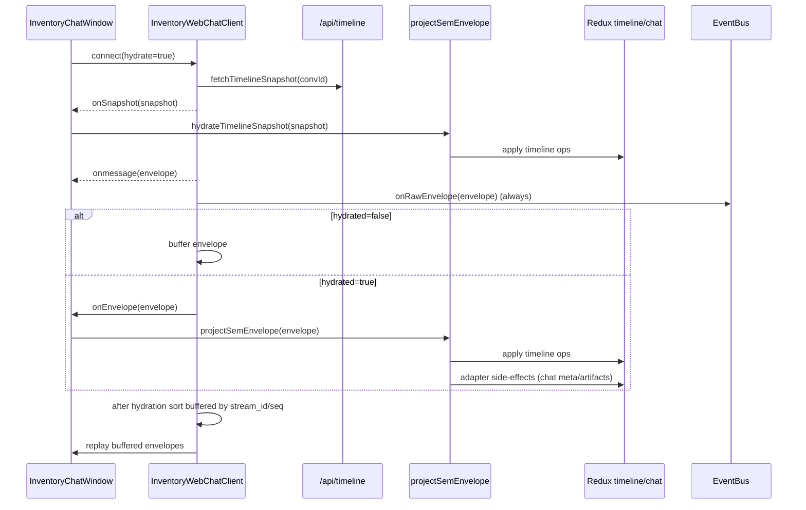

# Timeline-First Chat Window and Widget Integration Guide

This guide explains how the new chat runtime works and how to integrate your own widgets in a clean, reusable way.

It is written for developers who need to:

- understand the timeline-first architecture,
- embed chat in an app,
- project websocket SEM events into timeline entities,
- add app-specific widgets without coupling widget logic to the core chat window.

The examples below are based on the current implementation in:

- `packages/engine/src/hypercard-chat/runtime/projectionPipeline.ts`
- `packages/engine/src/hypercard-chat/sem/registry.ts`
- `packages/engine/src/hypercard-chat/timeline/timelineSlice.ts`
- `packages/engine/src/components/widgets/ChatWindow.tsx`
- `apps/inventory/src/features/chat/InventoryChatWindow.tsx`
- `apps/inventory/src/features/chat/runtime/projectionAdapters.ts`
- `apps/inventory/src/features/chat/runtime/timelineEntityRenderer.ts`
- `apps/inventory/src/features/chat/webchatClient.ts`

---

## 1. Why this architecture exists

The previous style of chat integration tended to mix several concerns in one place:

- transport concerns (`/ws`, `/chat`, hydration),
- projection concerns (mapping events to UI-visible messages),
- app concerns (artifact windows, runtime card registration, special widgets),
- debugging concerns (event tracing).

That coupling made extension hard and made it easy to accidentally increase Redux pressure with high-frequency event traffic.

The new architecture is timeline-first:

1. Incoming SEM events are projected into canonical timeline entities.
2. The chat window renders from timeline entities (not ad hoc synthetic message state).
3. App-specific behavior is attached through adapters and renderers.
4. Raw event debugging stays outside Redux in an event bus.

This gives a stable core and explicit extension surfaces.

---

## 2. Core concepts and boundaries

### 2.1 Canonical state: timeline entities

Timeline entities live in Redux and are conversation-scoped.

`TimelineEntity` (from `packages/engine/src/hypercard-chat/timeline/types.ts`) has:

- `id: string`
- `kind: string`
- `createdAt: number`
- `updatedAt?: number`
- `version?: string` (uint64-compatible decimal string)
- `props: Record<string, unknown>`

The reducer (`timelineSlice`) stores entities as:

- `byId` map
- `order` array

per conversation ID.

Why this matters:

- projection is idempotent and mergeable,
- hydration and live stream converge into one model,
- renderers can be stateless and deterministic.

### 2.2 SEM registry

`SemRegistry` maps event types to handlers that emit timeline operations:

- `addEntity`
- `upsertEntity`
- `rekeyEntity`
- `clearConversation`

Default handlers include:

- `timeline.upsert`
- `llm.start|delta|final`
- `tool.start|delta|result|done`
- `log`
- `ws.error`

Handlers return a `SemHandlerResult` (`ops` + optional `effects`), and `applySemTimelineOps` dispatches the ops.

### 2.3 Projection pipeline adapters

The engine projection pipeline (`projectSemEnvelope`) does two phases:

1. registry projection into timeline ops,
2. optional adapters (`onEnvelope`) for app-specific side effects.

Adapters are where app code belongs:

- update chat metadata counters/stats,
- derive artifact index,
- register runtime cards,
- trigger app workflows.

This keeps the projection core generic.

### 2.4 Rendering boundary

`ChatWindow` is a presentational component.

It receives:

- `messages: ChatWindowMessage[]`
- optional `renderWidget(widget)` function for inline widget blocks.

It does not know how to project SEM events or parse tool payloads.

### 2.5 Debugging boundary

Raw envelope logging uses the event bus (`eventBus.ts`) outside Redux.

The transport emits raw envelopes immediately at ingress. Debug viewers subscribe to that bus.

This prevents debug tooling from adding reducer churn.

---

## 3. End-to-end data flow

### 3.1 Startup + hydration + replay



### 3.2 Runtime layering

```mermaid
flowchart LR
  A[Incoming SEM Envelope] --> B[SemRegistry.handle]
  B --> C[SemTimelineOp[]]
  C --> D[applySemTimelineOps]
  D --> E[(timeline state)]
  B --> F[Projection Adapters]
  F --> G[(chat metadata state)]
  F --> H[(artifacts index)]
  E --> I[Timeline Entity Renderer]
  I --> J[ChatWindowMessage[]]
  J --> K[ChatWindow]
```

---

## 4. Engine primitives you will use

### 4.1 `projectSemEnvelope` and `hydrateTimelineSnapshot`

From `packages/engine/src/hypercard-chat/runtime/projectionPipeline.ts`:

```ts
projectSemEnvelope({
  conversationId,
  dispatch,
  envelope,
  semRegistry,
  adapters,
});

hydrateTimelineSnapshot({
  conversationId,
  dispatch,
  semRegistry,
  snapshot,
  adapters,
});
```

Use `hydrateTimelineSnapshot` once after snapshot fetch, then `projectSemEnvelope` for each live envelope.

### 4.2 `SemRegistry`

```ts
const registry = createSemRegistry();

// Optional app/custom event type registration
registry.register('myapp.map.v1', (envelope, ctx) => {
  return {
    ops: [
      {
        type: 'upsertEntity',
        entity: {
          id: envelope.event?.id ?? 'map-unknown',
          kind: 'widget_map',
          createdAt: ctx.now(),
          updatedAt: ctx.now(),
          props: {
            lat: envelope.event?.data?.lat,
            lng: envelope.event?.data?.lng,
            zoom: envelope.event?.data?.zoom ?? 12,
          },
        },
      },
    ],
    effects: [],
  };
});
```

### 4.3 Timeline selectors

Use `selectTimelineEntities(state, convId)` to drive rendering.

This keeps render logic decoupled from transport and adapters.

### 4.4 `ChatWindow` + inline widgets

`ChatWindowMessage` can use `content` blocks:

- `{ kind: 'text', text }`
- `{ kind: 'widget', widget: InlineWidget }`

`InlineWidget`:

- `id`
- `type`
- `props`
- optional `label`

`renderWidget(widget)` decides which React component to render.

---

## 5. Reference integration (Inventory)

Inventory chat wiring in `InventoryChatWindow.tsx` follows this pattern:

1. create `semRegistryRef` via `createSemRegistry()`
2. define adapters:
- `createChatMetaProjectionAdapter()`
- `createInventoryArtifactProjectionAdapter()`
3. wire transport handlers:
- `onRawEnvelope` -> `emitConversationEvent`
- `onSnapshot` -> `hydrateTimelineSnapshot`
- `onEnvelope` -> `projectSemEnvelope`
4. render:
- `timelineEntities` -> `mapTimelineEntityToMessage` -> `ChatWindow`

Important design choice: rendering is derived entirely from timeline entities.

Chat metadata state (`chatSlice`) only holds transport/UX metadata:

- connection status,
- suggestions,
- model name,
- token stats and streaming stats,
- stream error.

---

## 6. How to add your own widgets

There are two major strategies.

### Strategy A: Widget as timeline entity kind

Use when the widget represents canonical timeline state.

Examples:

- map location update,
- chart snapshot,
- geo route,
- domain card summary.

Flow:

1. SEM handler maps event to a timeline entity (`kind: 'widget_map'` etc.).
2. Entity renderer maps that entity to a `ChatWindowMessage` with a widget content block.
3. `renderWidget` mounts the actual React widget for `type: 'map'`.

### Strategy B: Widget as adapter-side effect

Use when widget data should not be canonical timeline state.

Examples:

- ephemeral status overlays,
- transient diagnostics,
- local-only controls.

In this case, keep timeline clean and use adapter/store local to your app.

For most product UI widgets, Strategy A is preferred.

---

## 7. Full worked example: inline map widget

### 7.1 Define incoming event

Server emits:

```yaml
sem: true
event:
  type: myapp.map.v1
  id: map:evt:123
  data:
    title: Nearby Stores
    lat: 37.7749
    lng: -122.4194
    zoom: 11
    markers:
      - id: store-1
        label: Store 1
        lat: 37.784
        lng: -122.41
```

### 7.2 Register SEM handler

```ts
registry.register('myapp.map.v1', (envelope, ctx) => {
  const d = envelope.event?.data ?? {};
  return {
    ops: [
      {
        type: 'upsertEntity',
        entity: {
          id: envelope.event?.id ?? `map-${ctx.now()}`,
          kind: 'widget_map',
          createdAt: ctx.now(),
          updatedAt: ctx.now(),
          props: {
            title: d.title ?? 'Map',
            lat: d.lat,
            lng: d.lng,
            zoom: d.zoom ?? 12,
            markers: d.markers ?? [],
          },
        },
      },
    ],
    effects: [],
  };
});
```

### 7.3 Extend timeline entity renderer

```ts
if (entity.kind === 'widget_map') {
  return {
    id: entity.id,
    role: 'system',
    status: 'complete',
    content: [
      { kind: 'text', text: String(entity.props.title ?? 'Map') },
      {
        kind: 'widget',
        widget: {
          id: `map-${entity.id}`,
          type: 'map',
          label: 'Location',
          props: {
            center: {
              lat: entity.props.lat,
              lng: entity.props.lng,
            },
            zoom: entity.props.zoom,
            markers: entity.props.markers,
          },
        },
      },
    ],
  };
}
```

### 7.4 Render widget component

```tsx
function renderWidget(widget: InlineWidget): React.ReactNode {
  if (widget.type === 'map') {
    return (
      <MapWidget
        center={widget.props.center as { lat: number; lng: number }}
        zoom={widget.props.zoom as number}
        markers={widget.props.markers as Array<{ id: string; lat: number; lng: number; label: string }>}
      />
    );
  }
  return null;
}
```

Pass that `renderWidget` to `ChatWindow`.

### 7.5 Pseudocode summary

```text
on websocket envelope:
  emit raw envelope to event bus
  project envelope -> timeline ops -> redux timeline
  run adapters for app side-effects

on render:
  entities = selectTimelineEntities(convId)
  messages = entities.map(entityRenderer)
  ChatWindow(messages, renderWidget)
```

---

## 8. Adapter design patterns

Adapters let you add app behavior without forking projection core.

### 8.1 Metadata adapter pattern

Used by `createChatMetaProjectionAdapter`.

Responsibilities:

- observe semantic event types (`llm.start|delta|final`),
- update model/tokens/stats,
- handle suggestions events,
- map `ws.error` to chat error metadata.

Rule:

- adapter should not mutate canonical timeline entities directly.
- timeline changes should come from registry handlers.

### 8.2 Artifact adapter pattern

Used by `createInventoryArtifactProjectionAdapter`.

Responsibilities:

- derive artifact index from SEM/timeline semantics,
- register runtime card code when provided.

This keeps compatibility with app/plugin code that depends on an artifact index while preserving timeline-first rendering.

### 8.3 Custom app adapter template

```ts
export function createMyAppProjectionAdapter(): ProjectionPipelineAdapter {
  return {
    onEnvelope({ conversationId, dispatch, envelope, projected }) {
      const type = envelope.event?.type;

      if (type === 'myapp.alert') {
        dispatch(showAlert({ conversationId, level: 'warning' }));
      }

      // optional: inspect projected.ops for advanced behavior
      if (projected.ops.length > 50) {
        dispatch(recordBurst({ conversationId, count: projected.ops.length }));
      }
    },
  };
}
```

---

## 9. Transport details you must preserve

`webchatClient` behavior is part of correctness.

### 9.1 Raw-first ingress

`routeIncomingEnvelope` always calls `onRawEnvelope` before any hydration gating.

That guarantees EventViewer sees all traffic, including envelopes that are temporarily buffered.

### 9.2 Hydration gate

Before hydration completes:

- envelopes are buffered,
- not projected yet.

After snapshot hydrate:

- buffered envelopes are sorted,
- replayed in deterministic order.

### 9.3 Ordering

Buffer sort policy:

1. `stream_id` lexical ordering when present
2. `seq` numeric ordering (via bigint parse)
3. fallback stable behavior for missing ordering fields

This avoids out-of-order entity updates during replay.

---

## 10. How to build your own chat shell in a new app

Use this as a concrete checklist.

1. Add reducers to store:
- `timeline: timelineReducer`
- your app chat metadata slice
- optional derived slices (artifacts, etc.)

2. Build registry:
- `const semRegistry = createSemRegistry()`
- add app handlers with `registry.register(...)`

3. Build adapter list:
- metadata adapter,
- app side-effect adapters,
- optional artifact adapter.

4. Build transport client handlers:
- `onRawEnvelope` -> event bus emit,
- `onSnapshot` -> `hydrateTimelineSnapshot(...)`,
- `onEnvelope` -> `projectSemEnvelope(...)`.

5. Build renderer:
- `selectTimelineEntities(...)`,
- map entities to `ChatWindowMessage`,
- use `content` blocks for widget messages.

6. Build widget renderer:
- switch on `InlineWidget.type`,
- render React widget components.

7. Validate with tests:
- projection pipeline test,
- ingress routing test,
- entity renderer tests,
- widget renderer stories/tests.

---

## 11. Testing strategy (recommended)

### 11.1 Unit tests

- registry handler behavior for custom events,
- adapter behavior per event type,
- entity renderer mapping logic,
- transport ordering and buffering.

### 11.2 Integration tests

Create a store with:

- `timelineReducer`,
- relevant side-effect slices.

Then assert:

- envelope -> timeline entity,
- envelope -> adapter side effects,
- snapshot hydrate + live replay consistency.

Current examples:

- `apps/inventory/src/features/chat/runtime/projectionPipeline.test.ts`
- `apps/inventory/src/features/chat/webchatClient.test.ts`

### 11.3 Storybook tests

Use stories to validate widget rendering contracts:

- empty and streaming states,
- mixed content blocks,
- large payload widget rendering,
- error states.

---

## 12. Performance and scaling notes

### 12.1 Keep high-frequency raw logs out of Redux

EventViewer already does this via the in-memory event bus.

Do not mirror raw envelope streams into Redux just for debugging.

### 12.2 Keep timeline entity payloads intentional

Store canonical fields needed for rendering and actions. Avoid dumping huge payload blobs into every entity unless needed.

If a payload is very large:

- keep compact summary in entity props,
- store detail in a side channel or lazy loader.

### 12.3 Avoid adapter overreach

Adapters should be cheap and deterministic.

If adapter work becomes expensive, queue/debounce it separately, but keep timeline projection synchronous and ordered.

---

## 13. Common pitfalls and how to avoid them

### Pitfall: doing app-specific parsing in `ChatWindow`

Fix:

- parse in SEM handlers or adapters,
- keep `ChatWindow` presentation-only.

### Pitfall: splitting projection across multiple code paths

Fix:

- all live envelopes go through `projectSemEnvelope`.
- all hydration entities go through `hydrateTimelineSnapshot`.

### Pitfall: debug tools depending on projected state

Fix:

- debug listeners consume raw `emitConversationEvent` feed.

### Pitfall: introducing dual truth for chat transcript

Fix:

- timeline entities are canonical transcript state.
- do not add a second synthetic message reducer model.

---

## 14. Minimal bootstrap pseudocode

```ts
const semRegistry = createSemRegistry();
semRegistry.register('myapp.map.v1', myMapHandler);

const adapters = [
  createChatMetaProjectionAdapter(),
  createMyAppProjectionAdapter(),
];

const client = new InventoryWebChatClient(convId, {
  onRawEnvelope: (env) => emitConversationEvent(convId, env),
  onSnapshot: (snapshot) => hydrateTimelineSnapshot({
    conversationId: convId,
    dispatch,
    semRegistry,
    snapshot,
    adapters,
  }),
  onEnvelope: (env) => projectSemEnvelope({
    conversationId: convId,
    dispatch,
    semRegistry,
    envelope: env,
    adapters,
  }),
});

const entities = selectTimelineEntities(state, convId);
const messages = entities.map(mapTimelineEntityToMessage);

return <ChatWindow messages={messages} renderWidget={renderWidget} ... />;
```

---

## 15. API quick reference

Engine exports you will use most:

- `createSemRegistry`
- `projectSemEnvelope`
- `hydrateTimelineSnapshot`
- `selectTimelineEntities`
- `timelineReducer`
- `ChatWindow`
- `emitConversationEvent`

Key app-side extension points:

- custom SEM handlers (`registry.register`)
- projection adapters (`ProjectionPipelineAdapter`)
- timeline entity renderer (`TimelineEntity -> ChatWindowMessage`)
- widget renderer (`InlineWidget -> ReactNode`)

---

## 16. Final integration checklist

Before shipping a new widget integration, verify all of these:

- canonical widget data is representable as timeline entity props,
- custom event handler exists and is covered by tests,
- renderer emits stable widget IDs (`InlineWidget.id`),
- `renderWidget` handles the widget type safely,
- raw event stream still visible in EventViewer,
- hydrate + replay path reproduces same final timeline state,
- no synthetic transcript duplication outside timeline entities.

If all are true, your widget integration is aligned with the new architecture and is reusable across hypercard-based apps.
