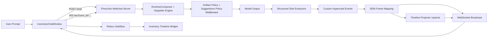
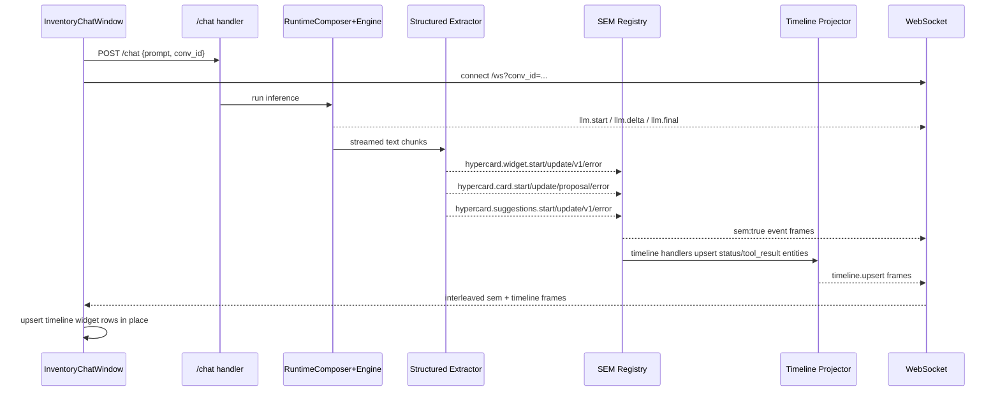
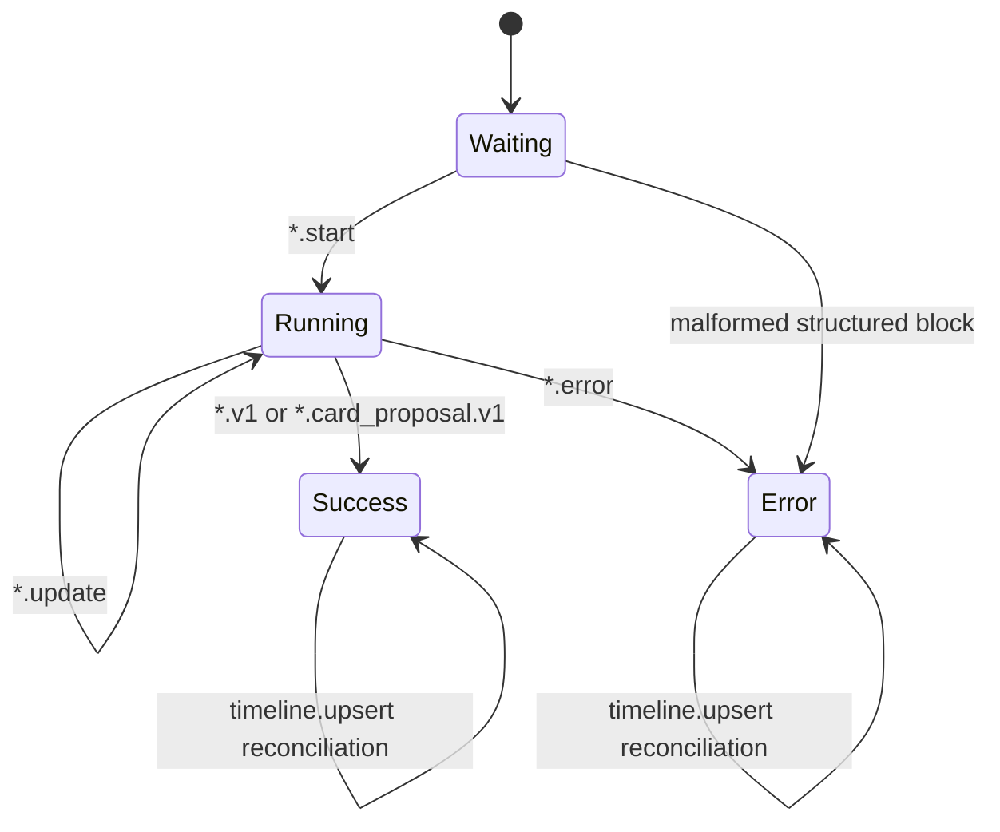

# Widget, Timeline, and Event Integration Playbook

## How to read this playbook

This document is designed as a full onboarding and execution guide, not just a reference. It assumes you do not already know this repository. Read it in order once, then use the API and checklist sections as a field manual during implementation.

The playbook is organized into eight pages:

1. System orientation
2. Backend runtime and transport architecture
3. Structured output and event pipeline
4. Timeline projection model
5. Frontend chat and timeline widget architecture
6. Cookbook: adding a new widget end-to-end
7. Testing and debugging workflows
8. Operational guardrails and implementation checklists

## Page 1: System orientation

### What this system does

The inventory chat system is a hard-cut integration between:

- a Go backend that exposes `POST /chat`, `GET /ws`, and `GET /api/timeline`
- a React frontend that streams events, renders chat output, and now renders an in-place timeline widget
- a SQLite-backed inventory domain for tool calls

The objective is deterministic, inspectable behavior with minimal fallback logic:

- tools query real inventory data
- structured widget/card outputs are parsed progressively from model text
- lifecycle events are emitted, translated to SEM frames, projected to timeline entities, and rendered in chat
- malformed structured output surfaces as explicit error events; missing structured blocks are allowed by default

### Repository map (starting points)

Backend:

- `go-inventory-chat/cmd/hypercard-inventory-server/main.go`
- `go-inventory-chat/internal/pinoweb/*.go`
- `go-inventory-chat/internal/inventorydb/*.go`

Frontend:

- `apps/inventory/src/features/chat/webchatClient.ts`
- `apps/inventory/src/features/chat/InventoryChatWindow.tsx`
- `apps/inventory/src/features/chat/chatSlice.ts`
- `apps/inventory/src/features/chat/InventoryTimelineWidget.tsx`

Ticket docs and scripts:

- `ttmp/2026/02/16/HC-033-ADD-WEBCHAT-INTEGRATION--add-webchat-integration/tasks.md`
- `ttmp/2026/02/16/HC-033-ADD-WEBCHAT-INTEGRATION--add-webchat-integration/reference/01-diary.md`
- `ttmp/2026/02/16/HC-033-ADD-WEBCHAT-INTEGRATION--add-webchat-integration/scripts/smoke-roundtrip-playwright.mjs`

### End-to-end architecture at a glance



### First local run for new developers

Backend:

```bash
cd 2026-02-12--hypercard-react/go-inventory-chat
go run ./cmd/hypercard-inventory-server hypercard-inventory-server --addr :8091
```

Frontend:

```bash
cd 2026-02-12--hypercard-react
INVENTORY_CHAT_BACKEND=http://127.0.0.1:8091 pnpm dev -- --host 127.0.0.1 --port 5173
```

Smoke check:

```bash
node ./ttmp/2026/02/16/HC-033-ADD-WEBCHAT-INTEGRATION--add-webchat-integration/scripts/smoke-roundtrip-playwright.mjs
```

## Page 2: Backend runtime and transport architecture

### Command bootstrap and route ownership

The backend is configured as a Glazed command, then mounted through Pinocchio services.

Core path:

- parse CLI sections and flags
- open/migrate/seed inventory SQLite
- construct runtime composer
- register hypercard event extensions
- build webchat server with sink wrapper
- register tools
- mount handlers for `/chat`, `/ws`, `/api/timeline`, `/api/*`, `/`

Relevant API signatures:

```go
func (c *Command) RunIntoWriter(ctx context.Context, parsed *values.Values, _ io.Writer) error
```

```go
srv, err := webchat.NewServer(
  ctx,
  parsed,
  staticFS,
  webchat.WithRuntimeComposer(composer),
  webchat.WithEventSinkWrapper(pinoweb.NewInventoryEventSinkWrapper(ctx)),
  webchat.WithDebugRoutesEnabled(os.Getenv("PINOCCHIO_WEBCHAT_DEBUG") == "1"),
)
```

### Strict request policy

Conversation and runtime policy are enforced in the custom resolver.

Key behavior:

- `GET /ws` requires `conv_id`, else `400`
- `POST /chat` accepts `prompt`/`text`, rejects runtime overrides
- runtime key is always pinned to `inventory`
- empty `conv_id` for chat request gets generated server-side

Signature:

```go
func (r *StrictRequestResolver) Resolve(req *http.Request) (webhttp.ConversationRequestPlan, error)
```

### Runtime composer contract

The runtime composer is where middleware and tool policy are fixed.

Responsibilities:

- reject runtime overrides at composition time as defense-in-depth
- build `StepSettings` from Glazed values
- inject inventory system prompt
- register middleware factories and middleware uses
- return `RuntimeArtifacts` with allowed tools and fingerprint

Signature:

```go
func (c *RuntimeComposer) Compose(ctx context.Context, req infruntime.RuntimeComposeRequest) (infruntime.RuntimeArtifacts, error)
```

### Tool registration model

Tools are registered by name and factory against the server registry.

Current tool set:

- `inventory_search_items`
- `inventory_get_item`
- `inventory_low_stock`
- `inventory_report`
- `inventory_update_qty`
- `inventory_record_sale`

Factory signature style in this codebase:

```go
func(ctx context.Context, in SomeInput) (SomeOutput, error)
```

## Page 3: Structured output and event pipeline

### Why structured extraction exists

Model text can include mixed human prose and machine-readable blocks. We need:

- progressive feedback while model streams
- strict schema checks for completion
- direct lifecycle events (start/update/ready/error)
- no hidden fallback generation

The structured sink extractor layer provides this.

### Structured tags used today

Widget block:

```text
<hypercard:widget:v1>
```yaml
...yaml...
```
</hypercard:widget:v1>
```

Card proposal block:

```text
<hypercard:cardproposal:v1>
```yaml
...yaml...
```
</hypercard:cardproposal:v1>
```

Suggestions block (optional):

```text
<hypercard:suggestions:v1>
```yaml
suggestions:
  - Show current inventory status
  - What items are low stock?
```
</hypercard:suggestions:v1>
```

### Middleware and no-fallback policy

Two policy middleware layers are installed by the runtime composer:

- `inventory_artifact_policy`: injects widget/card structured-output instructions
- `inventory_suggestions_policy`: injects optional suggestion-chip instructions

Behavioral rules:

- structured tags are optional per assistant turn (no mandatory-block enforcement)
- if a structured block is present but malformed, extractor sessions emit explicit `*.error` events
- do not synthesize fake `ready` payloads from tool output

### Progressive parse and title-gated start

Both extractor sessions (`inventoryWidgetSession`, `inventoryCardSession`) use debounced YAML parsing and emit only after minimum stable data exists.

Important invariant:

- `*.start` is emitted only after a non-empty `title` is parseable

This prevents noisy spinner rows for unnamed artifacts.

### Event types emitted by backend extension

Widget lifecycle:

- `hypercard.widget.start`
- `hypercard.widget.update`
- `hypercard.widget.v1`
- `hypercard.widget.error`

Card lifecycle:

- `hypercard.card.start`
- `hypercard.card.update`
- `hypercard.card_proposal.v1`
- `hypercard.card.error`

Suggestions lifecycle:

- `hypercard.suggestions.start`
- `hypercard.suggestions.update`
- `hypercard.suggestions.v1`
- `hypercard.suggestions.error`

### SEM mapping

Each custom event is mapped into a standard websocket SEM envelope:

```json
{
  "sem": true,
  "event": {
    "type": "hypercard.widget.v1",
    "id": "<item-id>",
    "data": {
      "itemId": "<item-id>",
      "title": "...",
      "widgetType": "...",
      "data": { "artifact": { "id": "...", "data": {} } }
    }
  }
}
```

### Sequence diagram: one prompt with structured output



## Page 4: Timeline projection model

### Timeline entities written by projection

For custom hypercard events, projection writes two classes of entities:

- `status` entities for start/update/error lifecycle messages
- `tool_result` entities for ready payloads (`hypercard.widget.v1`, `hypercard.card_proposal.v1`)

Suggestion lifecycle events are currently consumed directly by the frontend chat reducer and are not projected into durable timeline entities.

From `hypercard_events.go`:

```go
registerStatus("hypercard.widget.start", "info", ...)
registerStatus("hypercard.widget.update", "info", ...)
registerStatus("hypercard.widget.error", "error", ...)
registerStatus("hypercard.card.start", "info", ...)
registerStatus("hypercard.card.update", "info", ...)
registerStatus("hypercard.card.error", "error", ...)

registerResult("hypercard.widget.v1", "hypercard.widget.v1")
registerResult("hypercard.card_proposal.v1", "hypercard.card_proposal.v1")
```

### Frontend timeline row model

In `chatSlice.ts`, timeline rows are stored as widget props on a single system message:

```ts
export interface TimelineWidgetItem {
  id: string;
  title: string;
  status: 'running' | 'success' | 'error' | 'info';
  detail?: string;
  kind?: 'tool' | 'widget' | 'card' | 'timeline';
  template?: string;
  artifactId?: string;
  updatedAt: number;
}
```

And upserted through:

```ts
upsertTimelineItem({
  id,
  title,
  status,
  detail?,
  kind?,
  template?,
  artifactId?,
  updatedAt?
})
```

### Projection rules in frontend

`InventoryChatWindow.tsx` merges three streams into the same timeline widget:

- `tool.*` events
- custom `hypercard.*` lifecycle events
- durable `timeline.upsert` projections

Current strategy:

- prefer stable ids (`data.id` fallback for tool events)
- assign row `kind` as `tool/widget/card/timeline`
- parse structured `tool_result.result` or `resultRaw` to recover `title`, `template`, and `artifact.id`
- preserve metadata on future upserts unless explicitly replaced

### Lifecycle state diagram



### Invariants to keep

- one timeline widget message per conversation view
- in-place row updates keyed by stable `id`
- start events only after title parse
- no fallback success generation
- no required structured blocks per assistant turn

## Page 5: Frontend chat and timeline widget architecture

### Transport and envelope normalization

`InventoryWebChatClient` owns websocket lifecycle and envelope normalization.

Key interface:

```ts
export interface SemEventEnvelope {
  sem?: boolean;
  event?: { type?: string; id?: string; data?: Record<string, unknown> };
}
```

Client responsibilities:

- connect to `/ws?conv_id=<id>`
- parse incoming JSON
- normalize unknown payloads into object records
- emit typed status changes (`connecting/connected/closed/error`)

### Chat reducer boundaries

`chatSlice.ts` is responsible for:

- queued user prompt and optimistic pending AI row
- llm streaming lifecycle (`llm.start/delta/final`)
- stream error handling
- timeline widget message creation and row upserts
- suggestion chip state (`merge` on progressive events, `replace` on final ready event)
- whitespace hygiene for finalized AI/system text

Notably, timeline content is not stored in separate Redux slices yet. It is currently embedded in `ChatWindowMessage.content` for direct rendering.

Artifact records are stored separately in `artifactsSlice.ts`:

- keyed by `artifactId`
- upserted from `hypercard.widget.v1`, `hypercard.card_proposal.v1`, and equivalent projected `timeline.upsert` tool-result events
- consumed by template viewer cards via global domain projection (`domains.artifacts.byId`)

Suggestion chips are kept in chat state and passed through to `ChatWindow`:

- clear suggestions when a new user prompt is queued
- fill incrementally from `hypercard.suggestions.start/update`
- finalize/replace from `hypercard.suggestions.v1`

### Timeline widget presentation component

`InventoryTimelineWidget.tsx` is a standalone rendering component used by `ChatWindow` via `renderWidget` callback.

Presentation features:

- status glyphs (`...`, `OK`, `ERR`, `i`)
- row chips for kind (`TOOL`, `WIDGET`, `CARD`, `TIMELINE`)
- optional template chip
- artifact id display
- compact detail text
- empty-state placeholder

### Storybook coverage

New stories are in:

- `apps/inventory/src/stories/InventoryTimelineWidget.stories.tsx`

Included scenarios:

- mixed default timeline
- empty timeline
- tool-only timeline

This is the preferred way to iterate on timeline visualization without requiring backend startup.

## Page 6: Cookbook for adding a new widget type end-to-end

This section is the practical implementation recipe.

### Step A: decide the structured schema contract

Define exactly what the model must emit, for example a new widget class `trend`.

Example YAML contract:

```yaml
type: trend
title: Weekly Sell-Through
artifact:
  id: weekly_sellthrough
  data:
    points: []
actions: []
```

Rules to decide up front:

- required fields
- title requirement for `start`
- max payload size
- expected frontend rendering metadata

### Step B: update policy instructions middleware

File:

- `go-inventory-chat/internal/pinoweb/hypercard_middleware.go`

Update `defaultArtifactPolicyInstructions()` so the model sees the new contract.

Checklist:

- keep examples concise
- enforce non-empty title
- preserve no-fallback language

### Step C: update extractor payload and validation

File:

- `go-inventory-chat/internal/pinoweb/hypercard_extractors.go`

Touch points:

- payload struct fields
- `OnRaw` progressive update behavior
- `OnCompleted` validation and ready/error emission

If new fields are mandatory, validate them in `OnCompleted` and emit an error event with explicit reason.

### Step D: ensure SEM mapping has required fields

File:

- `go-inventory-chat/internal/pinoweb/hypercard_events.go`

Make sure mapping includes all frontend-required fields in `data` payload.

### Step E: timeline projection handler updates

Still in `hypercard_events.go`, adjust `registerStatus`/`registerResult` behavior if new status text or `customKind` is needed.

### Step F: frontend event mapping and row enrichment

File:

- `apps/inventory/src/features/chat/InventoryChatWindow.tsx`

Update:

- `formatHypercardLifecycle(...)`
- `formatTimelineUpsert(...)`

Populate:

- `kind`
- `template`
- `artifactId`
- concise user-facing `detail`

### Step G: frontend visual rendering

File:

- `apps/inventory/src/features/chat/InventoryTimelineWidget.tsx`

If new metadata should be visible, add chips or extra lines there.

### Step H: tests and stories

Backend tests:

- `go-inventory-chat/internal/pinoweb/hypercard_extractors_test.go`
- `go-inventory-chat/cmd/hypercard-inventory-server/main_integration_test.go`

Frontend tests:

- `apps/inventory/src/features/chat/chatSlice.test.ts`

Frontend stories:

- `apps/inventory/src/stories/InventoryTimelineWidget.stories.tsx`

## Page 7: Testing and debugging workflows

### Fast local checks

Backend unit/integration:

```bash
cd go-inventory-chat
go test ./...
```

Frontend typecheck and focused tests:

```bash
cd 2026-02-12--hypercard-react
pnpm -C apps/inventory exec tsc --noEmit
npm exec vitest run apps/inventory/src/features/chat/chatSlice.test.ts
```

Chat smoke:

```bash
node ./ttmp/2026/02/16/HC-033-ADD-WEBCHAT-INTEGRATION--add-webchat-integration/scripts/smoke-roundtrip-playwright.mjs
```

### tmux workflow used by this ticket

Backend pane:

```bash
tmux new-session -d -s hc033-backend 'cd .../go-inventory-chat && go run ./cmd/hypercard-inventory-server hypercard-inventory-server --addr :8091'
```

Frontend pane:

```bash
tmux new-session -d -s hc033-frontend 'cd .../2026-02-12--hypercard-react && INVENTORY_CHAT_BACKEND=http://127.0.0.1:8091 pnpm dev -- --host 127.0.0.1 --port 5173'
```

### How to inspect event health quickly

If timeline rows are missing or stale, verify these in order:

- websocket is connected for same `conv_id`
- `llm.*` events appear first (stream path healthy)
- custom `hypercard.*` events appear (extractor path healthy)
- `timeline.upsert` appears (projector path healthy)
- frontend `onSemEnvelope` maps those types into `upsertTimelineItem`

If suggestion chips are missing or stale, verify these in order:

- `hypercard.suggestions.*` events are present on websocket
- frontend mapping dispatches `mergeSuggestions`/`replaceSuggestions`
- reducer normalization is not dropping empty/duplicate values

### Common failure patterns and causes

No `*.start` events:

- likely missing `title` during progressive parse
- expected behavior due to title-gating rule

No suggestion chips during/after a turn:

- model did not emit `<hypercard:suggestions:v1>` (optional behavior)
- YAML block exists but `suggestions` is empty/invalid
- frontend mapping not handling `hypercard.suggestions.*`

Only errors, no `*.v1` or `*.card_proposal.v1`:

- malformed structured block
- missing required fields like `type/template/title`

`projected`-style generic rows or missing metadata:

- `tool_result` payload not parsed from `result`/`resultRaw`
- missing mapping in `formatTimelineUpsert`

Long noisy message list instead of one timeline widget:

- timeline reducer upsert path bypassed
- fallback event-to-text append still in use

### Known workspace-level limitation

Current repo has a pre-existing Vite worker format issue during production build and Storybook build:

- error: invalid `worker.format` value `iife` for code-splitting build
- source path includes `packages/engine/src/plugin-runtime/worker/sandboxClient.ts`

This issue is not specific to timeline widget work but will affect `vite build` and `storybook build` until fixed centrally.

## Page 8: Operational guardrails and implementation checklists

### Hard-cutover principles in this ticket

- prefer one real path over compatibility layers
- avoid mock/intermediate constructs unless strictly needed for short debugging loops
- keep lifecycle semantics explicit and test-backed
- keep runtime key and tool policy deterministic

### Do and do-not list

Do:

- emit explicit error events for malformed structured output
- keep `*.start` title-gated
- map both custom lifecycle and `timeline.upsert` into the same timeline row model
- preserve metadata (`kind/template/artifactId`) across updates
- add story coverage for each visible widget rendering change

Do not:

- generate fallback success payloads from tool outputs
- let frontend rely on incidental ordering of unrelated event IDs
- duplicate timeline rows for the same logical item when an upsert key exists

### Definition of done for widget/timeline changes

A change is complete only when all of the following are true:

- backend emits expected custom lifecycle events
- SEM frames contain the data frontend needs
- timeline projection creates/upserts durable entities correctly
- frontend shows in-place row updates (not event spam)
- tests cover new parsing/mapping behavior
- Storybook story exists for visual behavior
- ticket docs (`tasks`, `changelog`, `diary`) are updated

### Quick implementation checklist

Before coding:

- identify new schema fields and required validations
- identify expected timeline row identity key

During backend coding:

- update policy instructions
- update extractor parsing and validation
- update custom event and SEM mapping
- update timeline handler registration

During frontend coding:

- update envelope mapping
- update `upsertTimelineItem` payloads
- update artifact upsert mapping (`extractArtifactUpsertFromSem`)
- update timeline widget renderer
- update card open payload mapping (`buildArtifactOpenWindowPayload`)
- add/refresh stories

Before merge:

- run Go tests and frontend checks
- run manual chat prompt with live websocket
- verify one timeline widget message with in-place row updates

### Glossary

SEM frame:

- websocket JSON envelope with `sem: true` and `event` payload

Structured sink:

- parser layer that extracts structured tagged blocks from model text and emits typed events

Timeline projector:

- backend component that maps SEM events into durable timeline entities and emits `timeline.upsert`

Lifecycle event:

- event representing progress state of widget/card generation (`start/update/ready/error`)

No-fallback policy:

- explicit rule to never fabricate success payloads from non-structured output; absent optional blocks simply produce no structured lifecycle events

## Appendix: core signatures and snippets

Go signatures:

```go
func NewRuntimeComposer(parsed *values.Values, options RuntimeComposerOptions) *RuntimeComposer
func (c *RuntimeComposer) Compose(ctx context.Context, req infruntime.RuntimeComposeRequest) (infruntime.RuntimeArtifacts, error)
func NewStrictRequestResolver(runtimeKey string) *StrictRequestResolver
func (r *StrictRequestResolver) Resolve(req *http.Request) (webhttp.ConversationRequestPlan, error)
func NewInventoryEventSinkWrapper(baseCtx context.Context) webchat.EventSinkWrapper
func RegisterInventoryHypercardExtensions()
```

TypeScript signatures:

```ts
export interface SemEventEnvelope {
  sem?: boolean;
  event?: { type?: string; id?: string; data?: Record<string, unknown> };
}

export class InventoryWebChatClient {
  connect(): void;
  close(): void;
}

export interface TimelineWidgetItem {
  id: string;
  title: string;
  status: 'running' | 'success' | 'error' | 'info';
  detail?: string;
  kind?: 'tool' | 'widget' | 'card' | 'timeline';
  template?: string;
  artifactId?: string;
  updatedAt: number;
}
```

Reducer action payload:

```ts
upsertTimelineItem({
  id,
  title,
  status,
  detail?,
  kind?,
  template?,
  artifactId?,
  updatedAt?,
})
```

With this, a new developer can start from zero and implement a new widget/timeline feature with confidence and with fewer hidden assumptions.
