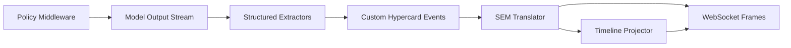
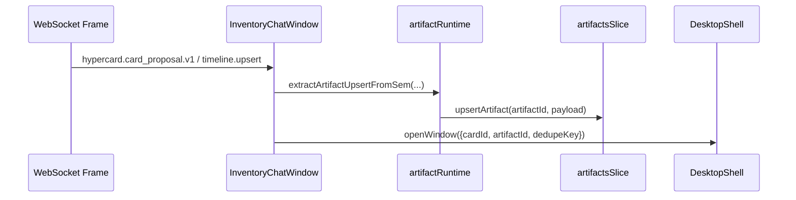
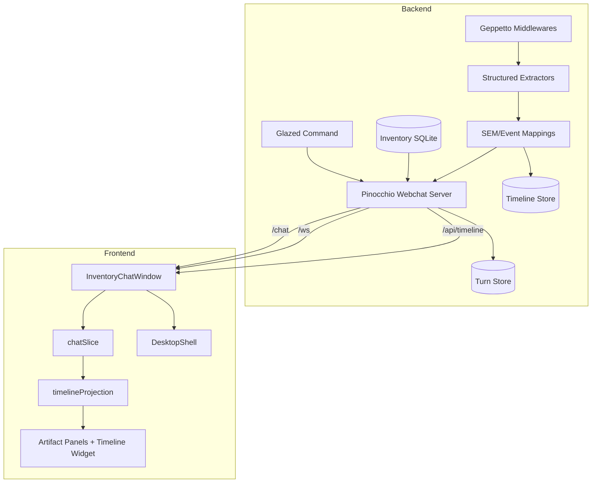

# HC-032 to HC-033 Consolidated Technical Postmortem and Continuation Guide

## 1. Purpose and audience

This document is a consolidated technical postmortem for two linked execution tickets:

1. `HC-032-CHAT-WINDOW` (full-window chat component and desktop composition groundwork)
2. `HC-033-ADD-WEBCHAT-INTEGRATION` (hard-cut integration of real backend webchat, tools, structured lifecycle events, timeline projection, persistence, and runtime cleanup)

It is written for new developers joining the project after delivery, and for maintainers preparing deferred work (`A12.*`). The goal is not only to list what changed, but to explain why each decision was made, what failed during execution, how failures were corrected, and how to continue safely.

## 2. Source corpus and method

This postmortem is based on first-party project artifacts:

1. `HC-032` diary and changelog.
2. `HC-033` diary and changelog.
3. `HC-033` implementation plan and widget/timeline integration playbook.
4. Final code state in backend and frontend repositories.

Method used for consolidation:

1. Extract timeline of implementation steps from both diaries.
2. Cross-map each step to concrete code files and commits.
3. Group findings into architectural milestones (UI substrate, transport cutover, extraction/eventing, projection, persistence, cleanup).
4. Capture failure patterns and recovery actions as reusable engineering guidance.

## 3. Executive summary

Between HC-032 and HC-033, the system moved from a story-level full-window chat UI concept to a production-ready inventory webchat runtime with durable replay.

Major outcomes:

1. Full-window `ChatWindow` and desktop integration primitives landed first (HC-032), including inline widget rendering contracts.
2. HC-033 performed a hard cutover from mock/fake chat flow to real Pinocchio webchat transport (`/chat`, `/ws`, `/api/timeline`).
3. Inventory domain/data and tools were implemented over SQLite with deterministic seed/reset flows.
4. Structured output lifecycle (`hypercard.widget.*`, `hypercard.card.*`, `hypercard.suggestions.*`) was implemented through Geppetto structured extractors and SEM mappings.
5. Frontend evolved from event-spam rendering into in-place timeline/widget/card panels and artifact-aware card opening.
6. Timeline hydration and turn persistence were validated end-to-end, including reload smoke and turn-store integration tests.
7. Duplicate assistant surface in plugin cards was removed per decision lock; one assistant surface remains (webchat app window).

Net architectural status:

1. Non-deferred phases (`0..11`) are complete in `HC-033`.
2. Remaining backlog is explicitly deferred (`A12.1`, `A12.2`, `A12.3`).

## 4. Initial baseline before HC-032

Before this workstream, chat UX in the ecosystem was mainly sidebar-style and not positioned as a first-class desktop window surface. Rich, inline structured widgets in chat messages were not formalized as a reusable full-window component contract.

On backend integration, inventory app flow was still in a mock/intermediate state and did not complete end-to-end transport + persistence + structured extraction + timeline hydration in one hard-cut path.

This baseline drove a two-ticket sequence:

1. HC-032 to establish UI substrate and composition affordances.
2. HC-033 to cut over runtime behavior to real webchat infrastructure.

## 5. HC-032 detailed recap (UI substrate phase)

### 5.1 Scope and intent

HC-032 built the full-window chat component and story infrastructure needed for future backend integration. It also improved desktop responsiveness and icon reflow so the chat surface could exist naturally in the desktop shell.

### 5.2 Step-by-step implementation timeline

#### Step 1: Full-window ChatWindow + inline widget blocks

Delivered:

1. `ChatWindow` component with streaming, welcome state, suggestions, action chips, and extensible inline widget blocks.
2. Type contracts:

```ts
export interface InlineWidget {
  id: string;
  type: string;
  props: Record<string, unknown>;
  label?: string;
}

export type ChatContentBlock =
  | { kind: 'text'; text: string }
  | { kind: 'widget'; widget: InlineWidget };

export interface ChatWindowMessage extends ChatMessage {
  content?: ChatContentBlock[];
}
```

3. Broad story coverage across streaming/error/mixed-widget states.

Why it mattered:

1. It established the exact frontend contract that HC-033 later used for timeline, card panel, and suggestions widgets.
2. It kept widget rendering host-owned through `renderWidget`, which allowed inventory-specific widget types without engine-level lock-in.

#### Step 2: Responsive desktop icon auto-flow

Delivered:

1. Dual-mode icon layout (`absolute` legacy vs `grid` auto-flow).
2. Responsive desktop shell sizing and icon reflow behavior.

Why it mattered:

1. Without this, desktop-level chat/window composition would look broken on large and narrow viewports.
2. It reduced coordination overhead in later stories and app-window cutover.

#### Step 3: Message style convergence to ChatView look

Delivered:

1. `ChatWindow` switched to shared `chat-message`/`chat-role` visual language.
2. Removed dead/duplicative CSS.

Why it mattered:

1. Minimized style divergence and maintenance duplication before HC-033 introduced high-volume event rendering.

#### Step 4: User message alignment

Delivered:

1. Scoped CSS for right-aligning user rows and leaving AI/system left-aligned.

Why it mattered:

1. Kept a familiar conversational visual grammar.

#### Step 5: Desktop story with action-based window opening and dynamic card creation simulation

Delivered:

1. Composite story proving chat->desktop window actions.
2. Prototype “create a card” behavior in story-level mutable stack patterns.

Why it mattered:

1. Demonstrated interaction patterns that later informed artifact-to-card runtime behavior in HC-033.

### 5.3 HC-032 issues and fixes

Observed issues:

1. Type rendering edge around timestamp metadata normalization.
2. Initial mismatch between custom message style and existing chat components.

Fixes:

1. Explicit timestamp coercion/guards.
2. Shared message styling adoption.

### 5.4 HC-032 carry-forward into HC-033

HC-032 provided the core frontend primitives used directly in HC-033:

1. `ChatWindow` content model.
2. `renderWidget` pluggability.
3. Desktop shell app-window composition baseline.

## 6. HC-033 detailed recap (runtime integration phase)

HC-033 progressed through planning, decision freeze, phased implementation, verification, and hard-cut cleanup.

### 6.1 Planning phase and design corrections

Early HC-033 did a deep plan validation against real code and corrected assumptions before writing runtime code.

Key corrections:

1. Command composition must follow Glazed pattern and reuse Pinocchio webchat composition.
2. Timeline/turn persistence must remain Pinocchio-owned (`timeline-*`, `turns-*` settings), no custom persistence stack.
3. Artifact/card generation is middleware + extractor/event-driven, not ad hoc frontend parsing.

Critical decision locks reached:

1. No fallback synthesis for card/widget success payloads.
2. `*.start` lifecycle events are title-gated.
3. Mandatory structured block enforcement removed (non-structured assistant turns allowed).
4. One assistant surface only.
5. Card-open dedupe per artifact.

### 6.2 Backend command and transport foundation (Phases 1-2)

Primary file:

1. `go-inventory-chat/cmd/hypercard-inventory-server/main.go`

Core composition pattern:

```go
func (c *Command) RunIntoWriter(ctx context.Context, parsed *values.Values, _ io.Writer) error {
    composer := pinoweb.NewRuntimeComposer(parsed, pinoweb.RuntimeComposerOptions{...})
    pinoweb.RegisterInventoryHypercardExtensions()

    srv, err := webchat.NewServer(
        ctx,
        parsed,
        staticFS,
        webchat.WithRuntimeComposer(composer),
        webchat.WithEventSinkWrapper(pinoweb.NewInventoryEventSinkWrapper(ctx)),
    )
    ...
}
```

Mounted route ownership:

1. `/chat`
2. `/ws`
3. `/api/timeline`
4. `/api/*`
5. `/`

What worked well:

1. Reuse-first approach reduced backend risk and let tests focus on inventory-specific behavior.
2. Strict request resolver kept runtime override policy deterministic.

### 6.3 Early frontend cutover for round-trip validation (Phase 2.5)

Goal:

1. Validate end-to-end streaming path early before artifact complexity.

Delivered:

1. Vite proxy setup for backend endpoints.
2. Minimal transport client (`conv_id` persistence + WS attach + prompt submit).
3. Streaming reducer handling `llm.start/delta/final`.
4. Playwright smoke for round-trip.

Why this was strategically correct:

1. It de-risked transport wiring before layering structured extraction and projection semantics.

### 6.4 Inventory domain and tools (Phases 3-4)

Backend domain:

1. SQLite schema/migration for `items`, `sales`.
2. Deterministic seed/reset command and script.
3. Tool set implemented and registered with allowed-tools lock.

Tool suite:

1. `inventory_search_items`
2. `inventory_get_item`
3. `inventory_low_stock`
4. `inventory_report`
5. `inventory_update_qty`
6. `inventory_record_sale`

What worked:

1. Deterministic seeded data made behavior reproducible across tests/smokes.
2. Tool contract tests stabilized interface assumptions early.

### 6.5 Middleware + extractor + SEM pipeline (Phases 5-6)

This was the technical core of HC-033.

Implemented chain:



Event families emitted:

1. `hypercard.widget.start|update|v1|error`
2. `hypercard.card.start|update|card_proposal.v1|error`
3. `hypercard.suggestions.start|update|v1|error`

Semantics:

1. Progressive parsing with incremental lifecycle emission.
2. Title-gated start emission.
3. No fallback success fabrication.

What worked:

1. Structured sink wrapper model cleanly isolated extraction concerns.
2. SEM mappings and timeline handlers gave a dual path: direct lifecycle frames + projected upserts.

What was problematic:

1. Initially, strict missing-block enforcement caused noisy user-facing errors on turns that intentionally had no structured block.
2. Policy was later corrected by removing mandatory enforcement and keeping structured blocks optional.

### 6.6 Frontend projection UX evolution (Phases 7-8)

Evolution path:

1. Started with many separate chat lines for lifecycle events (too noisy).
2. Replaced with in-place timeline widget row upserts.
3. Added dedicated generated-card and generated-widget panels.
4. Mapped suggestions lifecycle to chip widget with incremental updates.

Important rendering modules:

1. `apps/inventory/src/features/chat/chatSlice.ts`
2. `apps/inventory/src/features/chat/InventoryChatWindow.tsx`
3. `apps/inventory/src/features/chat/InventoryTimelineWidget.tsx`
4. `apps/inventory/src/features/chat/InventoryArtifactPanelWidgets.tsx`

What worked:

1. In-place upsert model drastically improved readability and reduced event spam.
2. Distinct panels for cards/widgets clarified artifact intent.

Issue encountered:

1. Timeline “Updating...” flicker due to dual stream updates overwriting row title with generic projected text.

Fix:

1. Parse projected lifecycle status and preserve stable title semantics.

### 6.7 Artifact runtime integration (Phase 9)

Delivered:

1. Artifact state keyed by artifact id.
2. SEM-to-artifact extraction adapter.
3. Viewer template cards (`reportViewer`, `itemViewer`).
4. Row-level open actions dispatching deduped card windows.

Flow:



Why it mattered:

1. This made generated artifacts first-class state and navigable UI entities.

### 6.8 Timeline hydration and persistence validation (Phase 10)

Delivered:

1. Frontend bootstrap fetch to `/api/timeline` prior to websocket connect.
2. Timeline entity hydration back into chat and artifact/timeline panels.
3. Hydrate+live merge policy via id-based upserts.
4. Dedicated projection mapper module + tests.
5. Reload/hydration smoke script.
6. Backend integration test verifying turn store snapshot persistence.

Hydration merge policy snippet:

```ts
upsertHydratedMessage({ id, role, text, status })
// If message exists by id:
// - update role/status
// - replace text only when new text is non-empty or old text empty
```

Projection module created:

1. `apps/inventory/src/features/chat/timelineProjection.ts`

Why this mattered:

1. It decoupled logic from React runtime and improved testability.

Issue encountered and fixed:

1. First reload smoke used strict AI text equality and timed out.
2. Corrected to structural persistence assertions (hydrated AI or timeline presence + entity kinds).

### 6.9 Hard-cut cleanup and final verification (Phase 11)

Delivered:

1. Removed duplicate plugin assistant surface from inventory stack and plugin bundle.
2. Removed assistant story export.
3. Added final operator runbook and known limitations in backend README.
4. Re-ran backend/frontend tests and both Playwright smokes.

Result:

1. One assistant surface remains: webchat app window.

## 7. Consolidated architecture after HC-033

### 7.1 Runtime architecture map



### 7.2 API and event contracts

Primary HTTP/WS contracts:

1. `POST /chat` with `prompt`, `conv_id`.
2. `GET /ws?conv_id=<id>` streaming SEM envelopes.
3. `GET /api/timeline?conv_id=<id>` hydration snapshot.

Core event handling families:

1. LLM streaming (`llm.start|delta|final`).
2. Tool lifecycle (`tool.start|delta|result|done`).
3. Hypercard lifecycle (`hypercard.widget.*`, `hypercard.card.*`, `hypercard.suggestions.*`).
4. Projected timeline upserts (`timeline.upsert`).

## 8. Problem log and root-cause analysis

### 8.1 Tool signature mismatch / executor compatibility

Symptom:

1. Confusion around context-bearing tool function signatures and executor adaptation.

Root cause:

1. Runtime adapters had mismatched assumptions about `ctx` handling in tool invocation wrappers.

Resolution:

1. Restored context-aware signatures and patched executor compatibility path.

### 8.2 Missing structured block hard-errors

Symptom:

1. Chat showed `missing structured widget/card block` errors for valid non-structured turns.

Root cause:

1. Overly strict middleware/enforcement policy conflating optional structured output with required output.

Resolution:

1. Removed mandatory enforcement. Structured blocks remain optional and model-authored.

### 8.3 Timeline label flicker

Symptom:

1. Row labels oscillated between rich and generic “Updating...” text.

Root cause:

1. Different event paths updated same row with inconsistent title semantics.

Resolution:

1. Added projected lifecycle parsing and stable title preservation.

### 8.4 Worker-side-effect test import issue

Symptom:

1. Unit test import path triggered `Worker is not defined` due runtime chain when testing projection behavior.

Root cause:

1. Testing logic from UI-bound module with side-effectful imports.

Resolution:

1. Extracted pure mapper (`timelineProjection.ts`) and tested that directly.

### 8.5 Brittle reload smoke assertion

Symptom:

1. First version timed out waiting for strict pre/post exact AI text equality.

Root cause:

1. Assertion coupled to text instability instead of persistence invariants.

Resolution:

1. Switched to structural assertions: hydrated UI evidence + non-empty timeline snapshot kinds.

## 9. Validation strategy and evidence matrix

### 9.1 Backend validation

Commands repeatedly used:

```bash
cd go-inventory-chat
go test ./...
```

Coverage included:

1. Route baseline behavior.
2. Structured extractor lifecycle behavior.
3. Tool contract and store behavior.
4. Turn-store persistence integration.

### 9.2 Frontend validation

Core checks:

```bash
pnpm -C apps/inventory exec tsc --noEmit
npm exec vitest run \
  apps/inventory/src/features/chat/chatSlice.test.ts \
  apps/inventory/src/features/chat/artifactsSlice.test.ts \
  apps/inventory/src/features/chat/artifactRuntime.test.ts \
  apps/inventory/src/features/chat/InventoryChatWindow.timeline.test.ts
```

Coverage included:

1. Streaming reducer semantics.
2. Artifact upsert behavior.
3. Hydration merge policy.
4. Timeline upsert status/result mapping.

### 9.3 End-to-end smoke checks

Round-trip:

```bash
node ttmp/2026/02/16/HC-033-ADD-WEBCHAT-INTEGRATION--add-webchat-integration/scripts/smoke-roundtrip-playwright.mjs
```

Reload/hydration:

```bash
node ttmp/2026/02/16/HC-033-ADD-WEBCHAT-INTEGRATION--add-webchat-integration/scripts/smoke-reload-hydration-playwright.mjs
```

Operational workflow used throughout:

1. `tmux` backend session (`hc033-backend`).
2. `tmux` frontend session (`hc033-frontend`).

## 10. What worked exceptionally well

### 10.1 Reuse-first architecture

Using existing Pinocchio + Geppetto extension points avoided custom transport/persistence rewrites and kept focus on inventory-specific concerns.

### 10.2 Phased cutover sequencing

The explicit “Phase 2.5 early frontend cutover” prevented late discovery of transport issues.

### 10.3 Event model discipline

Title-gated `start`, explicit `update`, strict no-fallback synthesis, and SEM projection created predictable lifecycle semantics.

### 10.4 Testability improvements via extraction

Moving projection logic into a pure module made edge-case behavior easier to verify and evolve.

### 10.5 Documentation rigor

The diary/changelog/task loop preserved intent and failure history, reducing reconstruction cost for future maintainers.

## 11. What did not work well

### 11.1 Early policy over-constraining

Mandatory structured-block enforcement created user-facing noise and had to be removed.

### 11.2 Initial timeline UX noise

Rendering each event as independent lines made chat unreadable until in-place widget projection was introduced.

### 11.3 Mixed-source row update semantics

Without careful normalization, lifecycle and projected events can fight over row identity/title/detail semantics.

### 11.4 Test brittleness at language layer

Assertions on exact generated text are fragile; structural invariants are more reliable for persistence checks.

## 12. Architectural invariants to preserve

These are non-negotiable unless deliberately superseded by a new approved design:

1. One assistant surface in inventory runtime path.
2. Runtime override disabled in MVP path.
3. Structured widget/card output optional but never fallback-fabricated.
4. `*.start` emitted only when title exists.
5. Timeline and turn persistence ownership remains in Pinocchio layer.
6. Frontend hydration occurs before live WS connect for same conversation.
7. Artifact window dedupe key remains artifact-oriented.

## 13. Continuation guide for new developers

### 13.1 Entry points and reading order

Recommended onboarding order:

1. `ttmp/.../design-doc/01-validated-analysis-and-hard-cutover-implementation-plan.md`
2. `ttmp/.../design-doc/02-widget-timeline-event-integration-playbook.md`
3. `ttmp/.../reference/01-diary.md` (HC-033 Steps 8 onward)
4. Backend code: `main.go`, `runtime_composer.go`, `hypercard_extractors.go`, `hypercard_events.go`
5. Frontend code: `webchatClient.ts`, `InventoryChatWindow.tsx`, `chatSlice.ts`, `timelineProjection.ts`

### 13.2 How to safely add a new lifecycle event

Checklist:

1. Define event type and payload schema in backend event module.
2. Emit from extractor/middleware with deterministic ids.
3. Register SEM mapping and timeline handler.
4. Add frontend parsing/projection logic.
5. Add pure unit test for mapper.
6. Add one integration/smoke assertion if behavior is user-visible.

Pseudo-flow:

```text
model output -> extractor parse session -> custom event -> SEM frame -> timeline.upsert
             \-> direct lifecycle frame -> frontend mapper -> in-place row upsert
```

### 13.3 How to debug timeline mismatches

1. Verify same `conv_id` across `/chat`, `/ws`, `/api/timeline`.
2. Confirm direct lifecycle events arrive over WS.
3. Confirm `timeline.upsert` is emitted for same logical entity.
4. Inspect mapper output id/kind/title/status consistency.
5. Check reducer upsert behavior for row identity collisions.

## 14. Deferred backlog context (A12)

Current deferred items:

1. `A12.1` Dynamic plugin code injection from card proposals.
2. `A12.2` Review/approve UX for generated plugin card definitions.
3. `A12.3` Extended runtime override policies for multi-runtime environments.

Current system intentionally stops short of executing generated card JS. It stores/renders artifacts through controlled viewer templates.

## 15. Risk register for next phase (especially A12.1)

If blind code injection is introduced (as requested for MVP experiment), key risks become immediate:

1. Untrusted runtime mutation and unsafe capability usage.
2. Card definition compatibility breakage across sessions.
3. Replay/persistence mismatch when generated code evolves between turns.
4. Operational irreversibility without versioned rollback.

Minimum guardrails even for blind MVP should include:

1. Session-scoped injection isolation.
2. Explicit provenance metadata per injected card.
3. Automatic capture of generated source text and hash in timeline or turn metadata.
4. Easy emergency disable flag at runtime composer boundary.

## 16. Practical runbook snapshot

Backend:

```bash
tmux new-session -d -s hc033-backend 'cd /home/manuel/workspaces/2026-02-14/hypercard-add-webchat/2026-02-12--hypercard-react/go-inventory-chat && go run ./cmd/hypercard-inventory-server hypercard-inventory-server --addr :8091 --timeline-db ./data/webchat-timeline.db --turns-db ./data/webchat-turns.db'
```

Frontend:

```bash
tmux new-session -d -s hc033-frontend 'cd /home/manuel/workspaces/2026-02-14/hypercard-add-webchat/2026-02-12--hypercard-react && INVENTORY_CHAT_BACKEND=http://127.0.0.1:8091 pnpm dev -- --host 127.0.0.1 --port 5173'
```

Smoke:

```bash
node ttmp/2026/02/16/HC-033-ADD-WEBCHAT-INTEGRATION--add-webchat-integration/scripts/smoke-roundtrip-playwright.mjs
node ttmp/2026/02/16/HC-033-ADD-WEBCHAT-INTEGRATION--add-webchat-integration/scripts/smoke-reload-hydration-playwright.mjs
```

## 17. Final assessment

HC-032 and HC-033 together delivered a successful hard cutover from concept-level chat UI to a validated backend-integrated webchat runtime with timeline and turn persistence. The implementation strategy was strong because it:

1. Reused stable infrastructure where available.
2. Sequenced risk with an early round-trip cutover checkpoint.
3. Locked explicit behavior contracts (no fallback, title-gated starts, one assistant surface).
4. Converted runtime surprises into durable tests and clearer module boundaries.

From a continuation perspective, the project is now in a strong position to attempt `A12.1`, but that attempt will cross a new risk boundary (executing generated JS), so even “blind MVP injection” should be done with targeted containment and observability from day one.

