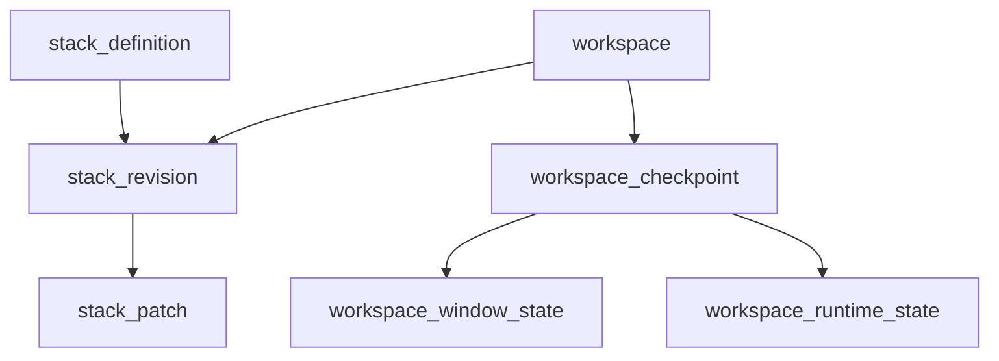

# Persistence and Management Strategies for Cards and Stacks

## Executive Summary

The current runtime already supports dynamic card code injection and per-session state, but persistence is fragmented: timeline data is durable, while plugin code revisions, runtime session state, and workspace window/nav layouts are mostly in-memory. This design proposes a durable control plane for stacks and sessions that keeps current runtime behavior while adding versioned storage, reload support, and operator-facing management UI.

Recommended direction:

- Use a two-plane persistence architecture:
  - Code plane: base bundle + immutable patch revisions.
  - State plane: workspace/session snapshots (windowing + runtime state).
- Keep event timeline persistence as a separate historical stream, not the source of truth for workspace restore.
- Hydrate state before websocket/live updates, reusing the proven chat bootstrap pattern.
- Introduce explicit code/data compatibility metadata and migration hooks.

## Problem Statement

We need to persist and manage three things that are currently only partially durable.

1. Card and stack code
- Static bundle code (`stack.plugin.bundleCode`) is durable in source control.
- Runtime-injected cards (`defineCard*`) are not persisted as first-class backend entities.

2. Runtime state
- `pluginCardRuntime.sessions[*].sessionState` and `cardState` are in Redux only.
- `windowing.windows` and per-session nav stacks are in Redux only.

3. Multi-session management
- There is no durable workspace model to list, reopen, fork, or inspect running sessions and code revisions.

Existing backend durability (timeline + turns) is strong but not targeted at this domain. It preserves event history and turn snapshots, not complete runtime workspace reconstitution.

> [!IMPORTANT]
> Persistence here is not one table. It is a consistency problem across runtime code, runtime state, and UI/session topology.

## Scope and Non-Goals

Scope:

- Persist stack code revisions including injected card code.
- Persist workspace/session state (window bounds, nav stacks, runtime session/card state).
- Restore persisted workspaces into running frontend sessions.
- Provide UI affordances to browse revisions/workspaces and manage lifecycle.
- Preserve existing capability policy and strict request posture.

Non-goals (for first implementation):

- Multi-user collaborative editing with conflict-free replicated state.
- Fine-grained real-time co-authoring of card code.
- Replacing timeline/turn stores.

## Current Baseline Constraints

### Frontend constraints

- Session host lifecycle is currently local and synchronous around `PluginCardSessionHost`.
- Session id generation in shell is ephemeral (`session-N` counters).
- Runtime registry is process-local map (`runtimeCardRegistry.ts`).
- Windowing and plugin runtime slices are independent and must be kept in sync.

### Backend constraints

- Strict resolver rejects runtime overrides (`request_resolver.go`).
- Existing chat APIs are conversation-centric (`/chat`, `/ws`, `/api/timeline`).
- SQLite patterns in Pinocchio use monotonic versioning and migration safety.

### Security constraints

- Runtime code can execute arbitrary JS inside QuickJS VM constraints.
- Capability policy prevents host-side misuse of domain/system intents.
- Persisted code introduces governance requirements (validation, provenance, rollback).

## Design Objectives

- Deterministic reconstruction:
  - Given `stack_revision_id + workspace_snapshot_version`, restore exactly the same runtime behavior.
- Bounded blast radius:
  - Bad patch or incompatible state should fail isolated session restore, not global runtime.
- Auditability:
  - Every code injection has author, timestamp, hash, and parent revision.
- Backward-compatible rollout:
  - Existing chat/timeline flow continues while new persistence APIs are introduced incrementally.
- Operational simplicity:
  - Leverage SQLite first; keep schema explicit and migration-friendly.

## Proposed Solution

## 1) Domain Model: Two Planes + Linking Keys

### Plane A: Code plane (versioned stack code)

Entities:

- `stack_definition`
  - stable `stack_id`
  - metadata (name, icon)
  - active revision pointer
- `stack_revision`
  - immutable snapshot metadata
  - points to base bundle hash and parent revision
  - code compatibility version
- `stack_patch`
  - immutable patch operation (`defineCard`, `defineCardRender`, `defineCardHandler`)
  - target card/handler + code blob + code hash

### Plane B: State plane (workspace/runtime state)

Entities:

- `workspace`
  - logical restored desktop (one user context or one task context)
- `workspace_window_state`
  - serialized `windowing.windows`, `order`, `desktop`, and per-session nav
- `workspace_runtime_state`
  - serialized `pluginCardRuntime.sessions` subset
- `workspace_checkpoint`
  - snapshot version pointer for atomic restore

### Linking keys

- `workspace.stack_revision_id` links state to code revision.
- `workspace_checkpoint.version` supports optimistic concurrency and incremental save.



> [!NOTE]
> Fundamental concept: code and state are versioned independently but restored together by a linkage pointer.

## 2) SQLite Schema Sketch (Recommended)

```sql
CREATE TABLE stack_definition (
  stack_id TEXT PRIMARY KEY,
  name TEXT NOT NULL,
  icon TEXT NOT NULL,
  active_revision_id TEXT,
  created_at_ms INTEGER NOT NULL,
  updated_at_ms INTEGER NOT NULL
);

CREATE TABLE stack_revision (
  revision_id TEXT PRIMARY KEY,
  stack_id TEXT NOT NULL,
  parent_revision_id TEXT,
  base_bundle_code TEXT NOT NULL,
  base_bundle_hash TEXT NOT NULL,
  code_schema_version INTEGER NOT NULL,
  created_by TEXT NOT NULL,
  created_at_ms INTEGER NOT NULL,
  FOREIGN KEY (stack_id) REFERENCES stack_definition(stack_id)
);

CREATE TABLE stack_patch (
  patch_id TEXT PRIMARY KEY,
  revision_id TEXT NOT NULL,
  ordinal INTEGER NOT NULL,
  op_type TEXT NOT NULL, -- defineCard | defineCardRender | defineCardHandler
  card_id TEXT NOT NULL,
  handler_name TEXT,
  code_text TEXT NOT NULL,
  code_hash TEXT NOT NULL,
  created_by TEXT NOT NULL,
  created_at_ms INTEGER NOT NULL,
  UNIQUE(revision_id, ordinal),
  FOREIGN KEY (revision_id) REFERENCES stack_revision(revision_id)
);

CREATE TABLE workspace (
  workspace_id TEXT PRIMARY KEY,
  stack_id TEXT NOT NULL,
  revision_id TEXT NOT NULL,
  title TEXT,
  created_by TEXT NOT NULL,
  created_at_ms INTEGER NOT NULL,
  updated_at_ms INTEGER NOT NULL,
  FOREIGN KEY (stack_id) REFERENCES stack_definition(stack_id),
  FOREIGN KEY (revision_id) REFERENCES stack_revision(revision_id)
);

CREATE TABLE workspace_checkpoint (
  workspace_id TEXT NOT NULL,
  version INTEGER NOT NULL,
  window_state_json TEXT NOT NULL,
  runtime_state_json TEXT NOT NULL,
  data_schema_version INTEGER NOT NULL,
  created_at_ms INTEGER NOT NULL,
  PRIMARY KEY (workspace_id, version),
  FOREIGN KEY (workspace_id) REFERENCES workspace(workspace_id)
);

CREATE INDEX workspace_checkpoint_latest
  ON workspace_checkpoint(workspace_id, version DESC);
```

Why JSON columns here are acceptable for v1:

- State shape is already JSON-like Redux structures.
- Prevents over-normalization before query needs are clear.
- Retains migration control via `data_schema_version`.

## 3) Backend Service and API Surface

Add a focused stack/workspace API namespace under inventory server.

Suggested endpoints:

- `GET /api/stacks/:stack_id/revisions/:revision_id`
  - returns base bundle + ordered patch list + code metadata
- `POST /api/stacks/:stack_id/patches`
  - validates and appends code patch to new revision
- `GET /api/workspaces/:workspace_id/load`
  - returns linked code revision + latest checkpoint
- `POST /api/workspaces/:workspace_id/checkpoints`
  - writes new checkpoint with optimistic `expected_version`
- `POST /api/workspaces`
  - create workspace from stack/revision
- `GET /api/workspaces?stack_id=...`
  - list workspaces for management UI

### Example load response

```json
{
  "workspaceId": "ws_123",
  "stackId": "inventory",
  "revision": {
    "revisionId": "rev_42",
    "baseBundleCode": "...",
    "patches": [
      {"op": "defineCard", "cardId": "profitAnalysis", "code": "({ ui }) => ({ ... })"}
    ],
    "codeSchemaVersion": 1
  },
  "checkpoint": {
    "version": 17,
    "windowState": {"windows": {}, "order": [], "desktop": {}, "sessions": {}},
    "runtimeState": {"sessions": {}},
    "dataSchemaVersion": 1
  }
}
```

### Write semantics

- Checkpoint writes are append-only versions.
- Revisions are immutable; new patch creates new revision id.
- `workspace.revision_id` can be advanced intentionally (with optional migration step).

## 4) Frontend Hydration and Save Loop

The frontend already has a working hydration pattern in chat:

- fetch snapshot
- replay state
- then connect websocket/live stream

We should mirror that for stack/workspace bootstrap.

### Proposed boot order for a persisted workspace

1. `GET /api/workspaces/:id/load`
2. Reconstruct stack runtime bundle:
   - start from base bundle
   - apply patches in order
3. Hydrate Redux slices:
   - `windowing`
   - `pluginCardRuntime`
   - optional domain slices snapshot
4. Open windows from hydrated state, preserving stable session ids.
5. Resume runtime hosts; each host loads revision bundle for its session.
6. Attach live websocket/chat updates.

### Proposed save triggers

- Debounced save every N seconds if dirty.
- Save on significant events:
  - window open/close/move/resize
  - nav changes
  - runtime state mutation
- Save on browser unload visibility change best-effort.

### Pseudocode for save coordinator

```text
on state change:
  if changed(windowing or pluginCardRuntime):
    mark dirty

every 2s:
  if dirty and !saveInFlight:
    payload = selectPersistableState(store)
    POST checkpoint(expectedVersion=currentVersion)
    if success:
      currentVersion = response.version
      dirty = false
    if version_conflict:
      refetch latest, merge-or-replay, retry
```

## 5) Live Patch Application to Active Sessions

Persisting code is not enough; active sessions must converge.

### Current capability

- `QuickJSCardRuntimeService` supports live:
  - `defineCard`
  - `defineCardRender`
  - `defineCardHandler`

### Proposed runtime session registry abstraction

Introduce a host-level registry keyed by `sessionId` with references to runtime service instances (or an adapter).

Operations:

- `applyPatchToSession(sessionId, patch)`
- `applyRevisionDeltaToAllSessions(stackId, fromRevision, toRevision)`

This should replace ad-hoc global registry behavior for persisted patches.

> [!WARNING]
> Applying patches to active sessions can break state assumptions if card code changes shape. Always run compatibility checks first.

## 6) Code/Data Versioning and Migrations

Need explicit compatibility contracts:

- `code_schema_version` on revision
- `data_schema_version` on checkpoint
- Optional per-card migration handlers

### Migration model

When upgrading workspace from revision A to B:

1. Diff affected cards/handlers.
2. For each card with state schema change, run migration function:
   - input: previous `cardState`, `sessionState`
   - output: migrated state
3. Persist new checkpoint at new version.
4. Switch workspace pointer to new revision.

### Migration hook options

- Option 1: JS migration functions stored with revision metadata.
- Option 2: Go host migration handlers keyed by `stack_id` + `from->to`.
- Option 3: Declarative transforms for common patterns (rename field, default field).

Recommendation:

- Start with host-side migration adapters in Go for safety and observability.
- Add JS-driven migrations only with strict sandbox/timeout controls.

## Design Decisions

### Decision 1: Keep timeline/turn stores separate from workspace state store

Rationale:

- timeline is event projection/history
- workspace restore needs canonical latest state
- mixing both increases complexity and query cost

### Decision 2: Immutable code revisions, append-only checkpoints

Rationale:

- simplifies audit and rollback
- aligns with existing monotonic patterns in timeline store
- avoids silent mutation of historical runtime behavior

### Decision 3: Use JSON snapshot columns for v1 state plane

Rationale:

- fast to implement
- state schema still evolving
- can normalize later using observed query requirements

### Decision 4: Hydration-before-live for workspaces

Rationale:

- proven in chat timeline flow
- avoids race where live events apply before baseline state

### Decision 5: Preserve strict request policy posture

Rationale:

- current resolver blocks arbitrary runtime overrides
- persistence APIs should remain explicit, authenticated, audited

## Alternatives Considered

## Alternative A: Snapshot-only monolith (single table with full app JSON)

Description:

- store complete app redux state + bundle code in one blob per save

Pros:

- very simple initial implementation
- easiest restore path

Cons:

- no patch audit trail
- hard diff/review for code changes
- coarse conflict management
- poor long-term maintainability

Verdict:

- acceptable as throwaway prototype, not recommended for production.

## Alternative B: Full event sourcing (all runtime intents as source of truth)

Description:

- persist every runtime intent and reconstruct state through projection replay

Pros:

- complete history
- rich debugging/replay

Cons:

- expensive replay for large sessions
- complicated projection correctness guarantees
- requires robust compaction/snapshot strategy anyway

Verdict:

- good long-term analytics complement, too heavy for first persistence milestone.

## Alternative C: Timeline piggyback only

Description:

- infer everything from existing `/api/timeline` and turn snapshots

Pros:

- minimal backend surface changes

Cons:

- timeline does not contain full window/runtime state
- code revision identity not guaranteed
- brittle reconstruction logic

Verdict:

- insufficient for deterministic workspace restore.

## Alternative D: CRDT collaborative state across clients

Description:

- synchronize state and code edits in near real-time collaborative model

Pros:

- excellent multi-user experience

Cons:

- significant complexity and new invariants
- unnecessary before single-user durable restore works

Verdict:

- defer until core persistence model is stable.

## Approach Comparison Matrix

| Approach | Durability | Auditability | Complexity | Restore Determinism | Recommended |
|---|---|---|---|---|---|
| Snapshot monolith | Medium | Low | Low | Medium | No |
| Event sourcing only | High | High | Very High | High | No (v1) |
| Timeline piggyback | Low | Low | Medium | Low | No |
| Two-plane revision + checkpoint | High | High | Medium | High | Yes |

## Implementation Plan

## Phase 0: Foundations (schema + service skeleton)

1. Add persistence package in `go-inventory-chat/internal/persistence/stackstore`.
2. Implement migrations for tables listed above.
3. Add repository interfaces and SQLite implementation.
4. Add unit tests for migration and CRUD.

Success criteria:

- can create stack revision, append patch, create workspace, append checkpoint, load latest.

## Phase 1: Read APIs + frontend loader

1. Add `GET /api/workspaces/:id/load` endpoint.
2. Add frontend workspace bootstrap module that hydrates before opening live streams.
3. Preserve existing non-persisted path behind feature flag.

Success criteria:

- refresh restores windows/nav and runtime state for chosen workspace.

## Phase 2: Save loop and optimistic concurrency

1. Add checkpoint write endpoint with `expected_version`.
2. Add frontend debounced save coordinator.
3. Handle version conflicts with refetch + replay strategy.

Success criteria:

- frequent state changes persist with no data loss during normal use.

## Phase 3: Runtime patch persistence + live apply

1. Add patch write endpoint with code validation pipeline.
2. Add frontend/host command to create persisted patch revisions.
3. Add runtime session registry and apply revision delta to active sessions.

Success criteria:

- injected card code survives reload and is visible to all relevant sessions.

## Phase 4: Management UI

1. Add workspace list and reopen/duplicate controls.
2. Add revision viewer (revision id, patch list, author/time).
3. Add rollback and fork actions with explicit confirmation.

Success criteria:

- operators can inspect and manage workspaces/revisions without direct DB access.

## Phase 5: Compatibility and migrations

1. Add code/data version metadata enforcement on load.
2. Implement migration hooks for known card state schema changes.
3. Add e2e tests for revision upgrade path.

Success criteria:

- older checkpoints remain loadable after code evolution.

## UI Management Design

A persistence system without management UI quickly becomes operational debt. Recommended UI surfaces:

### Workspace Manager panel

- list workspaces by stack and last updated
- actions: open, duplicate, archive, delete
- show active revision id and checkpoint version

### Revision Explorer panel

- show base revision and ordered patches
- show patch metadata (author, timestamp, hash)
- diff view (code text) and validation status
- actions: fork revision, rollback workspace pointer

### Session Inspector panel

- show current session ids, card ids, and health status
- show runtime errors and last intent outcomes
- allow forced reload per session

### Conflict Resolution dialog

- when save conflict occurs:
  - show local vs remote version
  - offer merge replay, overwrite, or discard local changes

## API and Data Validation Rules

At patch create time:

- parse/validate operation type and required fields
- run syntax validation for JS snippet
- optional dry-run in isolated QuickJS with timeout
- compute and persist `code_hash`
- reject oversized payloads beyond configured limit

At load time:

- ensure workspace revision exists
- ensure checkpoint schema versions are supported
- if unsupported and no migration, return explicit recoverable error

## Testing Strategy

### Unit tests

- migration idempotency
- revision and patch append semantics
- checkpoint optimistic concurrency
- schema validation and hash integrity

### Integration tests

- load workspace and restore equivalent state graph
- patch persistence and subsequent reload includes new card
- concurrent save conflict behavior

### End-to-end tests

- produce runtime card from chat -> persist patch -> reload browser -> open same card
- multi-window workspace restore with nav history and runtime state
- revision rollback and forward reapply

## Operational and Security Considerations

- Audit logs:
  - track who created each patch and checkpoint.
- Access control:
  - write endpoints should require stronger auth than read endpoints.
- Resource limits:
  - bound patch/code size and total patches per revision.
- Safety checks:
  - keep capability policy evaluation unchanged at runtime dispatch.
- Backup strategy:
  - include stack/workspace tables in existing SQLite backup workflow.

## Reference Anchors from Existing Persistence Code

This design intentionally mirrors proven patterns already used by timeline and turn stores.

Example from `pinocchio/pkg/persistence/chatstore/timeline_store_sqlite.go`:

```go
if _, err := tx.ExecContext(ctx, `
  INSERT INTO timeline_versions(conv_id, version)
  VALUES(?, ?)
  ON CONFLICT(conv_id) DO UPDATE SET version = excluded.version
`, convID, newVersion); err != nil {
  return errors.Wrap(err, "sqlite timeline store: upsert version")
}
```

Why this matters:

- It demonstrates a monotonic version cursor model.
- It demonstrates transactional update of entity state and version pointer.
- We should replicate this pattern for `workspace_checkpoint.version`.

Example from `pinocchio/pkg/persistence/chatstore/turn_store_sqlite.go`:

```go
ON CONFLICT(conv_id, session_id, turn_id) DO UPDATE SET
  turn_created_at_ms = MIN(turns.turn_created_at_ms, excluded.turn_created_at_ms),
  turn_metadata_json = excluded.turn_metadata_json,
  turn_data_json = excluded.turn_data_json,
  updated_at_ms = MAX(turns.updated_at_ms, excluded.updated_at_ms)
```

Why this matters:

- It captures careful upsert semantics instead of blind overwrite.
- We should adopt similar semantics for workspace metadata rows.

## Conflict and Merge Strategy

Checkpoint conflicts will happen when multiple tabs or clients write the same workspace.

Recommended strategy:

1. Use optimistic concurrency (`expected_version`).
2. If conflict:
  - fetch latest checkpoint
  - compute local delta since last acknowledged version
  - replay mergeable operations
3. If merge fails:
  - present operator choice (fork workspace, overwrite, discard local)

Merge priority rules for v1:

- Window bounds/z-order:
  - last writer wins per window id.
- Nav stacks:
  - prefer longest stack when both changed and top card differs.
- Runtime session/card state:
  - deep merge object keys for `patch`-style state
  - conflicting scalar keys use latest timestamp.

This should be explicit in save coordinator logs for auditability.

## State Selection Contract for Persistence

Not all Redux state should be persisted. Define a strict selector contract.

Persist now:

- `windowing.desktop`
- `windowing.windows`
- `windowing.order`
- `windowing.sessions`
- `pluginCardRuntime.sessions`

Do not persist now:

- runtime timeline and pending intent queues (debug/ephemeral)
- transient notifications
- live websocket connection status

Pseudocode selector:

```ts
function selectPersistableState(root: RootState) {
  return {
    windowing: {
      desktop: root.windowing.desktop,
      windows: root.windowing.windows,
      order: root.windowing.order,
      sessions: root.windowing.sessions,
    },
    pluginCardRuntime: {
      sessions: root.pluginCardRuntime.sessions,
    },
  };
}
```

## Rollout Strategy and Backward Compatibility

Use feature flags to avoid forcing all users into persistence path immediately.

Flags:

- `HC_PERSIST_WORKSPACES=1`:
  - enables load/save APIs and frontend save coordinator.
- `HC_PERSIST_RUNTIME_PATCHES=1`:
  - enables durable patch creation and revision updates.

Backward compatibility:

- If load API unavailable:
  - frontend falls back to current in-memory boot flow.
- If checkpoint missing:
  - create fresh workspace from stack home card.
- If checkpoint schema unsupported:
  - return explicit structured error with migration hint.

## Observability and Metrics

Add metrics early so failures are visible during rollout.

Backend metrics:

- workspace load latency and error rate
- checkpoint write latency and conflict rate
- patch validation failures by reason
- revision apply failures by op type

Frontend metrics:

- bootstrap duration (start -> first render)
- save loop success/failure count
- conflict resolution choice distribution
- session restore mismatch incidents

These metrics should be tied to workspace id and revision id for triage.

## Real Code Alignment Notes

Why this design matches current code:

- `runtimeService.ts` already offers granular patch operations, so storing patch operations is natural.
- `pluginCardRuntimeSlice.ts` already centralizes session/card state, making snapshot extraction straightforward.
- `windowingSlice.ts` already has deterministic serializable state for windows/nav.
- `InventoryChatWindow.tsx` already demonstrates hydration-before-live and can host workspace bootstrap logic.
- `timeline_store_sqlite.go` and `turn_store_sqlite.go` provide patterns for migrations, monotonic versions, and WAL DSN configuration.

## Open Questions

- Should stack/workspace persistence live in `go-inventory-chat` app layer first, or be generalized in Pinocchio package immediately?
- Do we need per-user workspace ownership now, or can workspace id be unscoped in v1?
- Should revision fork/merge be first-class in v1 UI, or postponed until patch volume justifies it?
- Do we persist domain slices snapshot in workspace checkpoint, or only windowing + runtime slices?

## References

- `ttmp/2026/02/16/HC-035-PERSIST-CARDS-STACKS--persistence-of-stacks-and-cards-including-runtime-js-injection/reference/02-hypercard-card-and-stack-mechanism-textbook.md`
- `ttmp/2026/02/16/HC-035-PERSIST-CARDS-STACKS--persistence-of-stacks-and-cards-including-runtime-js-injection/design-doc/01-stacks-and-cards-persistence-architecture-analysis.md`
- `packages/engine/src/components/shell/windowing/PluginCardSessionHost.tsx`
- `packages/engine/src/features/pluginCardRuntime/pluginCardRuntimeSlice.ts`
- `packages/engine/src/features/windowing/windowingSlice.ts`
- `go-inventory-chat/internal/pinoweb/hypercard_extractors.go`
- `pinocchio/pkg/persistence/chatstore/timeline_store_sqlite.go`
- `pinocchio/pkg/persistence/chatstore/turn_store_sqlite.go`
