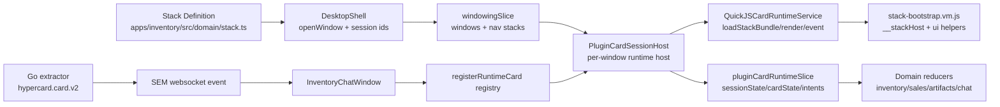
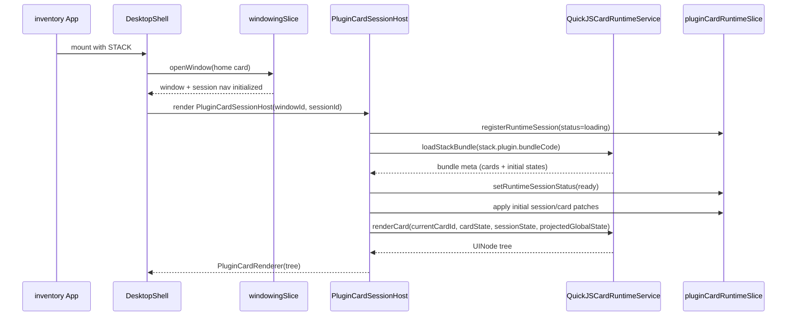
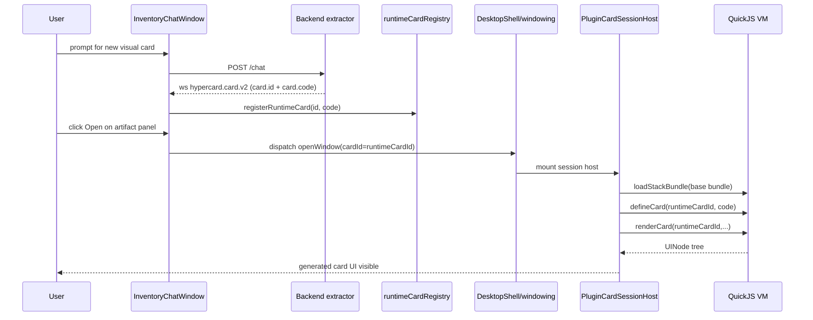

# HyperCard Card and Stack Mechanism Textbook

## Goal

This document explains the current HyperCard runtime as it exists in the codebase today, with enough depth that a new engineer can debug real behavior and safely design persistence features. It covers the card and stack model, JS bundle management, runtime session state, LLM-generated runtime cards, and where backend and frontend responsibilities meet.

## Context

The repository currently mixes two generations of ideas:

- A modern windowing + plugin runtime path centered on `DesktopShell`, `PluginCardSessionHost`, `windowingSlice`, and `pluginCardRuntimeSlice`.
- Older docs and language that still mention other shell/navigation names.

The active path for inventory uses:

- `apps/inventory/src/App.tsx` for app shell composition.
- `apps/inventory/src/domain/stack.ts` and `apps/inventory/src/domain/pluginBundle.vm.js` for stack and plugin card definitions.
- `apps/inventory/src/features/chat/InventoryChatWindow.tsx` for WebSocket event ingestion and runtime card registration.
- Go backend extraction pipeline in `go-inventory-chat/internal/pinoweb`.

> [!IMPORTANT]
> Fundamental concept: a `stack` is static metadata plus plugin bundle code, while a `session` is a runtime instance of that stack in a window. Multiple sessions can run the same stack concurrently with independent state.

## Fundamental Concepts

> [!NOTE]
> Concept 1: Stack definition is data, not execution.
> `CardStackDefinition` in `packages/engine/src/cards/types.ts` declares ids, icons, home card, plugin config, and card metadata. Execution happens later inside QuickJS.

> [!NOTE]
> Concept 2: Session identity is the join key across layers.
> `cardSessionId` links windowing navigation state, plugin runtime Redux state, and QuickJS VM lifecycle.

> [!NOTE]
> Concept 3: Runtime intents are the only write path from plugin JS to host app state.
> Plugin handlers do not mutate Redux directly. They emit intents (`card`, `session`, `domain`, `system`) that pass through policy and reducers.

> [!NOTE]
> Concept 4: LLM-generated cards are currently delivered as artifacts and then injected client-side.
> Backend emits structured `hypercard.card.v2`; frontend parses runtime card fields and registers them for injection.

## Architecture Overview



### Runtime Subsystems and Responsibilities

- Stack declaration subsystem:
  - Files: `packages/engine/src/cards/types.ts`, `apps/inventory/src/domain/stack.ts`
  - Responsibility: Declare stack id, home card, plugin code, capabilities, card catalog metadata.
- Windowing subsystem:
  - Files: `packages/engine/src/features/windowing/windowingSlice.ts`, `packages/engine/src/components/shell/windowing/DesktopShell.tsx`
  - Responsibility: Open/focus/close windows; maintain per-session navigation stack.
- Plugin runtime subsystem:
  - Files: `packages/engine/src/components/shell/windowing/PluginCardSessionHost.tsx`, `packages/engine/src/plugin-runtime/runtimeService.ts`, `packages/engine/src/plugin-runtime/stack-bootstrap.vm.js`
  - Responsibility: Load JS bundle in QuickJS, render cards, dispatch event handlers.
- Runtime state subsystem:
  - File: `packages/engine/src/features/pluginCardRuntime/pluginCardRuntimeSlice.ts`
  - Responsibility: Hold per-session session/card state and intent queues.
- Chat + artifact ingestion subsystem:
  - Files: `apps/inventory/src/features/chat/InventoryChatWindow.tsx`, `apps/inventory/src/features/chat/artifactRuntime.ts`
  - Responsibility: Consume semantic events and upsert artifacts, including runtime card definitions.
- Backend extraction subsystem:
  - Files: `go-inventory-chat/internal/pinoweb/hypercard_extractors.go`, `go-inventory-chat/internal/pinoweb/hypercard_events.go`
  - Responsibility: Parse LLM structured blocks and emit semantic events (`hypercard.card.v2`, etc.).

## Data Model Deep Dive

## 1) Stack and Card Definitions

The canonical type model is in `packages/engine/src/cards/types.ts`:

```ts
export interface CardStackDefinition {
  id: string;
  name: string;
  icon: string;
  homeCard: string;
  plugin: { bundleCode: string; capabilities?: { domain?: 'all' | string[]; system?: 'all' | string[] } };
  cards: Record<string, CardDefinition>;
}
```

Important implications:

- `cards` in stack definition are metadata used by shell menus/icons and fallback checks.
- Real plugin render/handler logic lives in `plugin.bundleCode` (for inventory this is `INVENTORY_PLUGIN_BUNDLE` from `pluginBundle.vm.js`).
- The runtime can serve cards not predeclared in `stack.cards` if they are injected and present in runtime registry.

In `apps/inventory/src/domain/stack.ts` the `cards` map includes placeholders (`type: 'plugin'`, simple `ui` text) while functional logic is in `pluginBundle.vm.js`. This split is intentional: the runtime JS bundle is authoritative for plugin behavior.

## 2) Windowing State and Session Navigation

`windowingSlice` (`packages/engine/src/features/windowing/windowingSlice.ts`) holds:

- `windows: Record<string, WindowInstance>`
- `order: string[]`
- `desktop` focus/menu state
- `sessions: Record<string, SessionNav>` where each has `nav: NavEntry[]`

Core behavior:

- `openWindow` optionally dedupes by `dedupeKey`.
- For card windows with `cardSessionId`, it bootstraps `sessions[sessionId].nav` with first card.
- `sessionNavGo/back/home` mutate per-session navigation stack.
- `closeWindow` removes associated session nav state.

```ts
if (spec.content.kind === 'card' && sessionId && !state.sessions[sessionId]) {
  state.sessions[sessionId] = {
    nav: [{ card: cardId, param: spec.content.card?.param }],
  };
}
```

This means card navigation is stateful per session, not global per stack.

## 3) Plugin Runtime Session State

`pluginCardRuntimeSlice` stores per-session runtime state separate from windowing:

- `sessions[sessionId].sessionState: Record<string, unknown>`
- `sessions[sessionId].cardState[cardId]: Record<string, unknown>`
- capability policy per session
- timeline log of intents and outcomes
- pending domain/system/nav intent queues

The reducer path `ingestRuntimeIntent` does this:

- `card` scope -> mutate `cardState[cardId]`
- `session` scope -> mutate `sessionState`
- `domain` scope -> enqueue pending domain intent if allowed
- `system` scope -> enqueue pending system intent if allowed

The local mutation API supports:

- `patch` (shallow merge)
- `set` (`path` + `value`, deep set)
- `reset` (clear object)

This cleanly separates VM intent production from host side effect execution.

## 4) QuickJS Session Runtime

`QuickJSCardRuntimeService` (`packages/engine/src/plugin-runtime/runtimeService.ts`) owns VM instances:

- `vms: Map<sessionId, SessionVm>`
- one runtime/context per session
- deadlines for load/render/event to enforce timeout boundaries
- memory and stack limits

Key APIs:

- `loadStackBundle(stackId, sessionId, code)`
- `renderCard(sessionId, cardId, cardState, sessionState, globalState)`
- `eventCard(sessionId, cardId, handler, args, cardState, sessionState, globalState)`
- `defineCard`, `defineCardRender`, `defineCardHandler`
- `disposeSession`

The bootstrap script `stack-bootstrap.vm.js` injects:

- `globalThis.defineStackBundle`
- `globalThis.__stackHost.getMeta/render/event/defineCard*`
- `ui.*` helper constructors for node kinds (`panel`, `row`, `button`, `table`, etc.)

## Lifecycle Walkthrough: App Boot to First Card Render

The following flow is what new engineers should memorize first.



### What `PluginCardSessionHost` Actually Does

In `packages/engine/src/components/shell/windowing/PluginCardSessionHost.tsx`:

1. Resolves plugin config from stack.
2. Ensures runtime session exists in Redux (`registerRuntimeSession`).
3. Loads bundle into QuickJS when session status is `loading`.
4. Marks session `ready`.
5. Injects any already-registered runtime cards (`injectPendingCards`).
6. Applies initial state from bundle metadata.
7. Computes projected global state for plugin consumption.
8. Calls `renderCard` on each render pass.
9. On UI events, calls `eventCard` and dispatches each returned intent via `dispatchRuntimeIntent`.
10. On unmount, disposes VM session and removes runtime session from Redux.

> [!IMPORTANT]
> `PluginCardSessionHost` is the bridge where persistence restore will need to land: before first render, after bundle load, and before live intent processing.

## How JavaScript Code Is Managed Today

Code enters runtime through three channels.

## Channel A: Static plugin bundle

- Source file: `apps/inventory/src/domain/pluginBundle.vm.js`
- Bound in stack: `apps/inventory/src/domain/stack.ts` (`plugin.bundleCode`)
- Load moment: session enters `loading` and host calls `loadStackBundle`

Pros:

- deterministic, versioned by git
- available at startup

Limitations:

- requires deployment for changes

## Channel B: Story/demo mutation of bundle code

In `packages/engine/src/components/shell/windowing/ChatWindowDesktop.stories.tsx`, card creation appends strings to `stack.plugin.bundleCode`:

```ts
const defineCall = `\nglobalThis.__stackHost.defineCard(${JSON.stringify(template.id)}, (${template.code}));\n`;
stack.plugin.bundleCode += defineCall;
```

This proves runtime mutability but is intentionally demo-level (no durability, no audit trail, no validation pipeline).

## Channel C: Runtime card registry + live injection

Inventory path uses runtime registry:

- registration: `registerRuntimeCard(cardId, code)` in `runtimeCardRegistry.ts`
- injection on host ready and on registry changes:
  - `injectPendingCards(runtimeService, sessionId)`

Registry behavior:

- global in-memory map
- not persisted
- applies to future and currently ready sessions via subscription callback

This is the mechanism currently used by chat-driven card generation.

## Intent System and Side-Effect Routing

Plugin handler output is a list of `RuntimeIntent` objects, validated by `validateRuntimeIntents`.

Supported scopes:

- `card`: mutate card-local state
- `session`: mutate per-session shared plugin state
- `domain`: dispatch to host domain reducer namespace
- `system`: navigation and shell commands

`dispatchRuntimeIntent` (`pluginIntentRouting.ts`) first logs/ingests intent into runtime slice, then conditionally forwards to host effects after capability checks.

System commands currently handled:

- `nav.back`
- `nav.go`
- `notify`
- `window.close`

Domain intent forwarding maps to action type `${domain}/${actionType}` with metadata:

```ts
{
  type: `${intent.domain}/${intent.actionType}`,
  payload: intent.payload,
  meta: { source: 'plugin-runtime', sessionId, cardId },
}
```

This is how plugin code in `pluginBundle.vm.js` updates inventory/sales slices.

## Session State Management Across Running Sessions

A common confusion is that there are several independent state planes.

### Plane 1: Window shell state

- slice: `windowing`
- owns: open windows, bounds, focus, nav stacks
- lifetime: until window closes or app reloads

### Plane 2: Plugin runtime state

- slice: `pluginCardRuntime`
- owns: plugin session state and per-card state
- lifetime: until session removed or app reloads

### Plane 3: Domain app state

- slices in inventory app: `inventory`, `sales`, `artifacts`, `chat`
- updated by normal Redux actions and domain intents from plugin runtime

### Plane 4: VM internal execution state

- location: QuickJS runtime context in `QuickJSCardRuntimeService`
- includes registered card definitions in VM memory
- lifetime: until `disposeSession` or reload

### Plane 5: Backend durable timeline/turn state

- timeline API: `/api/timeline`
- stores semantic projection and turn snapshots
- does not yet persist full plugin runtime session/window state

> [!NOTE]
> You cannot reason about bugs in card behavior by looking at only one plane. Most real issues are plane synchronization issues.

## How New Cards Are Created from LLM Conversations

This path is the core of the user request and should be understood end-to-end.

### Backend generation and extraction

- Prompt policy in `go-inventory-chat/internal/pinoweb/prompts/runtime-card-policy.md` requires a `<hypercard:card:v2>` YAML block containing `artifact` and `card.id/code`.
- `inventoryRuntimeCardExtractor` in `hypercard_extractors.go` parses streamed content and emits:
  - `hypercard.card.start`
  - `hypercard.card.update`
  - `hypercard.card.v2`
  - `hypercard.card.error`

### Event transport

`hypercard_events.go` maps typed events into SEM envelopes and publishes through websocket path consumed by frontend.

### Frontend ingestion

`InventoryChatWindow.tsx` -> `onSemEnvelope`:

- Parse event type/data.
- `extractArtifactUpsertFromSem` handles `hypercard.card.v2` and extracts:
  - `runtimeCardId`
  - `runtimeCardCode`
- Dispatch `upsertArtifact` into `artifacts` slice.
- If runtime card fields present, call `registerRuntimeCard(runtimeCardId, runtimeCardCode)`.

Relevant snippet (`InventoryChatWindow.tsx`):

```ts
if (artifactUpdate.runtimeCardId && artifactUpdate.runtimeCardCode) {
  registerRuntimeCard(artifactUpdate.runtimeCardId, artifactUpdate.runtimeCardCode);
}
```

### User opening generated artifact card

When user clicks Open in widget/card panel:

- UI resolves artifact id.
- Looks up artifact record to find `runtimeCardId`.
- Builds `OpenWindowPayload` via `buildArtifactOpenWindowPayload`.
- Uses `runtimeCardId` as `cardId` when available.

`artifactRuntime.ts` logic:

- static templates map to `reportViewer` / `itemViewer`
- runtime card path uses dynamic card id and icon variant

### Injection into session

When corresponding card session host becomes ready, `injectPendingCards` defines runtime cards in VM via `service.defineCard`.

This is why generated cards can open as plugin windows without code redeploy.

## Hydration and Reload Behavior Today

Current durable hydration is primarily chat timeline, not full runtime workspace.

### Implemented today

- `InventoryChatWindow` bootstrap calls `fetchTimelineSnapshot(convId)` before websocket connect.
- Snapshot entities are replayed into chat/timeline/artifact slices.
- This allows message and artifact recovery on refresh.

### Missing today

- persisted `windowing` state (open windows, bounds, nav)
- persisted `pluginCardRuntime` state (sessionState/cardState)
- persisted runtime registry entries (`runtimeCardRegistry`)
- persisted VM code revision history

Consequences:

- refresh loses open card windows and plugin session interaction state
- generated runtime card definitions are lost unless rebuilt from timeline artifacts and re-registered
- no backend source of truth for which code revisions were active in a workspace session

## Debugging the Mechanism

### Fast file map for debugging

- window not opening or wrong card id:
  - `packages/engine/src/components/shell/windowing/DesktopShell.tsx`
  - `packages/engine/src/features/windowing/windowingSlice.ts`
  - `apps/inventory/src/features/chat/artifactRuntime.ts`
- plugin card renders blank:
  - `packages/engine/src/components/shell/windowing/PluginCardSessionHost.tsx`
  - `packages/engine/src/plugin-runtime/runtimeService.ts`
  - `packages/engine/src/plugin-runtime/stack-bootstrap.vm.js`
- handler click does nothing:
  - `packages/engine/src/components/shell/windowing/PluginCardRenderer.tsx`
  - `packages/engine/src/components/shell/windowing/pluginIntentRouting.ts`
  - capability policy in `packages/engine/src/features/pluginCardRuntime/capabilityPolicy.ts`
- runtime card from chat not appearing:
  - `apps/inventory/src/features/chat/InventoryChatWindow.tsx`
  - `apps/inventory/src/features/chat/artifactRuntime.ts`
  - `packages/engine/src/plugin-runtime/runtimeCardRegistry.ts`
  - backend extractor files in `go-inventory-chat/internal/pinoweb`

### Recommended trace recipe

1. Trigger chat that produces `hypercard.card.v2`.
2. Confirm event appears in Event Viewer window.
3. Confirm artifact has `runtimeCardId` and `runtimeCardCode` in Redux.
4. Confirm runtime registry contains card (`RuntimeCardDebugWindow`).
5. Open artifact card; inspect payload `cardId` in log.
6. Confirm plugin session host reports injection success.
7. Confirm VM render path for that `cardId` returns valid UI tree.

## Pseudocode Summary for New Engineers

### Session host startup

```text
on mount(sessionId, stack, windowId):
  if no plugin config: show error
  ensure runtime session exists in redux(status=loading)
  load stack bundle into quickjs vm
  mark runtime session ready
  inject all pending runtime cards into vm
  apply bundle.initialSessionState to runtime slice
  apply bundle.initialCardState per card
  render current nav card with cardState + sessionState + projectedGlobalState
```

### Runtime handler dispatch

```text
on UI event(handler, args):
  intents = vm.eventCard(...)
  for each intent:
    ingest into runtime timeline/state
    if capability allows and scope is domain:
      dispatch domain action
    if capability allows and scope is system:
      map to nav/notify/window action and dispatch
```

### LLM runtime card ingest

```text
on sem envelope:
  if hypercard.card.v2:
    upsert artifact record
    if card.id and card.code exist:
      register runtime card in global registry

on plugin session ready or registry change:
  for each registry card:
    defineCard(sessionId, cardId, code)
```

## Usage Examples

### Example 1: Add a new static plugin card

1. Add card metadata to `INVENTORY_CARD_META` in `apps/inventory/src/domain/stack.ts`.
2. Add card behavior in `apps/inventory/src/domain/pluginBundle.vm.js` under `cards` map.
3. Ensure handlers emit allowed system/domain intents.
4. Confirm capabilities allow those intents.

### Example 2: Validate generated card flow from backend to frontend

1. Ask chat for a visual card.
2. Confirm extractor produced `hypercard.card.v2` event.
3. Confirm `artifacts.byId[artifactId].runtimeCardCode` exists.
4. Open artifact and ensure `buildArtifactOpenWindowPayload` uses `runtimeCardId`.
5. Inspect runtime debug window to verify session and card state.

### Example 3: Reason about a state bug

If card form state resets unexpectedly:

- Check if window closed/reopened (new session id implies fresh runtime state).
- Check if handler emitted `reset` on `card` or `session` scope.
- Check if `sessionNavHome` changed card and your state is card-local.
- Check if bundle initial state is being re-applied due session re-registration.

## Known Gaps Relevant to Persistence Work

- No backend API currently persists plugin session/window state.
- Runtime card registry is in-memory only.
- No revision model for runtime injected code.
- No guaranteed restore of open windows/nav stacks after reload.
- Timeline hydration restores artifacts but not full runtime workspace.

These gaps are the exact boundary addressed in `design-doc/02-persistence-and-management-strategies-for-cards-and-stacks.md`.

## Deep Walkthrough: One Prompt to One Generated Card Window

This section provides a concrete, execution-ordered narrative that engineers can replay while debugging.

### Step A: User sends prompt

- Component: `apps/inventory/src/features/chat/InventoryChatWindow.tsx`
- Function: `handleSend`
- Action:
  - dispatch local user prompt into chat slice (`queueUserPrompt`)
  - call `submitPrompt(prompt, conversationId)` to `/chat`

### Step B: Backend streams semantic events

- Go resolver validates request and conversation id in `request_resolver.go`.
- Runtime middleware enforces artifact policy (must output structured widget/card blocks).
- Extractors parse streamed content and publish card lifecycle events:
  - `hypercard.card.start`
  - `hypercard.card.update`
  - `hypercard.card.v2`

### Step C: Frontend receives `hypercard.card.v2`

- In `onSemEnvelope`:
  - parse event payload
  - `extractArtifactUpsertFromSem` extracts artifact and runtime card fields
  - store artifact in `artifacts.byId`
  - call `registerRuntimeCard(cardId, code)`

### Step D: User opens artifact window

- Widget panel `Open` action resolves artifact id.
- `buildArtifactOpenWindowPayload` creates card window spec:
  - `content.kind = 'card'`
  - `content.card.cardId = runtimeCardId`
  - `content.card.cardSessionId = artifact-session:<artifact>`
- `openWindow` dispatch creates window and session nav state.

### Step E: Runtime session host loads and injects

- `PluginCardSessionHost` registers runtime session (status `loading`).
- Loads bundle into QuickJS.
- Marks status `ready`.
- Calls `injectPendingCards` so runtime-generated card exists in VM.
- Renders current nav card id (which is the runtime card id for artifact windows).

### Step F: Interaction loop

- User clicks button in generated card.
- `PluginCardRenderer` maps UI event ref to handler name/args.
- Host calls `eventCard`.
- VM returns intents.
- Host dispatches intents via `dispatchRuntimeIntent`.
- Runtime and domain state mutate; UI rerenders.



## Invariants and Practical Rules

These rules are essential when implementing persistence or debugging regressions.

- Session id stability:
  - Any restore path must preserve `cardSessionId`; otherwise window/nav/runtime state will desynchronize.
- Nav and runtime coupling:
  - Windowing nav stack and runtime session state are separate slices, but user behavior assumes they move together.
- Capability checks:
  - Domain/system intents can be emitted by VM but still denied by policy; this is expected behavior, not always a bug.
- Bundle first, patch second:
  - Dynamic card injection assumes base bundle already loaded in VM context.
- Artifact id vs card id:
  - Artifact id identifies generated result object.
  - Runtime card id is executable card identity. They are different keys.

## Troubleshooting Playbook by Symptom

### Symptom: Generated card opens blank with \"No plugin output\"

Likely causes:

- runtime card id not registered
- defineCard injection failed
- render function returned invalid UI schema

Checks:

1. Verify artifact contains `runtimeCardId` and `runtimeCardCode` in `artifacts` slice.
2. Verify runtime registry includes id.
3. Verify session host logs successful injection.
4. Check `runtimeService.renderCard` errors and toast output.
5. Confirm generated code returns valid node kinds supported by `validateUINode`.

### Symptom: Clicking generated card buttons does nothing

Likely causes:

- handler name mismatch (`onClick.handler` not present in `handlers`)
- handler emits denied system/domain command
- payload shape fails command translation in `pluginIntentRouting.ts`

Checks:

1. Inspect emitted intents in runtime timeline.
2. Inspect `pendingSystemIntents` and `pendingDomainIntents`.
3. Confirm `stack.plugin.capabilities` includes required command/domain.

### Symptom: State disappears after refresh

Expected today for plugin/windowing runtime state.

Checks:

1. Confirm only timeline/artifact/chat entities rehydrate from `/api/timeline`.
2. Confirm no workspace persistence bootstrap exists yet.

## Glossary for New Engineers

- Stack:
  - Declarative metadata + plugin bundle code for an application domain.
- Card:
  - A renderable/interactable unit identified by `cardId`.
- Session:
  - Runtime instance of stack behavior bound to a window via `cardSessionId`.
- Runtime state:
  - Session and card state managed in `pluginCardRuntime`.
- Windowing state:
  - Desktop/window/nav metadata in `windowing`.
- Runtime patch:
  - A dynamic code operation (`defineCard*`) applied after base bundle load.
- Artifact:
  - Structured LLM output object tracked in `artifacts` slice and timeline panels.

## Related

- `ttmp/2026/02/16/HC-035-PERSIST-CARDS-STACKS--persistence-of-stacks-and-cards-including-runtime-js-injection/design-doc/01-stacks-and-cards-persistence-architecture-analysis.md`
- `ttmp/2026/02/16/HC-035-PERSIST-CARDS-STACKS--persistence-of-stacks-and-cards-including-runtime-js-injection/design-doc/02-persistence-and-management-strategies-for-cards-and-stacks.md`
- `ttmp/2026/02/16/HC-035-PERSIST-CARDS-STACKS--persistence-of-stacks-and-cards-including-runtime-js-injection/reference/01-diary.md`
