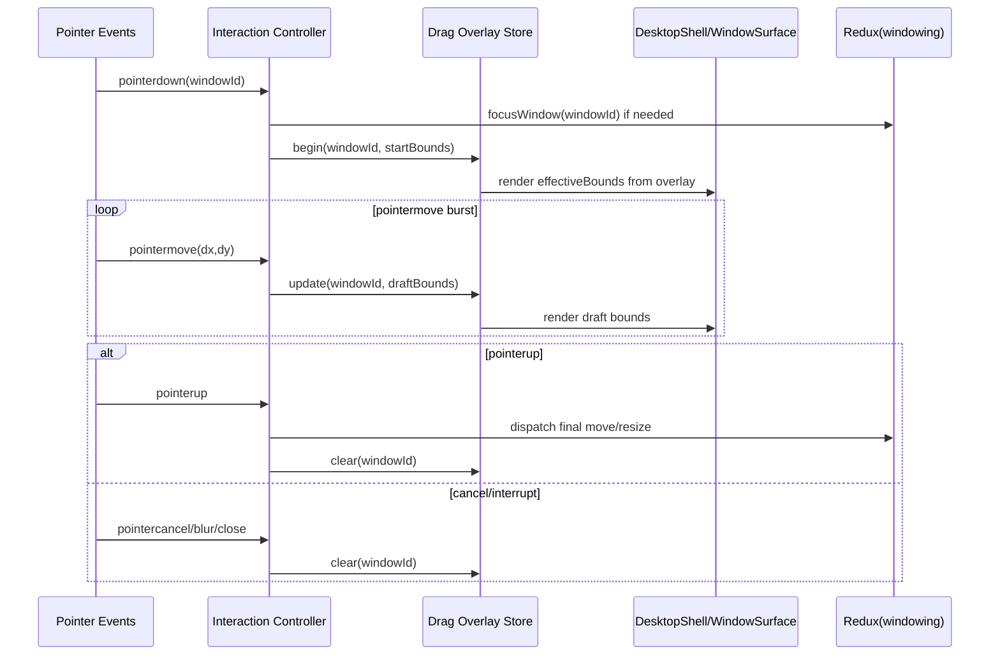

# W-C Implementation Guide: Ephemeral Overlay Drag Lane

## Executive Summary

W-C introduces an ephemeral geometry overlay for active drag/resize interactions:

1. Durable Redux window bounds remain canonical settled state.
2. Pointer-move updates write to a transient overlay map keyed by `windowId`.
3. UI renders `effectiveBounds = overlayBounds ?? reduxBounds`.
4. On pointerup, overlay is committed to Redux once and cleared.
5. On cancel/interrupt, overlay is discarded and Redux state remains unchanged.

This removes high-frequency durable writes while preserving current windowing semantics.

## Problem Statement

Current drag behavior updates durable store geometry during interactions, which causes unnecessary reducer and render pressure during pointer bursts. We need smoother interactions without losing:

1. Redux source-of-truth semantics for settled state.
2. Existing focus/z-index and close behavior.
3. Deterministic end-of-drag window bounds.

## Proposed Solution

### Core state model

1. **Durable lane** (existing): `windowing.windows[id].bounds`
2. **Ephemeral overlay lane** (new): `overlayByWindowId[id] = {x,y,w,h}` during interaction only

Overlay storage options (choose one):

1. React-local state in DesktopShell (`useRef + useSyncExternalStore` or `useState`)
2. Small dedicated external store module under windowing

Preferred for W-C: small external store to avoid parent churn and keep interaction concerns isolated.

### Effective bounds projection

For each window:

```ts
function selectEffectiveBounds(windowId: string): Bounds {
  const overlay = dragOverlayStore.get(windowId);
  if (overlay) return overlay;
  return selectWindowById(store.getState(), windowId)?.bounds ?? DEFAULT_BOUNDS;
}
```

### Interaction lifecycle contract

1. `begin`: capture durable start bounds + pointer origin; write initial overlay.
2. `move`: update overlay only (no durable `moveWindow/resizeWindow` dispatch on each move).
3. `commit`: on pointerup, dispatch final durable move/resize once; clear overlay.
4. `cancel`: on pointercancel/blur/close/unmount, clear overlay without durable commit.

## Timeline Diagram



## Design Decisions

1. Keep canonical settled geometry in existing Redux window map.
2. Keep overlay strictly transient and memory-bounded (active interactions only).
3. Require explicit cleanup for every termination path.
4. Keep focus dispatch at interaction start only, guarded against redundant focus.
5. Keep W-C compatible with W-D memoization and optional W-A throttling.

## Detailed Implementation Plan

### Phase 1: Overlay infrastructure

1. Add `dragOverlayStore.ts` with API:
   - `begin(windowId, bounds)`
   - `update(windowId, bounds)`
   - `clear(windowId)`
   - `clearAll()`
   - `subscribe/getSnapshot`
2. Add `useDragOverlaySnapshot()` hook.

### Phase 2: Desktop composition

1. In `DesktopShell.tsx`, compute per-window effective bounds from overlay snapshot + durable window defs.
2. Ensure only geometry fields are overridden by overlay.
3. Keep existing z-index/focus from durable state.

### Phase 3: Interaction controller wiring

1. In `useWindowInteractionController.ts`, route pointermove to overlay updates.
2. On pointerup:
   - dispatch final durable `moveWindow` or `resizeWindow`
   - clear overlay entry
3. On pointercancel/blur/unmount:
   - clear overlay entry
   - do not dispatch durable commit

### Phase 4: Safety and diagnostics

1. Add dev assertion for stale overlays older than threshold.
2. Clear overlay on close-window and desktop reset paths.
3. Add lightweight counters for begin/update/commit/cancel rates.

## Pseudocode

```ts
type DragSession = {
  windowId: string;
  mode: 'move' | 'resize';
  startPointer: { x: number; y: number };
  startBounds: Bounds;
  latestBounds: Bounds;
};

let active: DragSession | null = null;

function beginDrag(windowId: string, mode: 'move' | 'resize', e: PointerEvent) {
  const start = getDurableBounds(windowId);
  if (!start) return;

  active = {
    windowId,
    mode,
    startPointer: { x: e.clientX, y: e.clientY },
    startBounds: start,
    latestBounds: start,
  };

  overlay.begin(windowId, start);
}

function onMove(e: PointerEvent) {
  if (!active) return;

  const dx = e.clientX - active.startPointer.x;
  const dy = e.clientY - active.startPointer.y;

  const next = active.mode === 'move'
    ? clampMove(active.startBounds, dx, dy)
    : clampResize(active.startBounds, dx, dy);

  active.latestBounds = next;
  overlay.update(active.windowId, next);
}

function commit() {
  if (!active) return;
  dispatchFinalBounds(active.windowId, active.mode, active.latestBounds);
  overlay.clear(active.windowId);
  active = null;
}

function cancel() {
  if (!active) return;
  overlay.clear(active.windowId);
  active = null;
}
```

## Alternatives Considered

1. Continue durable Redux writes per move (status quo): simplest, but highest pressure.
2. W-A only (rAF throttle): reduces action rate but still durable high-frequency updates.
3. W-E interaction substate in Redux: better selector scoping but still Redux high-frequency action path.

W-C was selected as a direct way to remove durable write pressure during interaction while preserving settled Redux truth.

## Verification Checklist

1. Drag feels smooth with multiple windows and heavy card content.
2. Durable `moveWindow/resizeWindow` dispatch count drops to commit-only (or checkpoint-only if enabled).
3. No stale overlays after cancel, close, blur, or navigation reset.
4. Focus and z-order behavior remains unchanged.
5. Window final bounds match pointer-end expectation.

## Rollout Strategy

1. Gate behind feature flag `windowing.dragOverlayEnabled`.
2. Enable in dev first with counters + warning logs.
3. Compare baseline/action metrics before rollout.
4. Keep fallback path to current behavior for rollback.

## Open Questions

1. Should periodic checkpoint commits be enabled by default for crash recovery?
2. Should overlay state be inspectable in debug window for diagnostics?
3. Should resize and move use separate cancel semantics for ESC?

## References

- `2026-02-12--hypercard-react/ttmp/2026/02/17/HC-037-UI-CLEANUP--ui-cleanup-frontend-store-and-windowing-performance/design-doc/01-redux-event-pipeline-and-window-dragging-performance-analysis.md`
- `2026-02-12--hypercard-react/packages/engine/src/components/shell/windowing/DesktopShell.tsx`
- `2026-02-12--hypercard-react/packages/engine/src/components/shell/windowing/useWindowInteractionController.ts`
- `2026-02-12--hypercard-react/packages/engine/src/features/windowing/windowingSlice.ts`
