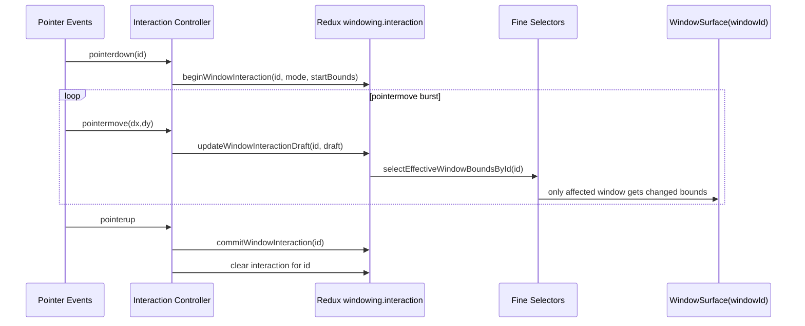

# W-E Implementation Guide: Redux Interaction Geometry Channel

## Executive Summary

W-E keeps all drag state in Redux but splits durable and interaction concerns:

1. `windowing.windows` remains durable settled geometry.
2. `windowing.interaction` holds high-frequency draft bounds.
3. UI subscribes with finer selectors (`windowId`-scoped effective bounds) to limit render fan-out.
4. Pointerup commits draft to durable bounds and clears interaction state.

This improves redraw scope while preserving a single Redux architecture.

## Problem Statement

High-frequency drag updates currently stress Redux and cause broad invalidation when large selectors consume full window arrays. We need a Redux-native way to reduce affected subscribers per action without changing durable semantics.

## Proposed Solution

### State shape extension

Add interaction substate:

```ts
interface WindowingInteractionState {
  activeWindowId: string | null;
  mode: 'move' | 'resize' | null;
  draftsById: Record<string, { x: number; y: number; w: number; h: number }>;
  startedAtMs: number | null;
}

interface WindowingState {
  desktop: DesktopState;
  windows: Record<string, WindowInstance>;
  order: string[];
  sessions: Record<string, SessionNav>;
  interaction: WindowingInteractionState;
}
```

### Action model

1. `beginWindowInteraction({ id, mode, startBounds })`
2. `updateWindowInteractionDraft({ id, bounds })`
3. `commitWindowInteraction({ id })`
4. `cancelWindowInteraction({ id })`
5. `clearWindowInteraction()`

### Selector model (finer subscriptions)

1. `selectInteractionDraftById(state, id)`
2. `selectEffectiveWindowBoundsById(state, id)`
3. `selectActiveInteractionId(state)`

`selectEffectiveWindowBoundsById` merges draft with durable bounds:

```ts
const selectEffectiveWindowBoundsById = (state, id) => {
  const draft = state.windowing.interaction.draftsById[id];
  if (draft) return draft;
  return state.windowing.windows[id]?.bounds;
};
```

## Timeline Diagram



## Design Decisions

1. Keep Redux-only architecture for teams preferring centralized inspectable state.
2. Separate durable vs interaction substate to reduce broad invalidation.
3. Keep `selectWindowsByZ` for ordering/focus concerns but use per-window selectors for geometry.
4. Keep action naming explicit for analytics/diagnostics.
5. Keep W-E compatible with W-A throttling and W-D memoization.

## Detailed Implementation Plan

### Phase 1: State and reducers

1. Extend initial state with `interaction` branch.
2. Add reducers for begin/update/commit/cancel/clear.
3. In `commit`, copy draft bounds into durable window bounds once.
4. In `cancel`, discard drafts only.

### Phase 2: Selector split

1. Keep `selectWindowsByZ` for id ordering/z data.
2. Add `selectEffectiveWindowBoundsById` for per-window geometry.
3. Memoize selector factories per window component instance.

### Phase 3: Component wiring

1. Update interaction controller to dispatch interaction actions on move.
2. Update window rendering to consume `windowId` + effective bounds selector.
3. Ensure non-dragged windows keep stable selector outputs.

### Phase 4: Diagnostics and hardening

1. Add middleware or dev counters for high-frequency interaction actions.
2. Detect stale drafts in dev mode and auto-clear.
3. Add close-window and reset hooks to clear orphan interaction state.

## Pseudocode

```ts
// reducer sketch
beginWindowInteraction(state, { payload: { id, mode, bounds } }) {
  state.interaction.activeWindowId = id;
  state.interaction.mode = mode;
  state.interaction.draftsById[id] = bounds;
  state.interaction.startedAtMs = Date.now();
}

updateWindowInteractionDraft(state, { payload: { id, bounds } }) {
  if (state.interaction.activeWindowId !== id) return;
  state.interaction.draftsById[id] = bounds;
}

commitWindowInteraction(state, { payload: { id } }) {
  const draft = state.interaction.draftsById[id];
  const win = state.windows[id];
  if (!draft || !win) return;
  win.bounds = { x: draft.x, y: draft.y, w: draft.w, h: draft.h };
  delete state.interaction.draftsById[id];
  state.interaction.activeWindowId = null;
  state.interaction.mode = null;
  state.interaction.startedAtMs = null;
}

cancelWindowInteraction(state, { payload: { id } }) {
  delete state.interaction.draftsById[id];
  if (state.interaction.activeWindowId === id) {
    state.interaction.activeWindowId = null;
    state.interaction.mode = null;
    state.interaction.startedAtMs = null;
  }
}
```

## Alternatives Considered

1. W-A only: lower dispatch rate but still writes durable geometry repeatedly.
2. W-B/W-C overlay outside Redux: stronger relief but introduces multi-store pattern.
3. Status quo: simplest but highest pressure and broadest rerender scope.

W-E is selected when Redux-only traceability and tooling are priorities.

## Verification Checklist

1. Only dragged window (and strictly dependent UI) re-renders geometry on move.
2. Durable bounds update only at commit (or checkpoint mode if configured).
3. No stale drafts after cancel, close, pointercancel, or route reset.
4. Focus and z ordering remain correct.
5. DevTools inspection clearly separates durable vs interaction updates.

## Rollout Strategy

1. Add feature flag `windowing.reduxInteractionChannelEnabled`.
2. Start with dev-on, production-off until metrics confirm benefit.
3. Pair with W-A (`requestAnimationFrame` throttling) if action rate still too high.
4. Keep rollback path to durable direct updates during transition.

## Open Questions

1. Should `updateWindowInteractionDraft` be throttled at rAF to reduce middleware/devtools overhead?
2. Do we need multi-window concurrent interactions for touch/multi-pointer?
3. Should interaction state be persisted across temporary app pauses, or always canceled?

## References

- `2026-02-12--hypercard-react/ttmp/2026/02/17/HC-037-UI-CLEANUP--ui-cleanup-frontend-store-and-windowing-performance/design-doc/01-redux-event-pipeline-and-window-dragging-performance-analysis.md`
- `2026-02-12--hypercard-react/packages/engine/src/features/windowing/windowingSlice.ts`
- `2026-02-12--hypercard-react/packages/engine/src/features/windowing/selectors.ts`
- `2026-02-12--hypercard-react/packages/engine/src/components/shell/windowing/useWindowInteractionController.ts`
