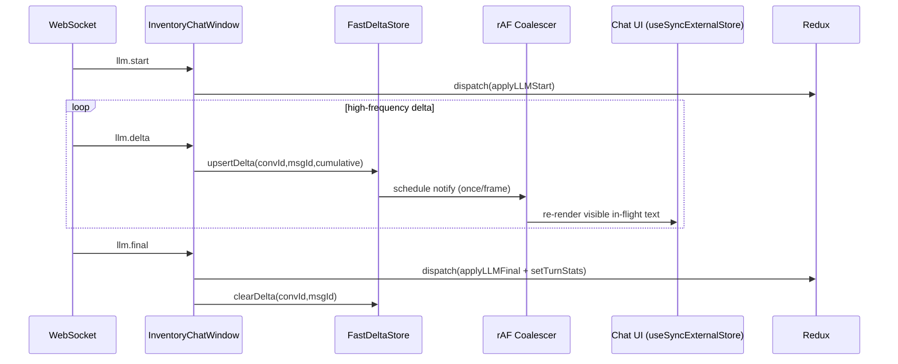
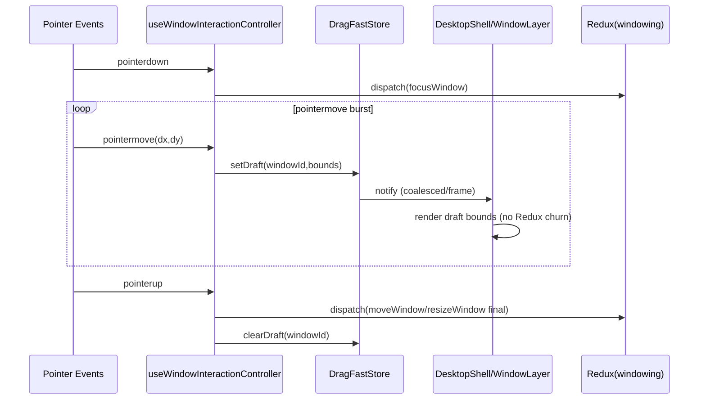

# Implementation Blueprint: External Fast Store for LLM Delta and Window Dragging

## Executive Summary

This ticket implements a dual-lane state architecture for HC-37 high-frequency paths:

1. **Fast lane (external store + `useSyncExternalStore`)** for transient, ultra-high-frequency updates.
2. **Durable lane (Redux)** for semantic, replayable app state.

Apply this pattern to two hotspots:

1. LLM streaming deltas (`llm.delta`) in inventory chat.
2. Window dragging/resizing pointer movement.

Core result:

- Reduce Redux dispatch pressure and render fan-out during bursts.
- Keep functional behavior intact: timeline projection, event/debug windows, final conversation history, and persisted window bounds in Redux.
- Make performance behavior explicit and testable with clear commit rules.

## Problem Statement

Current code pushes high-frequency updates directly through Redux:

1. Chat deltas route through `InventoryChatWindow.tsx` to reducers on nearly every stream event.
2. Dragging routes pointermove events to `moveWindow/resizeWindow` dispatch on each motion frame.

This creates unnecessary churn:

- too many reducer executions,
- too many selector recalculations,
- broad UI re-renders,
- harder-to-debug coupling of transient and durable state.

We need to separate “fast transient signal” from “durable semantic state”.

## Scope

In scope:

1. External store infra for fast updates.
2. Chat LLM delta fast-lane integration.
3. Drag/resize fast-lane integration.
4. Durable commit strategy and reconciliation.
5. Developer-oriented implementation tasks and verification plan.

Out of scope:

1. backend protocol changes,
2. replacing Redux for durable state,
3. complete chat virtualization implementation (tracked separately).

## Current Architecture Snapshot

### Chat path today

- File: `apps/inventory/src/features/chat/InventoryChatWindow.tsx`
- `onSemEnvelope` dispatches `applyLLMDelta` and timeline upserts per event.
- `displayMessages` maps full message list before render.
- `ChatWindow` renders `messages.map(...)` over full history.

### Window drag path today

- File: `packages/engine/src/components/shell/windowing/useWindowInteractionController.ts`
- On pointermove: immediately invokes `onMoveWindow` / `onResizeWindow`.
- `DesktopShell.tsx` maps these to Redux dispatches.

### Durable window state

- File: `packages/engine/src/features/windowing/windowingSlice.ts`
- `moveWindow` and `resizeWindow` mutate canonical bounds.
- This should remain source of truth after drag commit.

## Proposed Solution

## A) Build a generic fast external store primitive

Use a small store abstraction compatible with `useSyncExternalStore`.

Requirements:

1. immutable snapshots (new object on update),
2. subscribe/unsubscribe listeners,
3. optional `requestAnimationFrame` coalesced notifications,
4. bounded memory for historical metrics (if needed).

### Core primitive pseudocode

```ts
type Listener = () => void;

export function createFastStore<T>(initial: T) {
  let snapshot = initial;
  const listeners = new Set<Listener>();

  function getSnapshot() {
    return snapshot;
  }

  function subscribe(listener: Listener) {
    listeners.add(listener);
    return () => listeners.delete(listener);
  }

  function setSnapshot(next: T) {
    snapshot = next;
    for (const l of listeners) l();
  }

  return { getSnapshot, subscribe, setSnapshot };
}
```

### React hook usage pseudocode

```ts
export function useFastStoreSnapshot<T>(store: {
  subscribe: (l: () => void) => () => void;
  getSnapshot: () => T;
}) {
  return useSyncExternalStore(store.subscribe, store.getSnapshot, store.getSnapshot);
}
```

## B) Chat fast lane for LLM delta

### Durable vs transient split

Fast lane should contain:

1. in-flight delta text by `{conversationId, messageId}`,
2. stream token counters updated per-frame,
3. transient projection drafts for visual updates (optional).

Redux should contain:

1. queued user prompts,
2. stream start/final/error semantic transitions,
3. finalized message content,
4. durable timeline artifact entries.

### Integration plan

1. In `InventoryChatWindow.tsx`, on `llm.delta`:
   - update fast store immediately,
   - avoid per-delta Redux dispatch,
   - optionally emit throttled checkpoint dispatch every X ms (configurable).
2. On `llm.final`:
   - commit final text and stats to Redux,
   - clear in-flight fast entry.

### Chat flow timeline diagram (Mermaid)



### Chat overlay merge pseudocode

```ts
const reduxMessages = useSelector((s) => selectMessages(s, convId));
const fastDelta = useFastStoreSnapshot(deltaStore).byConv[convId] ?? {};

const mergedMessages = useMemo(() => {
  return reduxMessages.map((m) => {
    if (!m.id) return m;
    const overlay = fastDelta[m.id];
    if (!overlay) return m;
    return { ...m, text: overlay.cumulative, status: 'streaming' };
  });
}, [reduxMessages, fastDelta]);
```

## C) Window drag fast lane

### Durable vs transient split

Fast lane should contain:

1. active drag draft bounds for windows being moved/resized,
2. drag session state (start pointer, active ids).

Redux should contain:

1. focus events,
2. final `moveWindow`/`resizeWindow` on pointerup,
3. optional throttled checkpoint commits during long drags.

### Integration plan

1. In `useWindowInteractionController` pointermove:
   - compute draft bounds,
   - write to drag fast store,
   - no immediate Redux move/resize dispatch.
2. In `DesktopShell` render path:
   - overlay draft bounds over Redux window bounds while dragging.
3. On pointerup:
   - commit final bounds to Redux,
   - clear fast draft.

### Drag flow timeline diagram (Mermaid)



### Overlay bounds pseudocode

```ts
const reduxWindows = useSelector(selectWindowsByZ);
const dragDrafts = useFastStoreSnapshot(dragStore).drafts;

const windowDefs = useMemo(() => {
  return reduxWindows.map((w) => {
    const d = dragDrafts[w.id];
    const bounds = d ?? w.bounds;
    return toWindowDef({ ...w, bounds }, w.id === focusedId);
  });
}, [reduxWindows, dragDrafts, focusedId]);
```

## D) Coalescing strategy

Fast lane updates should be coalesced to one notification per animation frame.

### rAF coalescer pseudocode

```ts
let rafId: number | null = null;
let dirty = false;

function scheduleNotify() {
  dirty = true;
  if (rafId != null) return;
  rafId = requestAnimationFrame(() => {
    rafId = null;
    if (!dirty) return;
    dirty = false;
    notifyListeners();
  });
}
```

## Integration File Plan

## New files

1. `apps/inventory/src/features/chat/fastDeltaStore.ts`
2. `packages/engine/src/components/shell/windowing/dragFastStore.ts`
3. `packages/engine/src/shared/fastStore.ts` (optional shared primitive)

## Files to modify

1. `apps/inventory/src/features/chat/InventoryChatWindow.tsx`
   - reroute `llm.delta` to fast lane,
   - merge overlay for UI,
   - final commit behavior.
2. `packages/engine/src/components/shell/windowing/useWindowInteractionController.ts`
   - write pointermove drafts to fast lane,
   - commit on pointerup.
3. `packages/engine/src/components/shell/windowing/DesktopShell.tsx`
   - merge overlay draft bounds into render path.

## Design Decisions

1. Keep Redux as canonical durable state.
2. Use external store only for short-lived high-frequency updates.
3. Commit boundaries are event-driven (`final`/`pointerup`) with optional periodic checkpoints.
4. Use `useSyncExternalStore` for React concurrency-safe external subscriptions.

## Detailed Implementation Timeline

### Phase 0: Baseline instrumentation

1. Add temporary counters for `llm.delta` dispatch rate.
2. Add temporary counters for `moveWindow/resizeWindow` dispatch rate.
3. Capture baseline while streaming + dragging.

### Phase 1: Fast store primitive + tests

1. Implement reusable fast store with immutable snapshots.
2. Implement rAF notification coalescer.
3. Unit test subscribe/update/coalescing behavior.

### Phase 2: Chat fast lane

1. Add fast delta store.
2. Update `InventoryChatWindow` delta handling.
3. Merge overlay text into chat render path.
4. Commit finals to Redux and clear fast entries.
5. Verify event viewer behavior unchanged.

### Phase 3: Drag fast lane

1. Add drag draft store.
2. Update interaction controller pointermove logic.
3. Merge draft bounds in DesktopShell.
4. Commit final bounds to Redux on pointerup.
5. Verify focus/z-index behavior unchanged.

### Phase 4: Hardening

1. Add feature flags to toggle fast-lane behavior.
2. Add regression tests for state parity.
3. Remove temporary counters; keep stable diagnostics.

## Task Breakdown for New Developer

1. Read current hot paths:
   - `InventoryChatWindow.tsx`
   - `useWindowInteractionController.ts`
   - `DesktopShell.tsx`
2. Implement fast store primitive and unit tests.
3. Integrate chat fast lane behind feature flag.
4. Validate UI parity (streaming text, errors, suggestions, debug mode).
5. Integrate dragging fast lane behind feature flag.
6. Validate parity (focus, bounds, resize constraints, close behavior).
7. Run stress checks and compare dispatch rates vs baseline.
8. Update docs and remove feature flag only after validation.

## Risks and Mitigations

1. **Risk**: stale overlay vs Redux mismatch.
   - Mitigation: clear overlay on final/error/reset/removeConversation.
2. **Risk**: drag draft desync when window closes mid-drag.
   - Mitigation: clear draft on close and pointercancel.
3. **Risk**: over-notification from external store.
   - Mitigation: rAF coalescing + immutable batched updates.
4. **Risk**: hidden regressions due dual-lane complexity.
   - Mitigation: feature flag rollout + invariant assertions in dev.

## Verification Checklist

1. Chat streaming shows smooth text updates under bursty deltas.
2. Redux action rate during streaming drops materially.
3. Dragging feels smooth and Redux move/resize dispatches drop sharply.
4. Final chat message text and final window bounds remain correct in Redux.
5. Event viewer and runtime debug tools still function.

## Open Questions

1. Should chat emit periodic checkpoint commits during very long streams?
2. Should drag commits happen only on pointerup, or also every 120ms for crash-recovery semantics?
3. Should fast-lane stores live in engine shared package or app-specific folders first?

## References

- `apps/inventory/src/features/chat/InventoryChatWindow.tsx`
- `apps/inventory/src/features/chat/chatSlice.ts`
- `apps/inventory/src/features/chat/selectors.ts`
- `packages/engine/src/components/widgets/ChatWindow.tsx`
- `packages/engine/src/components/shell/windowing/useWindowInteractionController.ts`
- `packages/engine/src/components/shell/windowing/DesktopShell.tsx`
- `packages/engine/src/features/windowing/windowingSlice.ts`
- `packages/engine/src/features/windowing/selectors.ts`
