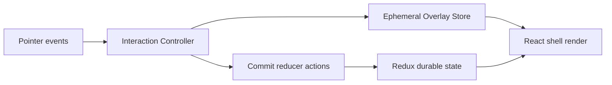

# Desktop Shell and Windowing Reusability Analysis for In-Browser OS Framework

## Executive Summary

The current DesktopShell stack is already a functional mini-OS runtime: menu bar, desktop icons, movable/resizable windows, z-order focus semantics, app/card window polymorphism, and a runtime plugin host. From a product perspective, this is strong. From a reusable-framework perspective, it is still in a monolithic-integration phase where policy, rendering, state orchestration, and domain-specific behavior are tightly co-located.

The central technical conclusion is:

1. The rendering primitives are reusable today.
2. The interaction model is reusable today.
3. The durable state model is reusable with minor API cleanup.
4. The shell composition layer is not yet reusable as a framework because extension contracts are implicit and app-specific policy lives in core orchestration.

To turn this into a reusable “in-browser OS” framework, we should split the system into explicit layers:

- `desktop-core`: durable state, reducers, selectors, interaction math, domain-agnostic contracts.
- `desktop-react`: React primitives, controller hooks, shell composition.
- `desktop-theme-macos1`: optional visual package providing macOS-1 style tokens/parts.
- `desktop-runtime-adapters`: optional HyperCard/plugin-runtime integration.

This analysis documents the current behavior deeply, then defines what must change to make this a reusable platform without regressing existing apps.

---

## Reading Guide

This document has two goals:

1. Explain what exists today, with concrete code-level anchors.
2. Evaluate reusability readiness subsystem by subsystem.

Symbol key used in this analysis:

- `S_durable`: durable Redux window/session state.
- `S_ephemeral`: transient interaction state (drag/resize preview).
- `R`: React render pass.
- `Δdispatch`: high-frequency dispatch pressure.

The high-level runtime equation today is:

`effectiveWindowGeometry = S_ephemeral.overlayBounds ?? S_durable.window.bounds`

This is a good foundation for a framework because it separates long-lived state from interaction preview state.

---

## 1. Current Architecture Map

### 1.1 Package and export shape

The public engine barrel exports nearly everything from a single entrypoint: `packages/engine/src/index.ts:9`. Shell, widgets, runtime, diagnostics, reducers, and app helpers all travel together.

Strengths:

- Easy onboarding import path: `@hypercard/engine`.
- Low friction for app teams.

Reusability concerns:

- No explicit subpath boundary for desktop-only consumption.
- Desktop shell depends conceptually on runtime-specific pieces by default pathing.
- Consumers cannot depend on “windowing framework only” without pulling broader engine semantics.

Implication:

A framework consumer building a different runtime (not HyperCard cards) should not need plugin runtime dependencies or runtime-specific exports.

### 1.2 Runtime composition flow

Current composition path in practice:

```text
App.tsx
  -> <DesktopShell ...>
       -> DesktopMenuBar
       -> DesktopIconLayer
       -> WindowLayer
           -> WindowSurface*
              -> card window: PluginCardSessionHost
              -> app window: renderAppWindow(appKey)
```

Main integration locus: `packages/engine/src/components/shell/windowing/DesktopShell.tsx:93`.

The shell currently decides all of the following:

- home card auto-open (`DesktopShell.tsx:162`)
- icon/menu generation defaults (`DesktopShell.tsx:115`, `DesktopShell.tsx:126`)
- command routing for tile/cascade/open/close (`DesktopShell.tsx:328`)
- drag overlay composition (`DesktopShell.tsx:186`)
- window-body caching signatures (`DesktopShell.tsx:54`, `DesktopShell.tsx:400`)
- card/app fallback rendering (`DesktopShell.tsx:364`)

This concentration is efficient for product delivery but is the main blocker to reusable-framework extraction.

---

## 2. Windowing Domain Model Assessment

### 2.1 Durable state model quality

The windowing slice is clean and mostly framework-grade:

- types: `packages/engine/src/features/windowing/types.ts:3`
- reducers: `packages/engine/src/features/windowing/windowingSlice.ts:16`
- selectors: `packages/engine/src/features/windowing/selectors.ts:1`

Model highlights:

- window map keyed by id (`windows`) + stable insertion order (`order`) + z counter.
- desktop transient state: active menu, selected icon, focused window.
- per-session nav stack for card sessions.

This shape is coherent for an in-browser OS framework. It captures universal desktop semantics rather than app-domain semantics.

### 2.2 Invariants and semantics

Observed durable invariants:

1. `openWindow` can dedupe by key and focus existing window (`windowingSlice.ts:31`).
2. focus bumps z and sets focused id (`windowingSlice.ts:71`).
3. close reselects highest-z window (`windowingSlice.ts:99`).
4. move/resize clamp to visibility/min constraints (`windowingSlice.ts:118`, `windowingSlice.ts:128`).

These are exactly the kinds of invariants we want in a reusable core.

### 2.3 Framework extraction readiness of reducer layer

Readiness: high.

What is missing for framework friendliness:

- stronger contract docs around geometry semantics (coordinate space, clamping assumptions).
- optional policy hooks for focus fallback strategy.
- first-class action metadata contract for external middleware/telemetry.

Potential API shape:

```ts
type WindowingPolicy = {
  focusFallback?: 'highestZ' | 'lastFocusedHistory' | ((state) => string | null);
  clampStrategy?: 'titlebar-visible' | 'fully-visible' | ((bounds, viewport) => bounds);
};
```

---

## 3. Interaction Pipeline Assessment (Drag/Resize)

### 3.1 Current controller contract

The pointer lifecycle is implemented in `packages/engine/src/components/shell/windowing/useWindowInteractionController.ts:43`.

Pipeline stages:

1. `beginInteraction` captures start geometry and pointer origin.
2. `pointermove` computes delta and invokes move/resize callbacks.
3. `pointerup` commits.
4. `pointercancel`/`blur` cancels.

This hook is already generic and reusable.

### 3.2 External fast lane (major improvement already present)

The drag overlay store in `packages/engine/src/components/shell/windowing/dragOverlayStore.ts:41` uses `useSyncExternalStore` for transient geometry preview. This is a key architectural strength.

Behavioral model:

- During interaction: write to `dragOverlayStore.update(...)`.
- UI renders overlay draft bounds.
- On commit: dispatch one durable `moveWindow`/`resizeWindow` action.

In symbols:

- during drag: `Δdispatch ≈ 0`, `R` scoped by external-store subscribers.
- on release: `Δdispatch = 1`.

For framework extraction, this is exactly the pattern to preserve.

### 3.3 Remaining pain points

Even with fast lane + memoization, shell-level orchestration is centralized.

Examples:

- overlay composition done in DesktopShell mapping loop (`DesktopShell.tsx:186`).
- command handlers and interaction wiring share same component scope.

This creates a larger-than-needed invalidation domain for framework consumers who may want custom command policies.

### 3.4 Reusability verdict

- Interaction primitives: reusable now.
- Interaction integration surface: needs decomposition for framework ergonomics.

---

## 4. Rendering and Memoization Assessment

### 4.1 WindowSurface memoization

`WindowSurface` uses a custom prop comparator in `packages/engine/src/components/shell/windowing/WindowSurface.tsx:67` and has dedicated `WindowBody` memoization.

This is a strong performance-oriented implementation and should remain in framework core render layer.

### 4.2 Body caching strategy

DesktopShell caches window body nodes using signatures in `DesktopShell.tsx:54` and `DesktopShell.tsx:400`.

Strength:

- avoids re-instantiating expensive window bodies on unrelated shell updates.

Risk:

- cache policy is embedded in shell and tied to HyperCard card/app content kinds.
- reusable framework should not hardcode content signature logic around card/app/dialog triplet.

Framework direction:

Move to a pluggable `windowBodyCachePolicy` abstraction:

```ts
type WindowBodyCachePolicy<WindowModel> = {
  signatureFor: (windowModel: WindowModel, mode: string) => string;
};
```

### 4.3 Layer primitives quality

Presentational primitives are strong and generic:

- `WindowLayer.tsx:16`
- `WindowSurface.tsx:24`
- `WindowTitleBar.tsx:12`
- `WindowResizeHandle.tsx:8`
- `DesktopMenuBar.tsx:16`
- `DesktopIconLayer.tsx:51`

These files are good candidates for a separate `desktop-react` package.

---

## 5. Theme and Styling Assessment

### 5.1 Current CSS topology

`packages/engine/src/theme/base.css` is 919 lines and includes:

- tokens
- desktop shell styles
- widget styles
- chat window styles
- syntax highlighting styles
- animations

This is efficient for one product bundle but not ideal for framework reuse.

### 5.2 What is already good

The `PARTS` contract in `packages/engine/src/parts.ts:1` is a real asset. Part names are stable semantic anchors across components.

For a framework, this is exactly what enables skinning.

### 5.3 What blocks clean reuse

- monolithic stylesheet couples desktop shell with unrelated widget concerns.
- no dedicated “desktop theme pack” vs “core reset/tokens” split.
- inline styles still exist in some debug/runtime windows (for example `apps/inventory/src/features/debug/ReduxPerfWindow.tsx:199`).

### 5.4 Framework-oriented style stratification

Recommended style packaging:

1. `desktop-tokens.css`
2. `desktop-shell.css`
3. `desktop-widgets.css`
4. `desktop-theme-macos1.css`
5. optional feature css packs (chat/code/editor)

A framework user should be able to install only shell + macos1 skin without chat widgets.

---

## 6. Extension Surface Assessment

### 6.1 Existing extension points

DesktopShell already exposes:

- `renderAppWindow` callback (`DesktopShell.tsx:82`)
- `onCommand` callback (`DesktopShell.tsx:84`)
- `menus` and `icons` injection

This is good.

### 6.2 What remains implicit

Missing explicit contracts for:

- command routing lifecycle (before default handling, after default handling, veto).
- desktop icon behavior policies (single-click select vs launch semantics).
- window creation presets.
- menu contribution composition from plugins/apps.

Today these are implemented manually in app code, for example `apps/inventory/src/App.tsx:67`.

### 6.3 Proposed extension contract model

Introduce structured extension APIs:

```ts
type DesktopCommandContext = {
  dispatch: Dispatch;
  getState: () => unknown;
  focusedWindowId: string | null;
};

type DesktopCommandHandler = (commandId: string, ctx: DesktopCommandContext) =>
  | { handled: true }
  | { handled: false };

type DesktopContribution = {
  menus?: DesktopMenuSection[];
  icons?: DesktopIconDef[];
  commands?: DesktopCommandHandler[];
  windowFactories?: Record<string, () => OpenWindowPayload>;
};
```

This shifts from ad-hoc callback logic to a reusable plugin-style framework surface.

---

## 7. Runtime Coupling Assessment

### 7.1 Current coupling

DesktopShell directly references plugin-card host behavior through `PluginCardSessionHost` path in `DesktopShell.tsx:375`.

This makes core shell feel runtime-opinionated.

### 7.2 Why this matters for a generic in-browser OS

A framework consumer may want:

- pure app windows only.
- iframe-hosted apps.
- remote microfrontends.
- non-HyperCard navigation runtime.

Hardwired card runtime paths reduce portability.

### 7.3 Decoupling target

Make shell content rendering adapter-driven:

```ts
type WindowContentRenderer = {
  canRender: (content: WindowContent) => boolean;
  render: (content: WindowContent, ctx: RenderCtx) => ReactNode;
};
```

Default adapters can ship in a HyperCard-specific package, not in the desktop core.

---

## 8. Storybook and Developer Experience Assessment

### 8.1 Current Storybook shape

Single Storybook config in inventory app aggregates engine and app stories: `apps/inventory/.storybook/main.ts:8`.

This is convenient but mixes:

- framework stories
- product stories
- app-specific debug stories

### 8.2 Framework concern

Reusable framework needs a “framework-first” Storybook surface where components and contracts are validated independent of inventory app context.

### 8.3 Required story layers

1. primitive visual stories (title bar, surface, menu, icon layer)
2. interaction contract stories (drag, resize, focus behavior)
3. integration shell stories (multiple contribution sets)
4. adapter stories (HyperCard adapter package)

Existing stories in `packages/engine/src/components/shell/windowing/*.stories.tsx` are a strong base and should be retained but reorganized into explicit strata.

---

## 9. Framework Target Model (Conceptual)

### 9.1 Layered architecture

```text
┌─────────────────────────────────────────────────────────────┐
│ desktop-theme-macos1 (optional skin package)               │
├─────────────────────────────────────────────────────────────┤
│ desktop-react (WindowLayer, DesktopShell, hooks, adapters) │
├─────────────────────────────────────────────────────────────┤
│ desktop-core (state, actions, selectors, policies)         │
├─────────────────────────────────────────────────────────────┤
│ host app + adapters (HyperCard runtime, chat, debug tools) │
└─────────────────────────────────────────────────────────────┘
```

### 9.2 State lane model



### 9.3 Reusability principles

1. Keep durable desktop semantics generic.
2. Keep high-frequency interaction in isolated transient lane.
3. Expose policy hooks instead of embedding product policy.
4. Ship runtime-specific integrations as adapters.
5. Ship visual identity as optional theme package.

---

## 10. Subsystem-by-Subsystem Findings and Proposals

### 10.1 Subsystem A: durable state/reducer core

Findings:

- strong invariants and tests already exist (`packages/engine/src/__tests__/windowing.test.ts:70`).
- semantics are clear enough for extraction.

Proposals:

- extract to `desktop-core/state` module.
- add typed policy injection points for clamp/focus strategy.
- publish reducer/action contract docs with sequence diagrams.

### 10.2 Subsystem B: interaction controller + fast lane

Findings:

- controller API is clean and reusable.
- external overlay store is a correct approach.

Proposals:

- keep `useWindowInteractionController` in `desktop-react`.
- move `dragOverlayStore` into generic `interactionOverlayStore` naming.
- expose this store as an implementation detail behind `useDesktopInteractionState` so consumers can swap strategies.

### 10.3 Subsystem C: shell composition

Findings:

- DesktopShell currently performs orchestration + defaults + runtime rendering.

Proposals:

- split into:
- `DesktopShellView` (pure presentational composition)
- `useDesktopShellController` (policy and state wiring)
- `createDesktopCommandRouter` (command pipeline)
- `windowBodyRenderAdapter` (content rendering strategy)

### 10.4 Subsystem D: theme/CSS

Findings:

- part-based selectors are good.
- CSS file is too broad for framework extraction.

Proposals:

- break base CSS by capability and distribute via package subpaths.
- document token contract with categories: spatial, typography, chrome, interaction, elevation.

### 10.5 Subsystem E: app integration and extension

Findings:

- app code currently owns a lot of shell policy (`apps/inventory/src/App.tsx:67`).

Proposals:

- provide desktop contributions API.
- provide helper utilities:
- `openWindowFactory`
- `registerDesktopContribution`
- `composeDesktopMenus`

### 10.6 Subsystem F: diagnostics/debug tooling

Findings:

- diagnostics model already avoids Redux observer effect (`packages/engine/src/diagnostics/reduxPerfMiddleware.ts:14`).
- debug windows are currently app-specific and style-inline heavy.

Proposals:

- formalize `desktop-debug-tools` optional package.
- move debug window visuals to part-based styling.

---

## 11. Technical Debt Matrix

### 11.1 High-impact debt

1. DesktopShell policy concentration.
2. runtime coupling in shell body rendering path.
3. monolithic CSS packaging.
4. single giant barrel export surface.

### 11.2 Medium-impact debt

1. implicit command lifecycle.
2. lack of desktop-contribution composition primitives.
3. mixed storybook ownership boundaries.

### 11.3 Low-impact debt

1. naming inconsistencies (`appKey` vs command identifiers).
2. optional path docs gaps.
3. minor duplicated fixture logic in stories.

---

## 12. Risk Analysis for Framework Extraction

### 12.1 Product regression risks

1. focus/z-order semantics drift during refactor.
2. drag commit/cancel regressions if overlay integration changes.
3. plugin-card navigation regressions due adapter extraction.

### 12.2 Adoption risks

1. over-abstracting too early can make first consumer harder.
2. if APIs are too generic without defaults, DX regresses.

### 12.3 Risk controls

1. snapshot integration tests against existing inventory flows.
2. contract tests for command routing and interaction lifecycles.
3. Storybook “reference stories” frozen as behavior baselines.

---

## 13. Proposed Documentation Artifacts for Framework Consumers

Required docs for reusability:

1. `Desktop Core Concepts`:
- window model
- z-order policy
- focus semantics
- session/navigation model

2. `Desktop Interaction Model`:
- begin/move/commit/cancel state transitions
- overlay lane explanation

3. `Desktop Contribution API`:
- menus/icons/commands/window factories
- merge precedence rules

4. `Theme Contract`:
- part names (`PARTS`)
- token catalog
- minimum required token set

5. `Adapter Guide`:
- how to implement non-HyperCard window content adapters

---

## 14. Summary Judgment: Is This Reusable Yet?

Short answer: partially.

What is reusable now:

1. durable windowing state model.
2. interaction controller.
3. window/menu/icon primitives.
4. performance lane split (durable + ephemeral).

What still blocks true framework status:

1. shell orchestration entanglement.
2. runtime-specific assumptions in core shell.
3. packaging/export and CSS modularity.
4. lack of explicit extension contracts.

If we execute the implementation plan in the companion HC-45 document, we can realistically transition from “app-centric engine shell” to “reusable in-browser OS framework with macOS-1 skin” without losing current behavior.

---

## Appendix A: Key Runtime Paths

- `packages/engine/src/components/shell/windowing/DesktopShell.tsx:93`
- `packages/engine/src/components/shell/windowing/useWindowInteractionController.ts:43`
- `packages/engine/src/components/shell/windowing/dragOverlayStore.ts:41`
- `packages/engine/src/components/shell/windowing/WindowSurface.tsx:67`
- `packages/engine/src/features/windowing/windowingSlice.ts:27`
- `packages/engine/src/features/windowing/selectors.ts:26`
- `packages/engine/src/theme/base.css:154`
- `apps/inventory/src/App.tsx:45`

## Appendix B: Minimal Framework-Facing Pseudocode

```ts
// Framework user entrypoint sketch
const desktop = createDesktopFramework({
  state: createDesktopState({ policy }),
  adapters: [hypercardAdapter(), appWindowAdapter()],
  theme: macos1Theme(),
  contributions: [inventoryContrib, debugContrib],
});

render(
  <DesktopProvider desktop={desktop}>
    <DesktopShellView />
  </DesktopProvider>
);
```
