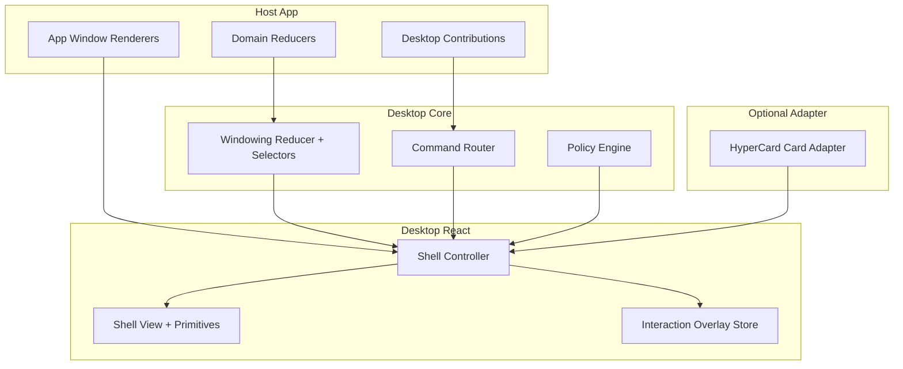
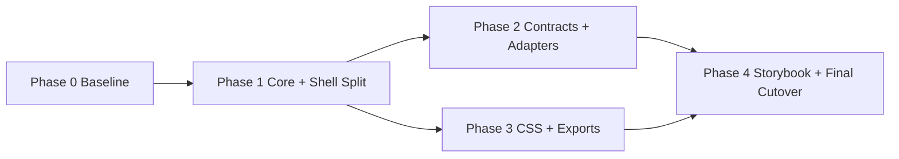

# Desktop Shell and Windowing Reusable Framework Implementation Plan

## Executive Summary

This plan converts the current app-centric desktop shell into a reusable framework while preserving current behavior and performance (including the existing fast drag lane). The approach is a hard cutover: no backward compatibility shims, no dual APIs, and no staged legacy support.

Primary deliverables:

1. Layered package architecture (`desktop-core`, `desktop-react`, `desktop-theme-macos1`, adapter package).
2. Explicit extension contracts (contributions, command router, window render adapters).
3. Split shell controller/view composition.
4. Modular CSS packs with a documented token + part contract.
5. Full app cutover (inventory + other apps) to prove framework viability.

Execution strategy:

- maintain behavior parity first,
- introduce target APIs,
- update all consumers in cutover PR slices,
- remove old surfaces immediately.

---

## 1. Scope and Non-Goals

### 1.1 In-scope

1. Desktop/windowing framework extraction and API cleanup.
2. Packaging and export boundary restructuring.
3. Shell composition refactor.
4. Theme modularization focused on desktop shell + macOS-1 look.
5. Storybook restructuring for framework-first validation.
6. Cutover runbook and legacy-surface removal checklist.

### 1.2 Out-of-scope

1. Full rewrite of chat subsystem.
2. QuickJS runtime architecture redesign.
3. Replacing Redux with another durable store.
4. New visual design language beyond macOS-1 default package split.

### 1.3 Hard constraints

1. Keep current windowing semantics identical during transition.
2. Keep fast interaction lane (`dragOverlayStore` model) intact.
3. Keep app-level ability to open custom app windows.
4. Do not regress dev diagnostics behavior.
5. No backward compatibility layer: old imports/APIs are removed at cutover.

---

## 2. Target Architecture and Package Plan

### 2.1 Package boundaries

Target modules inside `packages/engine/src` first, then optional npm package split later.

Phase-A internal directories:

```text
packages/engine/src/desktop/
  core/
    state/
    policies/
    commands/
    contributions/
  react/
    primitives/
    shell/
    hooks/
    adapters/
  theme/
    tokens.css
    shell.css
    macos1.css
```

Optional Phase-B publishing split:

- `@hypercard/desktop-core`
- `@hypercard/desktop-react`
- `@hypercard/desktop-theme-macos1`
- `@hypercard/desktop-hypercard-adapter`

### 2.2 Data-flow diagram (target)



### 2.3 Hard cutover strategy

Introduce new APIs and remove legacy exports in the same execution window.

Hard cutover rules:

1. no compatibility wrappers around legacy `DesktopShell`.
2. no feature flags for old/new desktop API selection.
3. all apps are updated to new desktop entrypoints within the HC-45 workstream.
4. remove deprecated exports and docs references immediately after call-site updates.

---

## 3. Detailed Workstreams

## 3.1 Workstream A: Core Boundary Extraction

### A.1 Objective

Isolate durable state and policy contracts from React/runtime concerns.

### A.2 Files to create/move

1. `packages/engine/src/desktop/core/state/windowingSlice.ts` (re-export/move from existing slice).
2. `packages/engine/src/desktop/core/state/selectors.ts`.
3. `packages/engine/src/desktop/core/state/types.ts`.
4. `packages/engine/src/desktop/core/policies/*.ts`.

### A.3 Implementation tasks

1. Create new directory structure with zero-behavior-change file moves.
2. Add barrel exports for new core module.
3. Update all imports to new paths.
4. Delete legacy paths after import rewrites are complete.

### A.4 Acceptance criteria

1. `windowing.test.ts` passes with new import path only.
2. No behavior difference in open/focus/close/move/resize semantics.
3. All app builds remain green with no legacy imports.

---

## 3.2 Workstream B: Shell Controller/View Split

### B.1 Objective

Break DesktopShell orchestration into reusable controller + presentational layers.

### B.2 Existing hotspot

`packages/engine/src/components/shell/windowing/DesktopShell.tsx:93` currently combines:

1. state selection
2. command policy
3. interaction wiring
4. body cache signatures
5. content rendering
6. menu/icon defaults

### B.3 New architecture

Create:

1. `useDesktopShellController.ts`
2. `DesktopShellView.tsx`
3. `desktopCommandRouter.ts`
4. `windowBodyCachePolicy.ts`

### B.4 Pseudocode

```ts
export function useDesktopShellController(opts: ControllerOpts) {
  const state = useDesktopStateSelectors();
  const interaction = useDesktopInteraction({ state, opts });
  const commands = useDesktopCommandRouter({ state, opts });
  const bodies = useWindowBodyCache({ windows: state.windows, renderers: opts.renderers });

  return {
    viewModel: {
      menus: state.menus,
      icons: state.icons,
      windows: state.effectiveWindows,
      toast: state.toast,
    },
    handlers: {
      onCommand: commands.handle,
      onDragStart: interaction.beginMove,
      onResizeStart: interaction.beginResize,
      onFocus: state.focus,
      onClose: state.close,
    },
    renderWindowBody: bodies.render,
  };
}
```

### B.5 Cutover steps

1. Introduce new files.
2. Replace current `DesktopShell` implementation with controller + view composition.
3. Update all call sites to the target props contract if needed.
4. Add tests for controller behavior (mock dispatch + selectors).

### B.6 Acceptance criteria

1. Existing DesktopShell stories unchanged visually/behaviorally.
2. Window drag still commit-on-end only.
3. Focus/cascade/tile commands still behave identically.

---

## 3.3 Workstream C: Extension Contract Formalization

### C.1 Objective

Replace implicit app policy wiring with explicit contribution contracts.

### C.2 New API

```ts
export interface DesktopContribution {
  id: string;
  menus?: DesktopMenuSection[];
  icons?: DesktopIconDef[];
  commands?: DesktopCommandHandler[];
  appWindowRenderers?: AppWindowRenderer[];
  startupWindows?: StartupWindowFactory[];
}
```

### C.3 Command router contract

```ts
export interface DesktopCommandHandler {
  priority?: number;
  matches: (commandId: string) => boolean;
  run: (commandId: string, ctx: DesktopCommandContext) => 'handled' | 'pass';
}
```

### C.4 Implementation tasks

1. Add contribution composer.
2. Add deterministic merge rules.
3. Add conflict handling strategy (same command/menu id collisions).
4. Add inventory contribution cutover.

### C.5 Conflict policy

1. command handlers sorted by priority descending.
2. first `handled` wins.
3. menu id collisions merged by section id with deterministic order.
4. icon id collisions fail fast in dev, warn in prod.

### C.6 Acceptance criteria

1. Inventory `App.tsx` command logic can move into contribution objects.
2. Debug window command and chat command both function via contributions.
3. No loss of custom renderAppWindow behavior.

---

## 3.4 Workstream D: Runtime Adapter Decoupling

### D.1 Objective

Decouple shell from HyperCard runtime-specific card host assumptions.

### D.2 Current coupling point

`DesktopShell.tsx:375` directly instantiates `PluginCardSessionHost` for `content.kind === 'card'`.

### D.3 Adapter interface

```ts
export interface WindowContentAdapter {
  id: string;
  canRender: (content: WindowContent) => boolean;
  render: (content: WindowContent, ctx: WindowAdapterContext) => ReactNode;
}
```

### D.4 Implementation tasks

1. Implement default app window adapter.
2. Wrap existing `PluginCardSessionHost` as HyperCard adapter.
3. Route card rendering through adapter chain.
4. Preserve fallback renderer behavior.

### D.5 Acceptance criteria

1. Current card windows still render via adapter.
2. Consumers can register non-HyperCard adapters.
3. Shell no longer imports runtime host directly.

---

## 3.5 Workstream E: CSS/Theme Modularization

### E.1 Objective

Split monolithic CSS into reusable packs and define token contract for desktop framework consumers.

### E.2 Current source

`packages/engine/src/theme/base.css` includes shell + widgets + chat + syntax styles.

### E.3 New CSS packs

1. `desktop/tokens.css`
2. `desktop/shell.css`
3. `desktop/primitives.css`
4. `desktop/theme/macos1.css`

Optional:

- `widgets/chat.css`
- `widgets/tables.css`
- `diagnostics/debug.css`

### E.4 Style migration order

1. extract token declarations.
2. extract shell selectors (`windowing-*` parts).
3. replace `base.css` imports with explicit modular desktop packs.
4. migrate inline styles to part-based selectors.

### E.5 Acceptance criteria

1. Existing apps import modular desktop packs (no `base.css` compatibility path).
2. New consumers can import only desktop shell + macOS-1 package.
3. Visual regression diff for desktop stories is clean.

---

## 3.6 Workstream F: Export Surface and Package API Hygiene

### F.1 Objective

Expose explicit framework-oriented entrypoints and reduce accidental coupling.

### F.2 Proposed exports

Add structured exports in `packages/engine/src/index.ts` and package subpath docs:

1. `@hypercard/engine/desktop-core`
2. `@hypercard/engine/desktop-react`
3. `@hypercard/engine/desktop-theme-macos1`
4. `@hypercard/engine/desktop-hypercard-adapter`

### F.3 Tasks

1. add index barrels for each logical module.
2. add typed docs for import intent per subpath.
3. remove legacy all-in-one barrel exports for desktop surfaces.

### F.4 Acceptance criteria

1. new imports compile for inventory and all other apps in this workspace.
2. no desktop imports remain on deprecated legacy paths.

---

## 3.7 Workstream G: Storybook Restructure

### G.1 Objective

Separate framework stories from app stories and establish contract-driven test stories.

### G.2 Tasks

1. create story taxonomy:
- `Desktop/Primitives`
- `Desktop/Interaction`
- `Desktop/Shell`
- `Desktop/Adapters/HyperCard`

2. add interaction contract stories with deterministic fixtures.
3. add performance profiling story for drag at 20-window density.
4. keep app stories as separate namespace.

### G.3 Acceptance criteria

1. framework stories runnable without inventory app dependencies.
2. interaction and shell contracts documented by stories.

---

## 4. Phasing and Timeline

## 4.1 Recommended phase plan

### Phase 0: Baseline hardening (2-3 days)

1. freeze behavior via tests and story snapshots.
2. add missing interaction cancellation tests.
3. add hard-cutover checklist document.

### Phase 1: Core extraction + shell split (4-6 days)

1. move core state modules.
2. introduce controller/view split.
3. remove legacy DesktopShell API surface and update all callers.

### Phase 2: Extension contracts + adapters (4-6 days)

1. add contributions model.
2. add content adapter chain.
3. migrate inventory commands/renderers.

### Phase 3: CSS modularization + export cleanup (3-5 days)

1. split styles and remove `base.css` compatibility aggregate.
2. add structured exports.
3. update docs and examples.

### Phase 4: Storybook and cutover completion (2-4 days)

1. restructure stories.
2. validate all apps.
3. legacy-surface removal verification and closure criteria.

Total expected: ~3 to ~4 weeks depending on reviewer cycle.

## 4.2 Dependency diagram



---

## 5. Testing and Validation Strategy

## 5.1 Unit tests

Add/extend tests for:

1. command router priority and short-circuit behavior.
2. contribution merge conflict logic.
3. adapter selection precedence.
4. overlay lifecycle parity (begin/update/commit/cancel).

## 5.2 Integration tests

1. open/focus/close/cascade/tile flows with contributions.
2. app window and card window co-existence.
3. cancel-drag and blur paths preserving durable state.

## 5.3 Visual regression tests

1. desktop shell base view.
2. focused vs unfocused titlebar stripe rendering.
3. dense icon layout (grid and absolute).
4. dialog variant behavior.

## 5.4 Performance guardrails

Define baseline metrics:

1. `actions/sec` during drag should remain near zero except commit.
2. 20-window drag scenario should maintain stable frame time.
3. window surface rerenders should remain scoped to active window where possible.

Use existing diagnostics window path as spot-check instrument (`apps/inventory/src/features/debug/ReduxPerfWindow.tsx:67`).

---

## 6. Hard Cutover Plan for Existing Apps

## 6.1 Inventory (first cutover consumer)

Cutover checkpoints:

1. switch imports to new desktop entrypoints.
2. convert custom command logic to contributions.
3. convert `renderAppWindow` map to adapter registration.
4. validate debug and chat windows.

## 6.2 Todo/CRM/Book Tracker

1. switch imports to new desktop entrypoints.
2. convert command/window wiring to new desktop contracts.
3. validate no regressions.

## 6.3 Hard cutover checklist

1. All apps boot with existing scripts using new desktop imports only.
2. all stories compile with no legacy desktop API references.
3. no reducer key changes required for consumers.
4. no change in windowing persisted state schema.
5. legacy desktop exports/files are removed.

---

## 7. Developer Task Breakdown (handoff-ready)

## 7.1 Task list

1. `T1`: Extract windowing state files into `desktop/core/state`, rewrite imports, remove legacy paths.
2. `T2`: Add `useDesktopShellController` and `DesktopShellView`, replace legacy shell composition directly.
3. `T3`: Implement `desktopCommandRouter` with priority + short-circuit tests.
4. `T4`: Add contribution composer and migrate inventory command/menu/icon configuration.
5. `T5`: Add window content adapter chain and move plugin card host into adapter package.
6. `T6`: Split CSS packs and remove `base.css` compatibility aggregator.
7. `T7`: Add structured desktop subpath exports and docs.
8. `T8`: Storybook taxonomy restructuring and contract stories.
9. `T9`: Performance validation and diagnostics benchmark notes.
10. `T10`: Final hard-cutover checklist completion and legacy-surface removal verification.

## 7.2 Definition of done per task

Each task is done only if:

1. tests pass,
2. stories run,
3. cutover notes updated,
4. changelog entry added in ticket,
5. affected files linked in docmgr metadata.

---

## 8. Code Sketches for Key Components

## 8.1 Contribution composer

```ts
export function composeContributions(items: DesktopContribution[]): ComposedDesktopConfig {
  const menus = mergeMenus(items.flatMap((c) => c.menus ?? []));
  const icons = mergeIcons(items.flatMap((c) => c.icons ?? []));
  const commandHandlers = sortByPriority(items.flatMap((c) => c.commands ?? []));
  const renderers = items.flatMap((c) => c.appWindowRenderers ?? []);

  return { menus, icons, commandHandlers, renderers };
}
```

## 8.2 Adapter chain

```ts
export function renderWindowContent(content: WindowContent, ctx: WindowAdapterContext, adapters: WindowContentAdapter[]) {
  for (const adapter of adapters) {
    if (adapter.canRender(content)) {
      return adapter.render(content, ctx);
    }
  }
  return <DefaultUnknownWindowContent content={content} />;
}
```

## 8.3 Command router

```ts
export function routeDesktopCommand(commandId: string, ctx: DesktopCommandContext, handlers: DesktopCommandHandler[]) {
  for (const h of handlers) {
    if (!h.matches(commandId)) continue;
    const result = h.run(commandId, ctx);
    if (result === 'handled') return true;
  }
  return false;
}
```

---

## 9. Risk Register and Mitigations

## 9.1 Risk: hidden behavior drift in shell defaults

Mitigation:

1. compare pre-cutover and post-cutover view models in snapshot tests.
2. run contract tests against command, drag, and window lifecycle semantics.

## 9.2 Risk: adapter ordering bugs

Mitigation:

1. explicit adapter precedence with stable order.
2. tests for overlapping `canRender` matches.

## 9.3 Risk: CSS split causes style omissions

Mitigation:

1. require explicit desktop pack imports and verify with visual regression stories.
2. use visual regression stories by part.

## 9.4 Risk: cutover churn in apps

Mitigation:

1. execute a single cutover branch with small PR slices but no compatibility branch.
2. enforce repository-wide import updates before merge.

---

## 10. Documentation Deliverables

Required docs to ship alongside implementation:

1. `Desktop Framework Quickstart`.
2. `Desktop Contribution API` reference.
3. `Window Content Adapter Guide`.
4. `Theming and Parts Contract`.
5. `Hard cutover to desktop framework APIs` guide.
6. `Performance model: durable vs ephemeral lanes` note.

---

## 11. Final Exit Criteria for HC-45

Ticket closes when all are true:

1. inventory app uses new framework contracts without behavior regression.
2. all additional apps use new desktop imports successfully.
3. shell no longer hard-depends on plugin runtime host internally.
4. CSS packs are modularized with no compatibility path.
5. Storybook includes framework contract stories.
6. docs and hard-cutover guide are published in-ticket.

---

## Appendix A: File-by-file first-pass edit map

Likely first-pass edits:

1. `packages/engine/src/components/shell/windowing/DesktopShell.tsx`
2. `packages/engine/src/components/shell/windowing/index.ts`
3. `packages/engine/src/index.ts`
4. `packages/engine/src/features/windowing/windowingSlice.ts`
5. `packages/engine/src/features/windowing/selectors.ts`
6. `packages/engine/src/theme/base.css`
7. `apps/inventory/src/App.tsx`
8. `apps/inventory/.storybook/main.ts`

Likely new files:

1. `packages/engine/src/desktop/core/...`
2. `packages/engine/src/desktop/react/...`
3. `packages/engine/src/desktop/adapters/...`
4. `packages/engine/src/theme/desktop/*.css`

## Appendix B: Suggested PR slicing

1. PR-1: core state relocation + import rewrites + legacy path deletion.
2. PR-2: shell controller/view split + caller updates (no compatibility wrapper).
3. PR-3: contributions + command router.
4. PR-4: adapter chain + HyperCard adapter extraction.
5. PR-5: CSS modularization + `base.css` compatibility removal.
6. PR-6: export cleanup + docs + storybook restructure.

This slicing keeps review size manageable and isolates risk.
