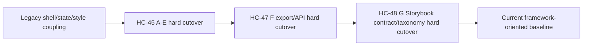
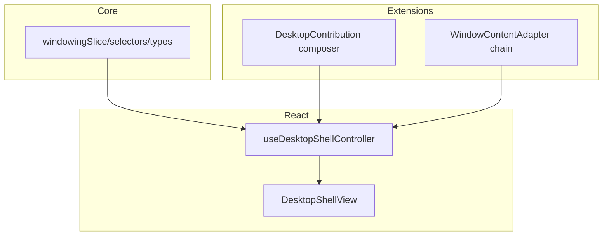

# Postmortem: HC-45 Desktop Framework Execution and Current State

## Executive Summary
HC-45 started as a deep architecture-and-plan ticket for extracting HyperCard desktop/windowing into a reusable in-browser OS framework. Execution then moved from planning into hard-cutover implementation, and eventually continued into two follow-up execution tickets that closed the remaining planned workstreams:

1. `HC-45`: Workstreams A-E implementation (core state boundary, shell split, contributions/adapters, CSS modularization).
2. `HC-47`: Workstream F (export surface and package API hygiene).
3. `HC-48`: Workstream G (storybook taxonomy + contract stories).

Overall result:

- The architecture moved from app-coupled shell internals to an explicit desktop framework surface.
- Desktop APIs are now consumed via explicit subpath entrypoints instead of the root barrel.
- Storybook now reflects framework-oriented IA and includes contract fixtures for critical extension seams.
- Hard-cutover policy (no backward compatibility shim layer) was respected after user direction changed from an earlier compatibility-oriented draft.

Residual gap summary:

- Packaging remains in one npm workspace package (`@hypercard/engine`) rather than split publishable packages.
- Some deliverables listed in the original plan's documentation section are still implicit (captured in code/story/docs fragments, but not published as dedicated guides).
- Formal performance baselines are still mostly manual/diagnostic rather than CI-enforced budgets.

## Problem Statement
The original HC-45 problem was not just code organization. It was a coupling problem across three axes:

1. **API coupling**: desktop/windowing APIs were reachable from the root engine barrel, making boundaries fuzzy and accidental imports common.
2. **Runtime coupling**: the shell path had direct assumptions about HyperCard card-host rendering behavior.
3. **Style coupling**: one large CSS file blended tokens, shell, chat, syntax, and primitives into a coarse import unit.

The reuse target was explicit: make the desktop shell/windowing layer viable as a framework for a macOS-1 style browser desktop model, while preserving behavior and interaction performance.

## Proposed Solution (As Executed)
The implementation sequence followed the phased intent of HC-45 but with an explicit **hard-cutover** operating rule:

- Introduce target boundaries.
- Migrate all in-repo consumers.
- Remove legacy surface immediately.
- Validate with type/tests/story checks.

At a high level:



## Timeline and Execution Record
### Phase 1: Core framework extraction (HC-45)
Key implementation commits:

- `988dfb6` `refactor(engine): hard-cutover desktop state and shell composition`
- `e1778aa` `feat(engine): add desktop contributions and window content adapters`
- `803a4ec` `refactor(theme): hard-cutover to modular desktop css packs`

Key documentation tracking commits:

- `a3270aa`, `40e8621`, `20eb47b`

### Phase 2: Export surface hard cutover (HC-47)
- `dd87bee` `refactor(engine): add desktop subpath entrypoints and hard-cutover imports`

### Phase 3: Storybook framework IA + contract stories (HC-48)
- `c662195` `refactor(storybook): hard-cutover engine taxonomy and add contract stories`

### Ticket closure state
- `HC-47`: complete.
- `HC-48`: complete.
- `HC-45`: still active in frontmatter; execution-wise A-G has been delivered across HC-45/47/48, so HC-45 is effectively in “postmortem/follow-up” phase.

## Workstream Alignment Matrix (Plan vs Actual)
## Workstream A: Core boundary extraction
**Planned intent**: move windowing durable state into desktop core module boundaries.

**Implemented**:

- `packages/engine/src/desktop/core/state/*` now hosts state types, selectors, reducer/actions.
- Legacy `features/windowing` source path removed.
- Callers/tests/stories moved to the new path.

**Assessment**: complete and aligned.

## Workstream B: Shell controller/view split
**Planned intent**: decompose monolithic shell orchestration.

**Implemented**:

- `useDesktopShellController.tsx`
- `DesktopShellView.tsx`
- Thin `DesktopShell.tsx` composition wrapper
- Dedicated command routing module integrated in controller flow.

**Assessment**: complete and aligned; major readability and extensibility gain.

## Workstream C: Extension contract formalization
**Planned intent**: make app extension points explicit (menus/icons/commands/startup hooks).

**Implemented**:

- `desktopContributions.ts` contract + composer + routing helpers.
- Inventory app migrated to contribution objects in `apps/inventory/src/App.tsx`.

**Assessment**: complete and aligned.

## Workstream D: Runtime adapter decoupling
**Planned intent**: replace shell-level runtime assumptions with adapter chain.

**Implemented**:

- `windowContentAdapter.ts` adapter contract + routing.
- `defaultWindowContentAdapters.tsx` for app/card/fallback adapters.
- Contribution-provided adapter extension path.

**Assessment**: complete and aligned; decoupling is meaningful though still in same package.

## Workstream E: CSS modularization
**Planned intent**: split monolithic CSS into reusable packs and explicit theme layers.

**Implemented**:

- Removed `theme/base.css`.
- Added modular packs under `packages/engine/src/theme/desktop/*`.
- Added explicit `theme/desktop/theme/macos1.css`.
- Updated app + Storybook imports.

**Assessment**: complete and aligned.

## Workstream F: Export surface/package API hygiene
**Planned intent**: structured desktop entrypoints and reduced accidental coupling.

**Implemented (HC-47)**:

- `packages/engine/package.json` exports map with:
  - `./desktop-core`
  - `./desktop-react`
  - `./desktop-hypercard-adapter`
  - `./desktop-theme-macos1`
  - `./theme`
- Desktop exports removed from root barrel `packages/engine/src/index.ts`.
- App imports hard-cutover to desktop subpaths.

**Assessment**: complete and aligned.

## Workstream G: Storybook restructure and contract stories
**Planned intent**: framework-first taxonomy and behavioral contract fixtures.

**Implemented (HC-48)**:

- New engine taxonomy enforced by `scripts/storybook/check-taxonomy.mjs`.
- Engine story titles hard-cutover to `Engine/Shell`, `Engine/Widgets`, `Engine/PluginRuntime`.
- New contract fixtures:
  - desktop contribution composition/routing
  - adapter-chain routing/precedence behavior
  - 20-window interaction density harness

**Assessment**: complete and aligned.

## Current Architecture Snapshot
## API surface
Recommended usage is now explicit and boundary-driven:

```ts
import { DesktopShell } from '@hypercard/engine/desktop-react';
import { openWindow } from '@hypercard/engine/desktop-core';
import '@hypercard/engine/theme';
```

The root engine barrel intentionally excludes desktop/windowing exports.

## Desktop composition model



## Style model
Desktop style is now modular and import-addressable:

- `theme/desktop/tokens.css`
- `theme/desktop/shell.css`
- `theme/desktop/primitives.css`
- `theme/desktop/chat.css`
- `theme/desktop/syntax.css`
- `theme/desktop/animations.css`
- `theme/desktop/theme/macos1.css`

## Storybook model
Engine stories now map to subsystem ownership instead of generic component buckets:

- `Engine/Shell/*`
- `Engine/Widgets/*`
- `Engine/PluginRuntime/*`

This aligns with package/subsystem semantics and makes extension contracts easier to discover.

## Design Decisions and Why They Held Up
1. **Hard cutover over compatibility wrappers**
Why it worked: it reduced long-tail maintenance and avoided dual APIs during a fast-moving cleanup phase.

2. **Controller/view split before broader package work**
Why it worked: de-risked behavior by isolating orchestration logic without forcing immediate package publishing changes.

3. **Contribution and adapter contracts before export hardening**
Why it worked: it stabilized internal extension points first, then exported only the clearer shapes.

4. **Taxonomy enforcement script for story IA**
Why it worked: prevents regressions by failing fast in test workflow.

## What Was Skipped, Deferred, or Partially Done
The original implementation plan listed several outcomes that are not fully materialized as standalone deliverables yet.

## Deferred 1: Separate publishable packages
Plan suggested optional package split (`desktop-core`, `desktop-react`, etc.) as independent packages.

Current state: implemented as subpath exports in a single package. This is acceptable for now, but true external package boundaries are still deferred.

## Deferred 2: Dedicated reference guides listed in plan Section 10
Planned docs included:

- Desktop Framework Quickstart
- Desktop Contribution API reference
- Window Content Adapter Guide
- Theming and Parts Contract
- Hard cutover migration guide
- Performance model note

Current state: these are partially represented across code comments, design docs, ticket diaries, and stories, but not consolidated into first-class reference docs.

## Deferred 3: Formal perf regression guardrails in CI
Plan called for explicit performance guardrails and benchmark notes.

Current state:

- diagnostics/FPS facilities exist,
- drag overlay architecture remains efficient,
- density harness stories exist,
- but no CI perf budget or automated perf benchmark gate.

## Deferred 4: Final ticket state normalization
Execution happened across HC-45, HC-47, HC-48. HC-47/48 are closed. HC-45 index still reads `Status: active`, which may be intentional for follow-up, but can be confusing if interpreted as implementation-incomplete.

## Cleanup and Improvement Opportunities (Next)
## Priority 1: Documentation consolidation (high clarity, low risk)
Create dedicated docs inside HC-45 (or a follow-up ticket) for the six reference deliverables listed above. Most source content already exists; this is primarily consolidation and curation.

## Priority 2: Contract coverage hardening (low-medium risk)
Extend story-contract fixtures into targeted unit/integration tests where deterministic behavior matters most:

- contribution conflict merge policy edge cases
- adapter precedence overlap cases
- shell command routing fallback semantics

## Priority 3: Performance governance (medium risk)
Add repeatable perf baselines around:

- drag interaction with 20+ windows,
- action throughput under event-heavy chat streams,
- render-count/rerender boundaries during interaction.

Prefer a lightweight guardrail strategy first (recorded benchmark snapshots + threshold alerts) before hard CI failure budgets.

## Priority 4: Packaging follow-through (medium-high risk)
If the goal is external adoption by third-party builders, evaluate moving from subpath exports to truly separate packages with independent versioning, changelog, and semantic contracts.

## Priority 5: API polish around desktop theme exports (low risk)
`desktop-theme-macos1` exists; expand with explicit documentation on token overrides and “minimum required CSS imports” for consumers who want custom skins.

## Alternatives Considered (Retrospective)
1. **Soft migration with compatibility wrappers**
Rejected by explicit user direction; hard cutover reduced complexity and accelerated cleanup.

2. **Package split first, internals second**
Would have increased churn while internals were still changing. The chosen order (internal contracts first, package boundary next) was safer.

3. **Storybook taxonomy left permissive**
Would have preserved short-term flexibility but invited drift. Enforcement scripting gave a stable information architecture.

## Implementation Plan (For Follow-up Phase)
A practical next-phase plan that keeps risk low:

1. Add a new HC-45 follow-up task block for “Documentation Consolidation Pack”.
2. Publish six focused reference docs from existing artifacts.
3. Add a “Perf Baseline Playbook” with exact commands and expected ranges.
4. Decide whether HC-45 closes now (A-G delivered) or remains active solely for consolidation.
5. If external package publishing is required, spin a dedicated packaging ticket to avoid mixing release engineering with architecture cleanup.

## Open Questions
1. Should HC-45 be formally closed now that A-G are implemented across HC-45/47/48, with docs consolidation moved to a new ticket?
2. Is subpath export granularity sufficient for near-term consumer adoption, or do we need independent npm packages in this cycle?
3. Do we want CI-enforced performance thresholds now, or a manual benchmark cadence first?
4. Should we treat the new contract stories as normative API contracts and version them as such?

## References
- `ttmp/2026/02/17/HC-45-DESKTOP-FRAMEWORK--desktop-shell-and-windowing-reusable-framework-cleanup/design-doc/01-desktop-shell-and-windowing-reusability-analysis-for-in-browser-os-framework.md`
- `ttmp/2026/02/17/HC-45-DESKTOP-FRAMEWORK--desktop-shell-and-windowing-reusable-framework-cleanup/design-doc/02-desktop-shell-and-windowing-reusable-framework-implementation-plan.md`
- `ttmp/2026/02/17/HC-45-DESKTOP-FRAMEWORK--desktop-shell-and-windowing-reusable-framework-cleanup/changelog.md`
- `ttmp/2026/02/17/HC-47-DESKTOP-EXPORTS--desktop-framework-export-surface-and-package-api-hygiene/changelog.md`
- `ttmp/2026/02/17/HC-48-DESKTOP-STORYBOOK--desktop-framework-storybook-restructure-and-contract-stories/changelog.md`
- `packages/engine/src/desktop/core/state/windowingSlice.ts`
- `packages/engine/src/components/shell/windowing/useDesktopShellController.tsx`
- `packages/engine/src/components/shell/windowing/desktopContributions.ts`
- `packages/engine/src/components/shell/windowing/windowContentAdapter.ts`
- `scripts/storybook/check-taxonomy.mjs`
