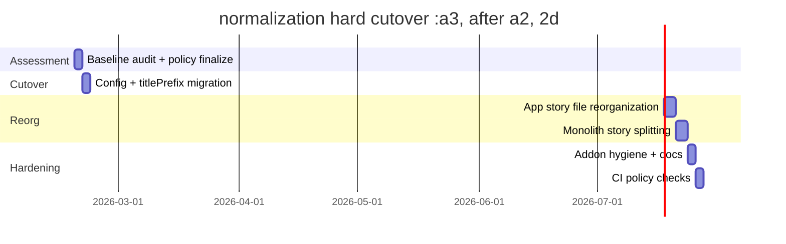

# Storybook Cleanup Assessment and Reorganization Plan

## Executive Summary

Storybook is currently functioning as a workspace-wide UI surface, but its information architecture (IA) is inconsistent with monorepo ownership boundaries. Story titles mix app and engine concerns (`Widgets/*`, `Pages/*`, `Shell/*`, `Todo/*`, `CRM/*`, `BookTracker/*`) without a stable top-level package grouping. This makes discovery, onboarding, and maintenance harder than necessary.

The target state for this ticket is a strict IA where Storybook hierarchy mirrors package/directory ownership. The first-level taxonomy should answer "who owns this story?" (Apps vs Packages), and the next levels should answer "which package?" and "which feature area?".

Recommended direction:

1. Hard-cutover title and navigation policy to `Apps/<app-name>/...` and `Packages/<package-name>/...`.
2. Reorganize app story files out of a flat `src/stories` bucket into feature-aligned directories.
3. Make Storybook source ownership explicit (either move config to repo root or formalize inventory-hosted-global ownership with strict rules).
4. Add drift detection checks so chaotic navigation cannot return.

## Problem Statement

### 1) Storybook ownership is global, but expressed as inventory-local

Storybook is launched from root:

```json
"storybook": "npm run -w apps/inventory storybook -- --config-dir .storybook"
```

But config lives at `apps/inventory/.storybook/main.ts`, and that config aggregates stories from all apps and engine:

```ts
stories: [
  '../src/**/*.stories.@(ts|tsx)',
  '../../todo/src/**/*.stories.@(ts|tsx)',
  '../../book-tracker-debug/src/**/*.stories.@(ts|tsx)',
  '../../crm/src/**/*.stories.@(ts|tsx)',
  '../../../packages/engine/src/**/*.stories.@(ts|tsx)',
]
```

Result: operational ownership feels "inventory-local" while runtime scope is workspace-global.

### 2) Story titles do not follow package boundaries

Current top-level title categories (42 story files):

- `Widgets`: 18
- `Shell`: 13
- `Pages`: 3
- `Chat`: 3
- `Todo`: 1
- `CRM`: 1
- `BookTrackerDebug`: 1
- `BookTracker`: 1
- `Plugin Runtime`: 1

This mixes cross-cutting UI labels (`Widgets`, `Shell`) with app names (`Todo`, `CRM`) and feature names (`Chat`, `Pages`) at the same hierarchy depth.

### 3) Story files are organized differently across apps and engine

Observed structure:

- Apps:
  - mostly flat `src/stories/*.stories.tsx`
- Engine:
  - mostly co-located under `packages/engine/src/components/.../*.stories.tsx`

This causes asymmetry:

- App stories are "bucketed" by storybook concern.
- Engine stories are organized by runtime component directory.

### 4) Monolithic story files increase maintenance drag

Large files (line counts):

- `packages/engine/src/components/widgets/ChatWindow.stories.tsx`: 1092
- `packages/engine/src/components/shell/windowing/ChatWindowDesktop.stories.tsx`: 500
- `packages/engine/src/components/shell/windowing/DesktopPrimitives.stories.tsx`: 459

These files combine many scenarios and are expensive to review, refactor, and keep internally consistent.

### 5) Addon dependency/config mismatch

Inventory package installs multiple Storybook addons:

- `@storybook/addon-a11y`
- `@storybook/addon-onboarding`
- `@storybook/addon-vitest`
- `@storybook/addon-docs`

But current config enables only:

- `addons: ['@storybook/addon-docs']`

This mismatch is either dead dependency drift or missing intended configuration.

### 6) Story metadata conventions are inconsistent

Examples of metadata inconsistency:

- mostly manual `title` strings, mixed naming style
- inconsistent spacing/casing in segments
  - `Shell/Windowing/Desktop Shell`
  - `Shell/Windowing/Chat Desktop`
  - `Shell/Windowing/useWindowInteractionController`
- minimal `tags` usage (`autodocs` appears in only one story)

This weakens Storybook discoverability and docs consistency.

## Current State Baseline

### Story file counts by source area

- `apps/inventory/src/stories`: 10
- `apps/todo/src/stories`: 1
- `apps/crm/src/stories`: 1
- `apps/book-tracker-debug/src/stories`: 1
- `packages/engine/src/components/widgets`: 15
- `packages/engine/src/components/shell`: 13
- `packages/engine/src/plugin-runtime`: 1

Total: 42 story files.

### Representative mismatch examples

| File | Current title | Why this is problematic |
|---|---|---|
| `apps/inventory/src/stories/InventoryTimelineWidget.stories.tsx` | `Widgets/Inventory Timeline` | App story appears under generic widget bucket, indistinguishable from engine ownership |
| `apps/inventory/src/stories/FullApp.stories.tsx` | `Pages/Full App` | App root story not grouped under app package |
| `packages/engine/src/components/widgets/BookTracker.stories.tsx` | `BookTracker/Home` | Engine story top-level differs from other engine widget stories |
| `packages/engine/src/components/shell/windowing/useWindowInteractionController.stories.tsx` | `Shell/Windowing/useWindowInteractionController` | Leaf label leaks hook identifier style into user-facing nav |
| `apps/todo/src/stories/TodoApp.stories.tsx` | `Todo/Full App` | App story has app prefix while inventory app stories do not |

### Existing guardrails

There is a small smoke test for app story modules:

- `packages/engine/src/__tests__/storybook-app-smoke.test.ts`

It checks exports exist, but does not validate title policy, file placement policy, or navigation hierarchy.

## Proposed Solution

## Target Information Architecture (IA)

Adopt a strict hierarchy:

1. Owner scope:
- `Apps`
- `Packages`

2. Package name:
- `Apps/Inventory`
- `Apps/Todo`
- `Apps/Crm`
- `Apps/BookTrackerDebug`
- `Packages/Engine`

3. Feature area (derived from directory structure):
- for apps: `App`, `Features/Chat`, `Features/Timeline`, `Features/Artifacts`
- for engine: `Components/Widgets`, `Components/Shell/Windowing`, `PluginRuntime`

4. Story leaf names:
- concise scenario names (`Default`, `Edge Cases`, `Error State`, `Mobile`)

Target examples:

- `Apps/Inventory/App/FullApp`
- `Apps/Inventory/Features/Chat/EventViewer`
- `Apps/Todo/App/FullApp`
- `Packages/Engine/Components/Widgets/ChatWindow`
- `Packages/Engine/Components/Shell/Windowing/DesktopShell`
- `Packages/Engine/PluginRuntime/RuntimeMutation`

## Title policy

Hard-cutover policy:

- No legacy prefixes (`Pages`, `Widgets`, `Chat`, `Shell`) at top level.
- All stories must resolve to `Apps/*` or `Packages/*`.
- No compatibility aliases in parallel.

Implementation model (recommended):

1. Use `stories` objects with `directory`, `files`, and `titlePrefix` in Storybook config.
2. Remove or minimize manual `meta.title` values.
3. Let path + `titlePrefix` drive hierarchy deterministically.

Suggested `main.ts` direction (conceptual):

```ts
const config: StorybookConfig = {
  stories: [
    { directory: '../src', files: '**/*.stories.@(ts|tsx)', titlePrefix: 'Apps/Inventory' },
    { directory: '../../todo/src', files: '**/*.stories.@(ts|tsx)', titlePrefix: 'Apps/Todo' },
    { directory: '../../crm/src', files: '**/*.stories.@(ts|tsx)', titlePrefix: 'Apps/Crm' },
    { directory: '../../book-tracker-debug/src', files: '**/*.stories.@(ts|tsx)', titlePrefix: 'Apps/BookTrackerDebug' },
    { directory: '../../../packages/engine/src', files: '**/*.stories.@(ts|tsx)', titlePrefix: 'Packages/Engine' },
  ],
}
```

## File organization policy

### Apps

Move from flat:

- `apps/<app>/src/stories/*.stories.tsx`

To feature-aligned:

- `apps/<app>/src/app/stories/*.stories.tsx`
- `apps/<app>/src/features/<feature>/stories/*.stories.tsx`

Inventory example:

- `apps/inventory/src/features/chat/stories/EventViewer.stories.tsx`
- `apps/inventory/src/features/chat/stories/CodeEditorWindow.stories.tsx`
- `apps/inventory/src/features/timeline/stories/PerRoundTimeline.stories.tsx`
- `apps/inventory/src/app/stories/FullApp.stories.tsx`

### Engine

Keep co-location in component directories, but split monolithic files into scenario-oriented files:

- `ChatWindow.core.stories.tsx`
- `ChatWindow.stream.stories.tsx`
- `ChatWindow.edge-cases.stories.tsx`

## Storybook config ownership policy

Two viable models:

### Option A: Move Storybook config to workspace root (recommended)

- `/.storybook/main.ts`
- `/.storybook/preview.ts`

Pros:

- ownership clarity
- no implicit inventory coupling
- cleaner shared platform mental model

Cons:

- one-time script/path updates

### Option B: Keep config in inventory, but formalize global ownership

Pros:

- lower migration effort

Cons:

- still semantically surprising
- requires ongoing discipline and docs

Recommendation: Option A for long-term clarity.

## Addon policy

Align dependencies with active config:

- either configure installed addons (`a11y`, `vitest`, etc.) intentionally
- or remove unused addon packages

No silent "installed-but-unused" addon drift.

## Design Decisions

### D1: Package-first IA is mandatory

Rationale:

- matches code ownership boundaries
- improves onboarding and bug triage
- eliminates ambiguous top-level buckets

### D2: Hard cutover over dual taxonomy

Rationale:

- avoids permanent compatibility burden
- prevents duplicated, conflicting story trees
- simpler mental model and tooling

### D3: Directory-driven hierarchy over handcrafted title strings

Rationale:

- reduces human drift
- makes structure auditable by lint scripts
- keeps Storybook tree aligned with filesystem

### D4: Split monolithic stories by concern

Rationale:

- faster review cycles
- easier ownership delegation
- better scenario discoverability

### D5: Add policy checks in CI

Rationale:

- prevents regressions after cleanup
- enforces conventions automatically

## Alternatives Considered

### Alternative 1: Keep current titles, add a custom sort only

Rejected because sorting does not solve ownership ambiguity or path mismatch.

### Alternative 2: Keep flat app story directories and only rename titles

Rejected because title normalization alone leaves file organization drift and weak maintainability.

### Alternative 3: Keep dual old/new prefixes during migration

Rejected because dual taxonomy prolongs confusion and documentation burden.

### Alternative 4: Engine-only cleanup, defer app cleanup

Rejected because current chaos is specifically cross-app + engine taxonomy mixing.

## Implementation Plan

## Phase 0: Safety and observability

1. Capture baseline story inventory and title map.
2. Add a script to print `file -> resolved title` for audit.
3. Confirm no hidden story files outside expected globs.

Acceptance criteria:

- baseline map committed in ticket artifact
- story count and source buckets recorded

## Phase 1: IA contract and config cutover

1. Choose ownership model (root `.storybook` recommended).
2. Convert `stories` globs to object form with `titlePrefix`.
3. Add global `storySort` that prioritizes:
- `Apps`
- `Packages`

Example sort shape:

```ts
parameters: {
  options: {
    storySort: {
      order: ['Apps', ['Inventory', 'Todo', 'Crm', 'BookTrackerDebug'], 'Packages', ['Engine']],
    },
  },
}
```

Acceptance criteria:

- Storybook root tree starts with `Apps` and `Packages`
- no legacy top-level groups remain

## Phase 2: Title normalization hard cutover

1. Remove legacy `meta.title` values that conflict with IA.
2. Rewrite remaining required `meta.title` values to canonical hierarchy.
3. Add lint/check script that rejects disallowed top-level titles.

Acceptance criteria:

- no `Pages/*`, `Widgets/*`, `Chat/*`, `Shell/*` at top level
- all stories resolve to `Apps/*` or `Packages/*`

## Phase 3: File reorganization

1. Move app stories into feature and app-domain directories.
2. Update imports and story references.
3. Split oversized monolithic files into focused scenario files.

Acceptance criteria:

- app stories no longer centralized in one flat folder
- top 3 largest story files reduced by split threshold target (for example, <400 lines each)

## Phase 4: Addon and documentation hygiene

1. Align addons in config with installed dependencies.
2. Add `docs/frontend/storybook.md` with explicit contribution rules.
3. Update onboarding docs and ticket references.

Acceptance criteria:

- addon set is explicit and minimal
- story contribution doc exists and is linked from ticket index

## Phase 5: Enforcement in CI

1. Add title-policy drift check.
2. Add placement-policy check.
3. Keep existing smoke tests and add taxonomy assertions.

Acceptance criteria:

- CI fails on story title/package placement drift

## Migration pseudocode and tooling sketches

### A) Title policy checker

```ts
// scripts/storybook/checkTitlePolicy.ts
for (const storyFile of listStoryFiles()) {
  const title = extractMetaTitleOrAutoTitle(storyFile);
  if (!title.startsWith('Apps/') && !title.startsWith('Packages/')) {
    fail(storyFile, `Invalid top-level title: ${title}`);
  }
  const ownerFromPath = inferOwnerFromPath(storyFile); // Apps/Inventory or Packages/Engine
  if (!title.startsWith(ownerFromPath)) {
    fail(storyFile, `Title/path mismatch: ${title} vs ${ownerFromPath}`);
  }
}
```

### B) Metadata codemod sketch

```ts
// scripts/storybook/rewriteTitles.ts
for (const storyFile of listStoryFiles()) {
  const targetPrefix = inferOwnerFromPath(storyFile);
  const currentMeta = parseMetaObject(storyFile);

  if (currentMeta.title) {
    const normalized = normalizeTitle(currentMeta.title, targetPrefix, storyFile);
    writeMetaTitle(storyFile, normalized);
  } else {
    // Optional: remove manual titles entirely and rely on auto-title + titlePrefix
    ensureMetaHasNoLegacyTitle(storyFile);
  }
}
```

### C) File move mapping sketch

```text
apps/inventory/src/stories/EventViewer.stories.tsx
-> apps/inventory/src/features/chat/stories/EventViewer.stories.tsx

apps/inventory/src/stories/PerRoundTimeline.stories.tsx
-> apps/inventory/src/features/timeline/stories/PerRoundTimeline.stories.tsx

apps/inventory/src/stories/FullApp.stories.tsx
-> apps/inventory/src/app/stories/FullApp.stories.tsx
```

## Rollout Timeline (proposed)



## Risks and Mitigations

### Risk 1: Story links/bookmarks break after title changes

Mitigation:

- one-shot hard cutover with clear changelog
- publish migration note in `docs/frontend/storybook.md`

### Risk 2: Refactor churn from moving many files at once

Mitigation:

- phase moves by app first, then engine monolith split
- keep each move in focused commit slices

### Risk 3: Tooling drift returns after cleanup

Mitigation:

- enforce policy with scripts and CI
- add PR checklist entry for Storybook taxonomy

## Open Questions

1. Should we move Storybook config to root immediately (Option A), or keep inventory-hosted global ownership for one more phase?
2. Do we want auto-generated titles only, or normalized explicit `meta.title` strings plus lint checks?
3. Should `BookTracker` stories live under `Packages/Engine/Components/Widgets/...` or under a dedicated `Packages/Engine/Examples/...` subtree?
4. Do we split `ChatWindow.stories.tsx` by rendering mode, feature area, or bug-history scenario classes?

## Proposed Task Breakdown for Implementation

1. Finalize IA contract and naming policy in writing.
2. Cut over Storybook config to `titlePrefix` object stories.
3. Rewrite/normalize all story titles.
4. Move app stories to feature-aligned directories.
5. Split monolithic engine story files.
6. Add CI checks for title/path policy.
7. Align addon dependencies with configured usage.
8. Write `docs/frontend/storybook.md` contribution guide.

## References

- `apps/inventory/.storybook/main.ts`
- `apps/inventory/.storybook/preview.ts`
- `package.json`
- `apps/inventory/package.json`
- `apps/inventory/src/stories/`
- `packages/engine/src/components/widgets/ChatWindow.stories.tsx`
- `packages/engine/src/components/shell/windowing/ChatWindowDesktop.stories.tsx`
- `packages/engine/src/components/shell/windowing/DesktopPrimitives.stories.tsx`
- `packages/engine/src/__tests__/storybook-app-smoke.test.ts`
