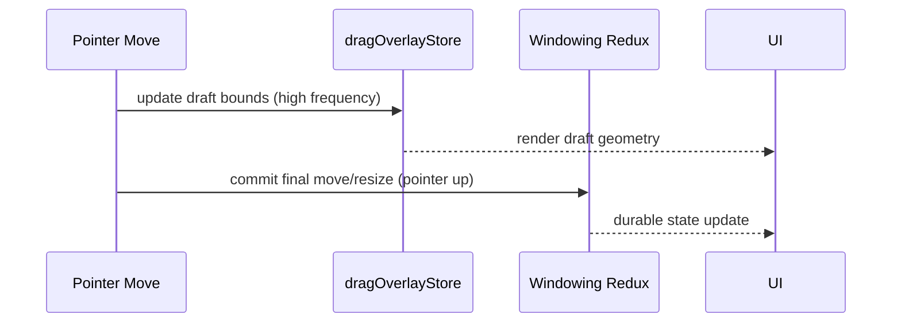

# Performance Model: Durable vs Ephemeral Lanes

## Goal
Provide a concrete rule set for when to use Redux state versus external stores for high-frequency interaction data.

## Context
The desktop framework intentionally separates:

1. **Durable state lane** (Redux): long-lived application state.
2. **Ephemeral interaction lane** (external store): high-frequency transient interaction drafts.

This avoids turning pointer-move/event-stream frequency into global Redux dispatch pressure.

## Quick Reference
## Durable lane (Redux)
Use Redux for state that must be authoritative, replayable, serializable, or queryable by selectors over time.

Current desktop examples:

- `windowingReducer` in `desktop/core/state/windowingSlice.ts`
- open/focus/close/move/resize committed window state
- session navigation state
- menus/icon selection and other durable shell UI state

## Ephemeral lane (external store)
Use external store for high-frequency transient data that should not commit every frame.

Current desktop example:

- `dragOverlayStore` in `dragOverlayStore.ts`
  - updated every pointer move via `useWindowInteractionController`
  - read using `useSyncExternalStore`
  - committed to Redux only on interaction end (`onCommitMoveWindow`, `onCommitResizeWindow`)

## Interaction flow model



## Diagnostics model (outside Redux)
Diagnostics are also intentionally external:

- Redux perf middleware (`createReduxPerfMiddleware`) writes timing events to module store.
- Frame monitor (`startFrameMonitor`) writes frame duration events.
- `useDiagnosticsSnapshot` polls and aggregates from ring buffers.
- No diagnostics actions are dispatched into Redux (avoids observer effect).

## Decision checklist for new features
Use Redux if the value is:

- needed after refresh/time travel/replay,
- part of business logic correctness,
- required by many selectors across feature boundaries.

Use external lane if the value is:

- high frequency (per token, per pointer frame, per animation frame),
- only needed for immediate rendering/projection,
- discardable without business correctness impact.

## Usage Examples
## Enabling diagnostics in dev store setup

```ts
createAppStore(
  { inventory: inventoryReducer },
  {
    enableReduxDiagnostics: import.meta.env.DEV,
    diagnosticsWindowMs: 5000,
  },
);
```

## External-store pattern sketch

```ts
const store = createMyFastStore();

function useMyFastSnapshot() {
  return useSyncExternalStore(store.subscribe, store.getSnapshot, store.getSnapshot);
}
```

## Related
- `packages/engine/src/components/shell/windowing/dragOverlayStore.ts`
- `packages/engine/src/components/shell/windowing/useWindowInteractionController.ts`
- `packages/engine/src/components/shell/windowing/useDesktopShellController.tsx`
- `packages/engine/src/app/createAppStore.ts`
- `packages/engine/src/diagnostics/diagnosticsStore.ts`
- `packages/engine/src/diagnostics/reduxPerfMiddleware.ts`
- `packages/engine/src/diagnostics/frameMonitor.ts`
